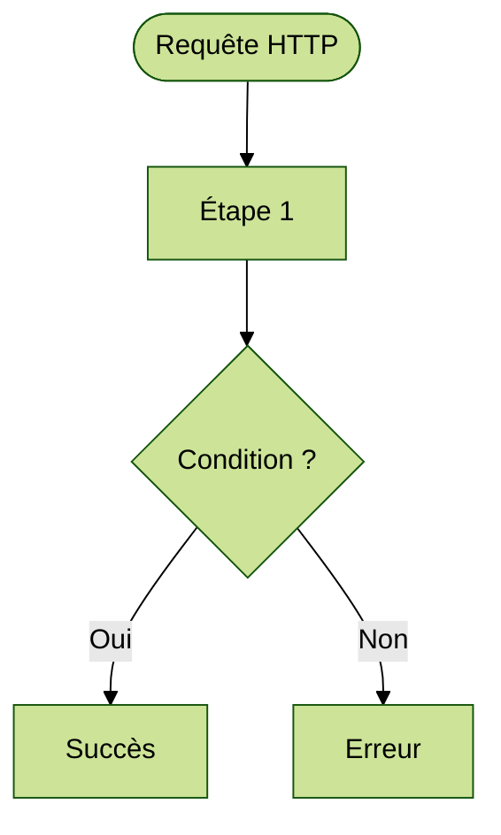
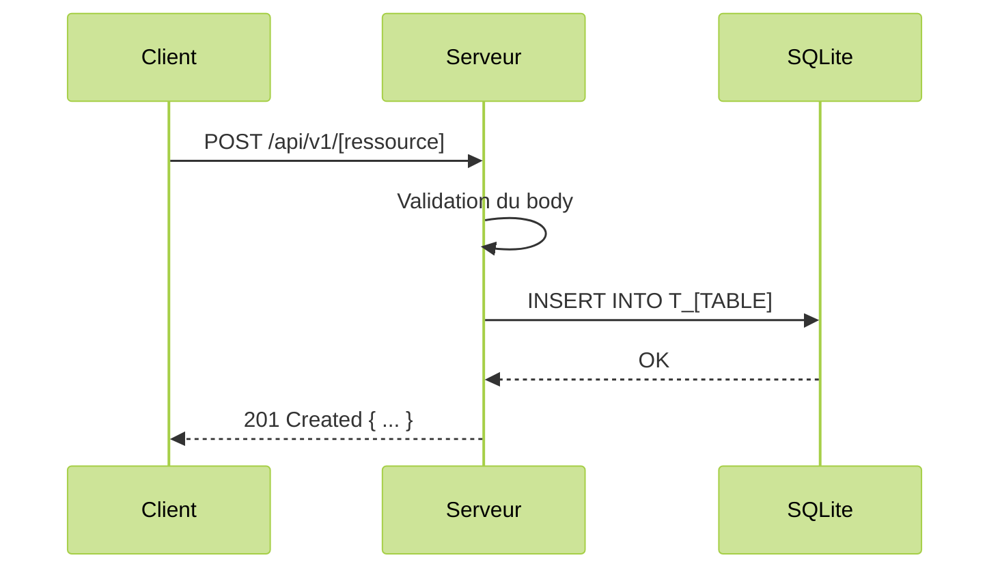

# Instructions GitHub Copilot — Cahiers des charges Quiz Buzzer

Ce fichier définit le format, la structure et la charte graphique à respecter pour tous les cahiers des charges (User Stories) du projet **Quiz Buzzer**. Il est utilisé comme référence par GitHub Copilot pour garantir une cohérence entre les documents.

---

## 🌐 Langue et ton

- Tous les documents sont rédigés entièrement en **français**.
- Le titre de la User Story utilise le format **"En tant qu'"** devant une voyelle, **"En tant que"** devant une consonne.
- Les messages d'erreur JSON restent en **anglais** (convention API).
- Les commentaires dans les exemples de code restent en **français**.

---

## 📁 Convention de nommage des fichiers

```
US-XXX-description-en-kebab-case.md
```

- `XXX` : numéro à trois chiffres, complété par des zéros (ex. : `001`, `012`).
- `description` : titre court en kebab-case, sans accents, sans caractères spéciaux.
- Exemples : `US-001-server-startup.md`, `US-003-themes-crud.md`, `US-006-quiz-crud.md`.

---

## 🏗️ Structure générale d'un document

Chaque cahier des charges suit l'ordre de sections ci-dessous. Les sections marquées **[optionnel]** sont incluses uniquement si elles sont pertinentes pour la US concernée.

```
# US-XXX — Titre complet du cahier des charges

## 📋 Contexte projet
## 🎯 User Story
## ✅ Critères d'acceptance
## 🔄 Diagramme de flux
## 🔀 Diagramme de séquences
## 🧪 Cas de tests — requêtes cURL        [optionnel — API REST et WebSocket]
## 🔧 Spécifications techniques
## 📡 Endpoint(s)                         [optionnel — US avec endpoint(s) HTTP]
## 🔐 Authentification et autorisation    [optionnel — US avec routes protégées]
## 📝 Logging structuré                   [optionnel — US avec événements loggés]
## 🌱 Seed — Description                  [optionnel — US avec données initiales]
## 🔌 Architecture [Composant]            [optionnel — US architecturale (WebSocket, etc.)]
## 🚨 Catalogue des erreurs               [optionnel — US avec API REST]
## 📐 Périmètre
## 🔍 Points de vigilance
```

Un séparateur `---` est placé **après chaque section** (avant la section suivante), sans exception.

---

## 📋 Section : Contexte projet

Chaque US référence le document centralisé **VISION.md** (principe DRY) :

```markdown
## 📋 Contexte projet

Voir [VISION.md](VISION.md) pour la description complète du projet et de ses quatre applications.
```

---

## 🎯 Section : User Story

Format en bloc de citation :

```markdown
## 🎯 User Story

> **En tant qu'** [acteur],
> **je veux** [action souhaitée],
> **afin de** [bénéfice / objectif].
```

- Utiliser `**En tant qu'**` devant une voyelle (a, e, i, o, u, y, h muet).
- Utiliser `**En tant que**` devant une consonne.
- Terminer chaque ligne par une virgule (sauf la dernière par un point).

---

## ✅ Section : Critères d'acceptance

### Structure

- Utiliser des sous-sections `###` pour regrouper les critères par opération ou thème.
- Nommer les sous-sections d'après l'opération HTTP et le endpoint : ex. `### Création — \`POST /api/v1/themes\``.

### Format du tableau

```markdown
| # | Critère | Résultat attendu |
|---|---|---|
| CA-1 | Description du critère | Résultat attendu (code HTTP, format de réponse, etc.) |
```

- Numéroter les critères **CA-1, CA-2, …** en recommençant à **CA-1** pour chaque nouvelle US.
- Pour un sous-critère d'un CA existant, utiliser le suffixe lettré : `CA-65b`.
- Les sous-sections standard pour une US CRUD REST sont :
  - `### Création — \`POST /api/v1/[ressource]\``
  - `### Lecture d'une ressource — \`GET /api/v1/[ressource]/:id\``
  - `### Lecture de la liste — \`GET /api/v1/[ressource]\``
  - `### Modification complète — \`PUT /api/v1/[ressource]/:id\``
  - `### Modification partielle — \`PATCH /api/v1/[ressource]/:id\`` (si PATCH implémenté)
  - `### Suppression — \`DELETE /api/v1/[ressource]/:id\``
  - `### Sécurité et transversalité`
- Le critère de couverture de tests appartient toujours à `### Sécurité et transversalité` avec le libellé : `Tests unitaires et d'intégration` / `Couverture de tests ≥ 90%`.
- Immédiatement après le titre `## ✅ Critères d'acceptance`, avant toute sous-section `###`, insérer l'encadré suivant :

```markdown
> 🧪 **Exigence de couverture** — Voir [Conventions techniques — Couverture des tests](CONVENTIONS-TECHNIQUES.md#-exigence-de-couverture-des-tests). Chaque CA doit être couvert par au moins un test automatisé. Couverture globale ≥ 90 %.
```

---

## 🔄 Section : Diagramme de flux

Présente dans toutes les US. Placée après les critères d'acceptance (`## ✅ Critères d'acceptance`).

### Convention Mermaid

Le diagramme de flux utilise la syntaxe `flowchart TD` (top-down) de Mermaid avec le thème `forest` :



### Fichiers source et générés

| Fichier | Rôle |
|---|---|
| `diagrams/US-XXX-description.mmd` | Source Mermaid du diagramme de flux |
| `diagrams/US-XXX-description.png` | Image PNG générée par `mmdc` (thème `forest`) |

- La génération PNG est automatique via `bash scripts/generate-all.sh` (tous les fichiers `*.mmd` du dossier `diagrams/` sont convertis).
- Prérequis : `@mermaid-js/mermaid-cli` installé globalement (`npm install -g @mermaid-js/mermaid-cli`).

### Format dans le document

```markdown
## 🔄 Diagramme de flux


```

### Classes de style standard

| Classe | Couleur | Usage |
|---|---|---|
| `success` | `fill:#d4edda,stroke:#28a745,color:#155724` | Résultats de succès (2xx) |
| `error` | `fill:#f8d7da,stroke:#dc3545,color:#721c24` | Résultats d'erreur (4xx, 5xx) |
| `warning` | `fill:#fff3cd,stroke:#ffc107,color:#856404` | Cas intermédiaires, dégradés |
| `info` | `fill:#cce5ff,stroke:#004085,color:#004085` | Informations, états terminaux |

---

## 🔀 Section : Diagramme de séquences

Présente dans toutes les US. Placée après le diagramme de flux (`## 🔄 Diagramme de flux`).

### Convention Mermaid

Le diagramme de séquences utilise la syntaxe `sequenceDiagram` de Mermaid avec le thème `forest` :



### Fichiers source et générés

| Fichier | Rôle |
|---|---|
| `diagrams/US-XXX-description-sequence.mmd` | Source Mermaid du diagramme de séquences |
| `diagrams/US-XXX-description-sequence.png` | Image PNG générée par `mmdc` (thème `forest`) |

- Le suffixe `-sequence` permet de distinguer le fichier du diagramme de flux (`US-XXX-description.mmd`).
- La génération PNG est automatique via `bash scripts/generate-all.sh` (tous les fichiers `*.mmd` du dossier `diagrams/` sont convertis).

### Format dans le document

```markdown
## 🔀 Diagramme de séquences


```

### Participants standard

| Alias | Participant | Usage |
|---|---|---|
| `C` | Client | Buzzer, Angular ou tout client HTTP |
| `S` | Serveur | Serveur Node.js (hub) |
| `DB` | SQLite | Base de données SQLite |
| `WS` | WebSocket | Serveur WebSocket (si applicable) |

- Des participants supplémentaires peuvent être ajoutés selon la US (ex. : `participant MW as Middleware`).

### Règles

- Le diagramme illustre le **flux principal** (happy path) de la US ainsi que les **cas d'erreur significatifs**.
- Les participants sont déclarés avec un alias court (ex. `participant C as Client`).
- Les messages utilisent les **méthodes HTTP** et **chemins d'URL** réels (ex. `POST /api/v1/themes`).
- Les réponses incluent le **code HTTP** (ex. `201 Created`, `400 Bad Request`).
- Les blocs `alt` / `else` sont utilisés pour les embranchements (succès / erreur).
- Les blocs `loop` sont utilisés pour les opérations répétées.
- Les blocs `opt` sont utilisés pour les opérations optionnelles.
- Le thème Mermaid est toujours `forest` (cohérent avec les diagrammes de flux).

---

## 🧪 Section : Cas de tests — requêtes cURL

Présente pour toutes les US avec des endpoints REST ou WebSocket.

### En-tête de section

```markdown
## 🧪 Cas de tests — requêtes cURL

> **Variables** à définir avant d'exécuter les commandes :
> ```bash
> BASE_URL=http://localhost:3000
> TOKEN=<votre_token_JWT_admin>           # Obtenu via POST /api/v1/token (US-002)
> [AUTRES_VARIABLES]=<valeur>             # Description courte
> ```
```

### Format de chaque test

```markdown
**CA-X** — Description courte du cas → `CODE HTTP attendu`

```bash
curl -s -w "\n→ HTTP %{http_code}\n" -X [MÉTHODE] "$BASE_URL/api/v1/[ressource]" \
  -H "Authorization: Bearer $TOKEN" \
  -H "Content-Type: application/json" \
  -d '{...}'
```
```

- Chaque test est précédé de son numéro CA en **gras** : `**CA-X**`.
- Les commandes `curl` utilisent systématiquement `-s -w "\n→ HTTP %{http_code}\n"`.
- Les sous-sections reprennent exactement les mêmes noms que dans `## ✅ Critères d'acceptance`.
- Les tests sont organisés par sous-section, dans le même ordre que les critères.

---

## 🔧 Section : Spécifications techniques

### Tableau principal

Chaque US référence le document centralisé **CONVENTIONS-TECHNIQUES.md** (principe DRY) et ne documente que les spécifications **propres à son périmètre** :

```markdown
## 🔧 Spécifications techniques

Voir les [Conventions techniques](CONVENTIONS-TECHNIQUES.md) pour la stack complète, les principes d'architecture (KISS, DRY, YAGNI, SOLID) et les conventions de données.

### Spécifications propres à cette US

| Élément | Choix |
|---|---|
| Bibliothèque WebSocket | `ws` (dernière version stable disponible) |
```

- Les spécifications communes (Runtime, Langage, BDD, Tests, Identifiants, Horodatage, Principes) sont dans **CONVENTIONS-TECHNIQUES.md**.
- Des lignes supplémentaires propres à la US peuvent être ajoutées (ex. : `Bibliothèque WebSocket`, `multer`, `bcrypt`).

### Schéma SQL

Inclure un bloc `sql` avec le `CREATE TABLE` pour toute table créée par la US. Convention de nommage : `T_NOM_ABR` pour la table, `ABR_COLONNE` pour chaque colonne.

### Convention JSON — snake_case

Inclure des exemples JSON (objet unitaire et liste paginée si applicable) avec :
- 2 espaces d'indentation.
- Champs en `snake_case`.
- Dates au format ISO 8601 UTC : `"2026-03-XXTHH:mm:ss.000Z"`.
- UUIDs au format `"018e4f5X-XXXX-7XXX-XXXX-XXXXXXXXXXXX"`.
- Champs optionnels non renseignés à `null`.

### Versioning API

Le versioning API est centralisé dans **CONVENTIONS-TECHNIQUES.md**. Les US qui avaient cette sous-section y font désormais référence :

```markdown
### Versioning API

Voir [Conventions techniques — Versioning API](CONVENTIONS-TECHNIQUES.md#-versioning-api).
```

---

## ⚙️ Principes d'architecture fondamentaux : KISS, DRY, YAGNI et SOLID

La description détaillée des principes (exemples, tableaux, application dans le projet) est centralisée dans **[CONVENTIONS-TECHNIQUES.md — Exigence fondamentale](CONVENTIONS-TECHNIQUES.md#️-exigence-fondamentale--kiss-dry-yagni-solid)**.

Chaque US y fait référence via la section `## 🔧 Spécifications techniques`.

---

### KISS — *Keep It Simple, Stupid*

**Règle** : Choisir systématiquement la solution la plus simple qui satisfait le besoin.

| ✅ À faire | ❌ À éviter |
|---|---|
| Une fonction unique par responsabilité | Des fonctions « couteaux suisses » multi-rôles |
| Un middleware `authenticate` qui vérifie le JWT | Un middleware qui authentifie ET autorise ET rate-limite |
| Des réponses d'erreur avec un format JSON fixe `{ status, error, message }` | Des structures d'erreur variables selon le contexte |
| Un handler de route plat et lisible | Des abstractions en couches non justifiées |

**Dans le projet** : chaque route handler reçoit ses dépendances par injection (db, config, authenticate, authorize, RateLimiter) et ne fait qu'une seule chose — traiter un endpoint précis.

---

### DRY — *Don't Repeat Yourself*

**Règle** : Toute logique dupliquée doit être extraite dans une fonction ou un module partagé.

| ✅ À faire | ❌ À éviter |
|---|---|
| Middlewares `authenticate` et `authorize` définis une fois dans l'US-003, réutilisés dans toutes les US suivantes | Réécrire la vérification JWT dans chaque route handler |
| Fonction utilitaire `normalizeString(str)` pour trim + collapse | Répéter `str.trim().replace(/\s+/g, ' ')` dans chaque route |
| Format d'erreur JSON centralisé dans un helper `sendError(res, status, code, message)` | Construire la réponse d'erreur manuellement dans chaque handler |
| Constante `UUID_REGEX` importée depuis un module commun | Redéfinir la regex UUID dans chaque fichier de validation |

**Dans le projet** : les middlewares, helpers de validation et utilitaires UUIDv7/horodatage sont **définis une seule fois** et importés partout.

---

### YAGNI — *You Ain't Gonna Need It*

**Règle** : Ne pas implémenter de fonctionnalité qui n'est pas explicitement demandée dans la US courante.

| ✅ À faire | ❌ À éviter |
|---|---|
| Implémenter uniquement les endpoints décrits dans `## 📡 Endpoints` | Ajouter `GET /api/v1/quizzes/:id` parce que « ça sera sûrement utile » |
| Pagination simple (page + limit) | Un moteur de recherche full-text non demandé |
| Stocker les tokens en mémoire pour le WebSocket | Implémenter un système de refresh token non spécifié |
| Filtres listés dans `## 📡 Endpoints — Paramètres de filtrage` | Ajouter des filtres supplémentaires « par anticipation » |

**Dans le projet** : la colonne **Exclu** de chaque `## 📐 Périmètre` documente explicitement ce qui est hors périmètre YAGNI.

---

### SOLID — *Five object-oriented design principles*

**Règle** : Appliquer les cinq principes de conception orientée objet/module.

| Principe | Application dans le projet |
|---|---|
| **S** — Single Responsibility | Chaque middleware, handler, helper a une responsabilité unique. `authenticate` = vérifier le JWT. `authorize(role)` = vérifier le rôle. Séparés, jamais fusionnés. |
| **O** — Open/Closed | `authorize(role)` est paramétré par rôle : ouvert à l'extension (nouveaux rôles) sans modification de son code. |
| **L** — Liskov Substitution | Les handlers de routes respectent la même signature `(req, res, next)` : interchangeables dans la chaîne Express. |
| **I** — Interface Segregation | Les dépendances sont injectées précisément (db, config, authenticate…). Un handler ne reçoit pas un objet global monolithique. |
| **D** — Dependency Inversion | Les routes dépendent d'abstractions (les middlewares injectés), pas d'implémentations concrètes importées directement. |

---

### Rappel dans chaque US

Le rappel des principes KISS/DRY/YAGNI/SOLID est centralisé dans **CONVENTIONS-TECHNIQUES.md**. Chaque US y fait référence via la ligne :

```markdown
Voir les [Conventions techniques](CONVENTIONS-TECHNIQUES.md) pour la stack complète, les principes d'architecture (KISS, DRY, YAGNI, SOLID) et les conventions de données.
```

---

## 🧪 Exigence de couverture des tests

Les exigences de couverture (seuil ≥ 90 %, organisation des fichiers, configuration Jest) sont centralisées dans **[CONVENTIONS-TECHNIQUES.md — Exigence de couverture des tests](CONVENTIONS-TECHNIQUES.md#-exigence-de-couverture-des-tests)**.

### Rappel dans chaque US

Immédiatement après le titre `## ✅ Critères d'acceptance` et avant toute sous-section `###`, insérer :

```markdown
> 🧪 **Exigence de couverture** — Voir [Conventions techniques — Couverture des tests](CONVENTIONS-TECHNIQUES.md#-exigence-de-couverture-des-tests). Chaque CA doit être couvert par au moins un test automatisé. Couverture globale ≥ 90 %.
```

---

## 📡 Section : Endpoint(s)

### Tableau principal

```markdown
## 📡 Endpoints

| Méthode | URL | Description | Auth | Code succès |
|---|---|---|---|---|
| `POST` | `/api/v1/[ressource]` | Créer une ressource | Bearer (admin) | `201 Created` |
| `GET` | `/api/v1/[ressource]` | Lister les ressources (paginé) | Bearer (admin) | `200 OK` |
| `GET` | `/api/v1/[ressource]/:id` | Récupérer une ressource | Bearer (admin) | `200 OK` |
| `PUT` | `/api/v1/[ressource]/:id` | Modifier entièrement une ressource | Bearer (admin) | `200 OK` |
| `DELETE` | `/api/v1/[ressource]/:id` | Supprimer une ressource | Bearer (admin) | `204 No Content` |
```

- Pour un endpoint unique (ex. US-002), utiliser `## 📡 Endpoint` (singulier).

### Tableau des headers Allow

```markdown
### Headers `Allow` par ressource

| URL | Méthodes autorisées |
|---|---|
| `/api/v1/[ressource]` | `GET, POST` |
| `/api/v1/[ressource]/:id` | `GET, PUT, DELETE` |
```

---

## 🔐 Section : Authentification et autorisation

Présente pour toutes les US avec des routes REST prot��gées. Le mécanisme JWT complet est centralisé dans **AUTHENTIFICATION.md** (principe DRY). Chaque US y fait référence :

```markdown
## 🔐 Authentification et autorisation

Voir l'[Annexe — Authentification et autorisation](AUTHENTIFICATION.md) pour le mécanisme JWT, la structure du payload et l'architecture middleware.

Les middlewares `authenticate` et `authorize('admin')` définis en [US-003](US-003-authentication-token.md) sont réutilisés sur toutes les routes de cette US.
```

---

## 📝 Section : Logging structuré

Inclure pour les US avec des événements à logger (connexions, authentifications, etc.).

```markdown
## 📝 Logging structuré

### Format JSON

**[Nom de l'événement] :**

```json
{
  "timestamp": "2026-03-XXTHH:mm:ss.000Z",
  "level": "INFO",
  "event": "NOM_EVENEMENT_SNAKE_UPPER",
  "champ1": "valeur1"
}
```
```

- Niveaux de log : `"INFO"` (succès), `"WARN"` (échec métier), `"ERROR"` (erreur serveur).
- Noms d'événements en `SCREAMING_SNAKE_CASE`.

---

## 🚨 Section : Catalogue des erreurs

### Tableau principal

```markdown
## 🚨 Catalogue des erreurs

| Code erreur | Code HTTP | Message | Contexte |
|---|---|---|---|
| `VALIDATION_ERROR` | `400` | _(dynamique selon le cas)_ | Description du contexte d'erreur |
| `UNAUTHORIZED` | `401` | `"Authentication token is missing or invalid."` | Token absent/expiré/invalide |
| `FORBIDDEN` | `403` | `"You do not have permission to perform this action."` | Rôle insuffisant |
| `NOT_FOUND` | `404` | `"The requested [ressource] was not found."` | Ressource inexistante |
| `METHOD_NOT_ALLOWED` | `405` | _(dynamique)_ | Méthode non supportée |
| `INTERNAL_SERVER_ERROR` | `500` | `"An unexpected error occurred. Please try again later."` | Erreur serveur |
```

- La colonne s'appelle **`Code HTTP`** (pas simplement `HTTP`).
- Les messages d'erreur standards sont en **anglais**, entre backticks quand fixes, avec `_(dynamique)_` quand variables.
- Inclure **systématiquement** les erreurs `UNAUTHORIZED`, `FORBIDDEN` (si routes protégées), `METHOD_NOT_ALLOWED`, `INTERNAL_SERVER_ERROR`.

### Bloc JSON de référence

```markdown
### Format standard des réponses d'erreur

```json
{
  "status": 400,
  "error": "VALIDATION_ERROR",
  "message": "Description de l'erreur."
}
```
```

---

## 📐 Section : Périmètre

```markdown
## 📐 Périmètre

| Inclus | Exclu |
|---|---|
| Ce qui est implémenté dans cette US | Ce qui est hors périmètre (YAGNI, US dédiées, etc.) |
```

- Toujours inclure une ligne pour les tests : `Tests unitaires et d'intégration (couverture ≥ 90%)`.
- Toujours inclure `Déploiement / CI-CD` dans la colonne **Exclu**.
- Utiliser des cellules vides dans la colonne Exclu si la colonne Inclus a plus de lignes.

---

## 🔍 Section : Points de vigilance

```markdown
## 🔍 Points de vigilance

### Titre du point de vigilance

Paragraphe explicatif...

### Autre point de vigilance

Paragraphe explicatif...
```

- Chaque point est un `###` avec un titre descriptif.
- Le texte est rédigé en phrases complètes.
- Points récurrents à inclure dans les US CRUD REST :
  - **Unicité insensible à la casse** (si contrainte UNIQUE COLLATE NOCASE).
  - **PUT/PATCH sans changement réel** (`last_updated_at` non modifié).
  - **Sécurité des erreurs 500** (pas de stack trace dans la réponse).
  - **Middlewares réutilisables (DRY / SOLID)** (pour les US qui réutilisent `authenticate`/`authorize`).

---

## 🎨 Règles de mise en forme (charte graphique)

### Séparateurs

- Un `---` est placé **après chaque section H2**, immédiatement avant la prochaine section H2.
- Pas de `---` à l'intérieur d'une section (sauf exception narrative justifiée).

### Tableaux

- Format compact sans espaces autour des `|` : `| Colonne | Valeur |`
- Séparateur de colonnes : `|---|---|---|` (tirets simples, sans espaces).

### Blocs de code

- Toujours spécifier le langage : `json`, `sql`, `javascript`, `bash`, `env`, `markdown`.
- Indentation de **2 espaces** dans tous les blocs JSON et SQL.

### Gras et code inline

- `**Gras**` pour les termes clés, principes, noms de bibliothèques.
- `` `Code inline` `` pour les valeurs techniques : méthodes HTTP, chemins d'URL, noms de champs, codes d'erreur, variables d'environnement.

### Emojis de sections

| Emoji | Section |
|---|---|
| 📋 | Contexte projet |
| 🎯 | User Story |
| ✅ | Critères d'acceptance |
| 🔄 | Diagramme de flux |
| 🔀 | Diagramme de séquences |
| 🧪 | Cas de tests — requêtes cURL |
| 🔧 | Spécifications techniques |
| 📡 | Endpoint(s) |
| 🔐 | Authentification et autorisation / Mécanisme d'authentification |
| 📝 | Logging structuré |
| 🌱 | Seed |
| 🔌 | Architecture [Composant] |
| 🚨 | Catalogue des erreurs |
| 📐 | Périmètre |
| 🔍 | Points de vigilance |

---

## 🔢 Conventions de données

Les conventions de données sont centralisées dans **[CONVENTIONS-TECHNIQUES.md — Conventions de données](CONVENTIONS-TECHNIQUES.md#-conventions-de-données)**.

---

## 📚 Documents de référence transversaux (DRY)

| Document | Contenu centralisé |
|---|---|
| [VISION.md](../VISION.md) | Contexte projet, 4 applications, principes de développement |
| [CONVENTIONS-TECHNIQUES.md](../CONVENTIONS-TECHNIQUES.md) | Stack technique, principes KISS/DRY/YAGNI/SOLID, couverture des tests, conventions de données, versioning API, pagination |
| [AUTHENTIFICATION.md](../AUTHENTIFICATION.md) | Mécanisme JWT, payload, architecture middleware `authenticate` / `authorize` |
| [SECURITE-TRANSVERSALE.md](../SECURITE-TRANSVERSALE.md) | Critères de sécurité transversaux (401, 403, 405, 415, 429, 500), cas de tests |
| [error-codes.md](../error-codes.md) | Catalogue centralisé des codes d'erreur (standards + spécifiques par domaine) |

> **Principe DRY** — Chaque information n'existe qu'à un seul endroit. Les US référencent ces documents au lieu de dupliquer leur contenu.

---

## ✅ Checklist de validation d'un nouveau document

Avant de valider un nouveau cahier des charges, vérifier :

- [ ] Le fichier est nommé `US-XXX-description.md` avec le bon numéro séquentiel.
- [ ] La page de couverture (`diagrams/covers/US-XXX-cover.png`) est présente et référencée **avant** le titre `# US-XXX`.
- [ ] La section `## 📋 Contexte projet` référence **VISION.md** (pas de duplication du tableau des 4 applications).
- [ ] La User Story est en bloc de citation (`>`) avec **En tant qu'**, **je veux**, **afin de**.
- [ ] Les critères d'acceptance sont numérotés **CA-1** à **CA-N** (restart à 1 pour chaque US).
- [ ] L'encadré **Exigence de couverture** (`> 🧪`) référence **CONVENTIONS-TECHNIQUES.md**, présent après `## ✅ Critères d'acceptance`, avant toute sous-section `###`.
- [ ] La section `## 🔄 Diagramme de flux` est présente après `## ✅ Critères d'acceptance`, avec le PNG du diagramme Mermaid (thème `forest`).
- [ ] La section `## 🔀 Diagramme de séquences` est présente après `## 🔄 Diagramme de flux`, avec le PNG du diagramme Mermaid (thème `forest`, syntaxe `sequenceDiagram`).
- [ ] La section `## 🧪 Cas de tests` est présente pour toute US avec un ou plusieurs endpoints REST.
- [ ] La section `## 🔧 Spécifications techniques` référence **CONVENTIONS-TECHNIQUES.md** et ne documente que les spécifications propres à la US.
- [ ] La colonne du catalogue des erreurs s'appelle **`Code HTTP`** et référence **error-codes.md** pour les codes standards.
- [ ] La section `## 🔐 Authentification et autorisation` référence **AUTHENTIFICATION.md** (pas de duplication du mécanisme JWT).
- [ ] Un `---` est présent après chaque section H2.
- [ ] Les exemples JSON utilisent des dates au format ISO 8601 UTC : `"2026-03-XXTHH:mm:ss.000Z"`.
- [ ] La section `## 📐 Périmètre` inclut `Déploiement / CI-CD` dans Exclu et la couverture ≥ 90% dans Inclus.
