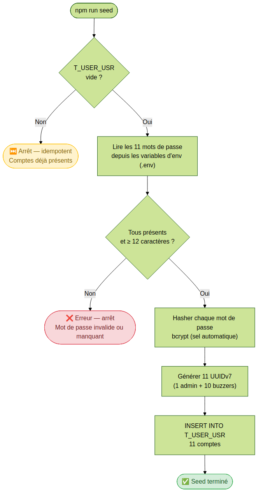
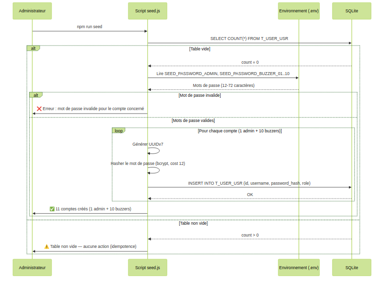

# US-002 — Seed des comptes utilisateurs

## 📋 Contexte projet

Le projet **Quiz Buzzer** se décompose en quatre applications :

| Application | Technologie | Rôle |
|---|---|---|
| **Buzzers** | PlatformIO / ESP32-S3 | Périphériques physiques de jeu |
| **App mobile** | Android / NFC | Configuration WiFi des buzzers |
| **App maître de jeu** | Angular | Interface de gestion des parties |
| **Serveur (hub)** | Node.js / JavaScript | Communication WebSocket entre l'app Angular et les buzzers, gestion du workflow des parties |

---

## 🎯 User Story

> **En tant qu'** administrateur système,
> **je veux** initialiser les comptes utilisateurs (1 admin + 10 buzzers) via un script de seed,
> **afin de** disposer immédiatement des comptes nécessaires au fonctionnement du quiz.

---

## ✅ Critères d'acceptance

> 🧪 **Exigence de couverture** — Chaque critère d'acceptance listé ci-dessous doit être couvert par **au moins un test automatisé** (unitaire et/ou d'intégration). Un CA non couvert par un test est considéré comme **non livré**. La couverture globale du code de l'US doit être **≥ 90%**, mesurée via `jest --coverage`.

### Seed des utilisateurs — `npm run seed`

| # | Critère | Résultat attendu |
|---|---|---|
| CA-1 | Au premier démarrage, si la table `T_USER_USR` est vide, les 11 comptes sont créés automatiquement | 1 admin + 10 buzzers (`quiz_buzzer_01` à `quiz_buzzer_10`) |
| CA-2 | Les mots de passe sont lus depuis des variables d'environnement (fichier `.env` non versionné) | Hashés avec bcrypt avant insertion |
| CA-3 | Le seed est idempotent : si les comptes existent déjà, le script ne fait rien | Pas de doublon ni de réinitialisation |
| CA-4 | Les mots de passe respectent la politique OWASP : 12 caractères minimum | Le seed refuse de s'exécuter si un mot de passe ne respecte pas la politique |

### Sécurité et transversalité

| # | Critère | Résultat attendu |
|---|---|---|
| CA-5 | Tests unitaires et d'intégration | Couverture de tests ≥ 90% |

---

## 🔄 Diagramme de flux



---

## 🔀 Diagramme de séquences



---

## 🔧 Spécifications techniques

| Élément | Choix |
|---|---|
| Runtime | Node.js 24 LTS (dernière version stable disponible) |
| Langage | JavaScript (ES Modules) |
| Base de données | SQLite |
| Tests | Jest (dernière version stable disponible) |
| Identifiants | UUIDv7 généré côté Node.js |
| Horodatage | ISO 8601 UTC (millisecondes), généré côté Node.js |
| Principes d'architecture | YAGNI, KISS, DRY, SOLID |

> ⚠️ **Exigence fondamentale** — Toute implémentation de cette US doit scrupuleusement respecter les principes **KISS** (solutions simples), **DRY** (pas de duplication), **YAGNI** (pas de fonctionnalité prématurée) et **SOLID** (architecture modulaire et responsabilités séparées). Ces principes prévalent sur toute optimisation prématurée ou généralisation non justifiée par un besoin immédiat documenté.

### Dépendance avec US-003

La table `T_USER_USR` est définie dans l'**US-003** (authentification par token). Cette US-002 ne crée pas la table : elle suppose que la base de données a déjà été initialisée (migration exécutée via l'US-003). Le script de seed s'appuie sur le schéma existant.

### Script npm

```json
{
  "scripts": {
    "seed": "node src/seed.js"
  }
}
```

Le script est exécuté en ligne de commande :

```bash
npm run seed
```

### Politique de mot de passe (OWASP)

| Règle | Valeur |
|---|---|
| Longueur minimale | 12 caractères |
| Longueur maximale | 72 caractères (limite bcrypt) |
| Algorithme de hachage | bcrypt (sel automatique) |
| Facteur de coût bcrypt | 12 (recommandation OWASP) |

Le script refuse de s'exécuter si un mot de passe lu dans les variables d'environnement ne respecte pas la politique. Le message d'erreur identifie le compte concerné sans exposer le mot de passe.

### Structure des fichiers

```
src/
  seed.js              ← script de seed principal
  seed/__tests__/
    seed.test.js       ← tests unitaires et d'intégration CA-1 à CA-5
```

---

## 🌱 Seed — Description

### Workflow du script

Le script `src/seed.js` suit les étapes suivantes :

```
1. Connexion à la base de données SQLite
2. Vérification : la table T_USER_USR est-elle vide ?
   → Non : arrêt immédiat (idempotence — CA-3)
   → Oui : suite
3. Lecture des 11 mots de passe depuis les variables d'environnement
4. Validation de chaque mot de passe (≥ 12 caractères, ≤ 72 caractères)
   → Invalide ou manquant : arrêt avec message d'erreur (CA-4)
   → Tous valides : suite
5. Hachage de chaque mot de passe avec bcrypt (facteur de coût : 12)
6. Génération de 11 UUIDv7 (un par compte)
7. Insertion des 11 comptes dans T_USER_USR
8. Affichage du résultat : "Seed terminé — 11 comptes créés."
```

### Comptes créés

| Login | Rôle | Variable d'environnement |
|---|---|---|
| `admin` | `admin` | `SEED_PASSWORD_ADMIN` |
| `quiz_buzzer_01` | `buzzer` | `SEED_PASSWORD_BUZZER_01` |
| `quiz_buzzer_02` | `buzzer` | `SEED_PASSWORD_BUZZER_02` |
| `quiz_buzzer_03` | `buzzer` | `SEED_PASSWORD_BUZZER_03` |
| `quiz_buzzer_04` | `buzzer` | `SEED_PASSWORD_BUZZER_04` |
| `quiz_buzzer_05` | `buzzer` | `SEED_PASSWORD_BUZZER_05` |
| `quiz_buzzer_06` | `buzzer` | `SEED_PASSWORD_BUZZER_06` |
| `quiz_buzzer_07` | `buzzer` | `SEED_PASSWORD_BUZZER_07` |
| `quiz_buzzer_08` | `buzzer` | `SEED_PASSWORD_BUZZER_08` |
| `quiz_buzzer_09` | `buzzer` | `SEED_PASSWORD_BUZZER_09` |
| `quiz_buzzer_10` | `buzzer` | `SEED_PASSWORD_BUZZER_10` |

### Format du fichier `.env`

Le fichier `.env` doit être créé à la racine du projet. Il n'est **pas versionné** (ajouté au `.gitignore`).

```dotenv
# Mots de passe du seed — NE PAS VERSIONNER CE FICHIER
SEED_PASSWORD_ADMIN=<mot_de_passe_admin_min_12_car>
SEED_PASSWORD_BUZZER_01=<mot_de_passe_buzzer_01_min_12_car>
SEED_PASSWORD_BUZZER_02=<mot_de_passe_buzzer_02_min_12_car>
SEED_PASSWORD_BUZZER_03=<mot_de_passe_buzzer_03_min_12_car>
SEED_PASSWORD_BUZZER_04=<mot_de_passe_buzzer_04_min_12_car>
SEED_PASSWORD_BUZZER_05=<mot_de_passe_buzzer_05_min_12_car>
SEED_PASSWORD_BUZZER_06=<mot_de_passe_buzzer_06_min_12_car>
SEED_PASSWORD_BUZZER_07=<mot_de_passe_buzzer_07_min_12_car>
SEED_PASSWORD_BUZZER_08=<mot_de_passe_buzzer_08_min_12_car>
SEED_PASSWORD_BUZZER_09=<mot_de_passe_buzzer_09_min_12_car>
SEED_PASSWORD_BUZZER_10=<mot_de_passe_buzzer_10_min_12_car>
```

> ⚠️ **Sécurité** — Ne jamais committer le fichier `.env` dans le dépôt Git. Utiliser `.env.example` (avec des valeurs fictives) comme modèle versionné.

---

## 📐 Périmètre

| Inclus | Exclu |
|---|---|
| Création des 11 comptes (1 admin + 10 buzzers) via script de seed | Création dynamique de comptes via API REST |
| Lecture des mots de passe depuis les variables d'environnement | Interface de gestion des utilisateurs |
| Validation de la politique de mot de passe (OWASP, ≥ 12 caractères) | Modification des comptes après création |
| Hachage bcrypt (facteur de coût : 12) | Suppression des comptes |
| Idempotence (pas de doublon si le seed est rejoué) | Authentification (gérée par US-003) |
| Génération des UUIDv7 | Déploiement / CI-CD |
| Tests unitaires et d'intégration (couverture ≥ 90%) | |

---

## 🔍 Points de vigilance

### Idempotence stricte

Le script vérifie l'état de la table `T_USER_USR` **avant** toute insertion. Si au moins un enregistrement existe, le script s'arrête sans effectuer aucune modification. Cette vérification doit être atomique pour éviter les conditions de course dans un environnement où plusieurs instances démarreraient simultanément.

### Sécurité des mots de passe

Les mots de passe ne doivent **jamais** apparaître dans les logs, les messages d'erreur ou le code source. Le fichier `.env` doit figurer dans `.gitignore`. Le fichier `.env.example` fourni dans le dépôt contient uniquement des valeurs fictives (ex. : `<mot_de_passe_admin_min_12_car>`).

### Limite bcrypt à 72 caractères

bcrypt tronque silencieusement les mots de passe à 72 octets. La validation doit donc imposer une longueur maximale de 72 caractères pour éviter que deux mots de passe distincts (mais partageant les 72 premiers caractères) produisent le même hash.

### Dépendance avec US-003

La table `T_USER_USR` et son schéma sont définis dans l'US-003. Le script de seed doit s'exécuter **après** l'initialisation de la base de données. L'ordre d'exécution recommandé est : `npm run migrate && npm run seed`.

### Facteur de coût bcrypt

Le facteur de coût bcrypt est fixé à **12**, conformément aux recommandations OWASP (2024). Ce facteur peut être ajusté via une variable d'environnement `BCRYPT_COST` pour adapter les performances selon l'environnement (ex. : `10` en tests pour accélérer l'exécution).

---
