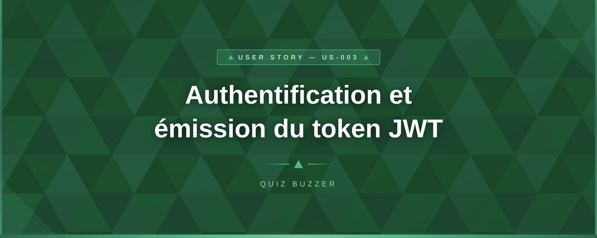
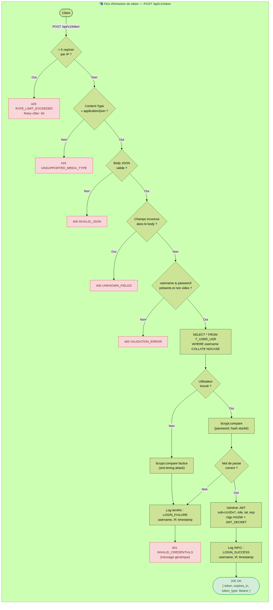
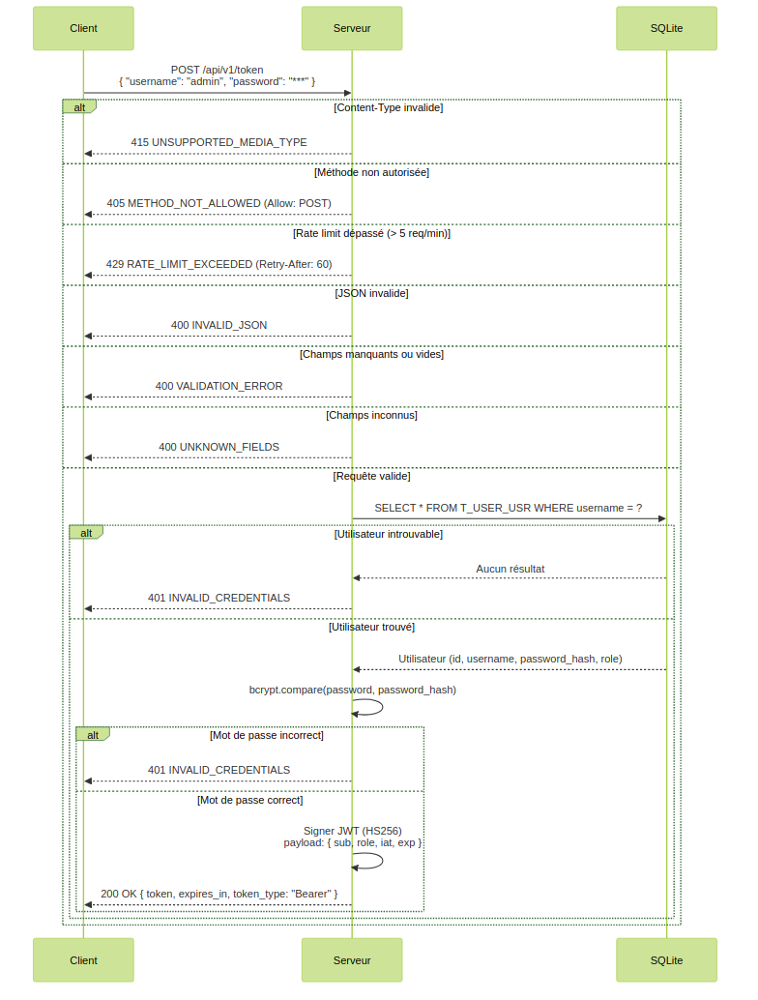

# US-003 — Authentification et émission du token JWT

## 📋 Contexte projet

Le projet **Quiz Buzzer** se décompose en quatre applications :

| Application | Technologie | Rôle |
|---|---|---|
| **Buzzers** | PlatformIO / ESP32-S3 | Périphériques physiques de jeu |
| **App mobile** | Android / NFC | Configuration WiFi des buzzers |
| **App maître de jeu** | Angular | Interface de gestion des parties |
| **Serveur (hub)** | Node.js / JavaScript | Communication WebSocket entre l'app Angular et les buzzers, gestion du workflow des parties |

---

## 🎯 User Story

> **En tant qu'** utilisateur (administrateur ou buzzer),
> **je veux** m'authentifier auprès du serveur avec mes identifiants (username / password),
> **afin d'** obtenir un token JWT me permettant d'accéder aux ressources protégées de l'API REST et du WebSocket.

---

## ✅ Critères d'acceptance

> 🧪 **Exigence de couverture** — Chaque critère d'acceptance listé ci-dessous doit être couvert par **au moins un test automatisé** (unitaire et/ou d'intégration). Un CA non couvert par un test est considéré comme **non livré**. La couverture globale du code de l'US doit être **≥ 90%**, mesurée via `jest --coverage`.

### Émission du token — `POST /api/v1/token`

| # | Critère | Résultat attendu |
|---|---|---|
| CA-1 | S'authentifier avec un username et un password valides | `200 OK` avec le token JWT, sa durée de validité et son type |
| CA-2 | Le token JWT est signé avec l'algorithme HS256 | Vérifiable avec le secret `JWT_SECRET` |
| CA-3 | Le payload JWT contient les claims `sub` (UUIDv7 utilisateur), `role` ("admin" ou "buzzer"), `iat` et `exp` | Claims conformes à la RFC 7519 |
| CA-4 | La durée de validité du token est de 1 heure par défaut | Configurable via la variable d'environnement `JWT_EXPIRATION` (en secondes) |
| CA-5 | L'endpoint n'est pas protégé par un Bearer token | Accessible sans authentification préalable |
| CA-6 | Le body ne doit contenir que les champs `username` et `password` | Champs inconnus → `400 UNKNOWN_FIELDS` |
| CA-7 | Le `Content-Type` doit être `application/json` | Sinon → `415 UNSUPPORTED_MEDIA_TYPE` |

### Gestion des erreurs d'authentification

| # | Critère | Résultat attendu |
|---|---|---|
| CA-8 | Username ou password incorrect | `401 INVALID_CREDENTIALS` — Message générique ne révélant pas lequel est faux |
| CA-9 | Champ `username` manquant ou vide | `400 VALIDATION_ERROR` |
| CA-10 | Champ `password` manquant ou vide | `400 VALIDATION_ERROR` |
| CA-11 | Corps de requête invalide (pas du JSON) | `400 INVALID_JSON` |
| CA-12 | Champs inconnus dans le body | `400 UNKNOWN_FIELDS` |

### Rate limiting spécifique

| # | Critère | Résultat attendu |
|---|---|---|
| CA-13 | Le endpoint `/token` est limité à 20 requêtes par minute **par adresse IP** | Dépassement → `429 RATE_LIMIT_EXCEEDED` avec header `Retry-After: 60` |

### Logging

| # | Critère | Résultat attendu |
|---|---|---|
| CA-14 | Les connexions réussies sont loggées | Log structuré JSON avec username, IP, timestamp, niveau `INFO` |
| CA-15 | Les connexions échouées sont loggées | Log structuré JSON avec username tenté, IP, timestamp, niveau `WARN` |

### Méthodes HTTP non supportées

| # | Critère | Résultat attendu |
|---|---|---|
| CA-16 | Méthode HTTP non supportée sur `/api/v1/token` | `405 METHOD_NOT_ALLOWED` avec header `Allow: POST` |

### Sécurité et transversalité

| # | Critère | Résultat attendu |
|---|---|---|
| CA-17 | Erreur serveur inattendue | `500 INTERNAL_SERVER_ERROR` (aucun détail technique exposé) |
| CA-18 | Tests unitaires et d'intégration | Couverture de tests ≥ 90% |

> **Note :** Les critères relatifs au seed des comptes utilisateurs (`npm run seed`) ont été extraits vers la **[US-002 — Seed des comptes utilisateurs](US-002-seed-users.md)**.

---

## 🔄 Diagramme de flux



---

## 🔀 Diagramme de séquences



---

## 🔧 Spécifications techniques

| Élément | Choix |
|---|---|
| Runtime | Node.js 24 LTS (dernière version stable disponible) |
| Langage | JavaScript (ES Modules) |
| Base de données | SQLite |
| Tests | Jest (dernière version stable disponible) |
| Identifiants | UUIDv7 généré côté Node.js |
| Horodatage | ISO 8601 UTC (millisecondes), généré côté Node.js |
| Hachage mot de passe | bcrypt avec sel automatique |
| Token | JWT signé HS256 |
| Principes d'architecture | YAGNI, KISS, DRY, SOLID |

> ⚠️ **Exigence fondamentale** — Toute implémentation de cette US doit scrupuleusement respecter les principes **KISS** (solutions simples), **DRY** (pas de duplication), **YAGNI** (pas de fonctionnalité prématurée) et **SOLID** (architecture modulaire et responsabilités séparées). Ces principes prévalent sur toute optimisation prématurée ou généralisation non justifiée par un besoin immédiat documenté.

### Schéma de la table

```sql
CREATE TABLE T_USER_USR
(
    USR_ID              TEXT PRIMARY KEY,
    USR_USERNAME        TEXT NOT NULL UNIQUE COLLATE NOCASE,
    USR_PASSWORD        TEXT NOT NULL,  -- hashed with bcrypt
    USR_ROLE            TEXT NOT NULL DEFAULT 'buzzer' CHECK (USR_ROLE IN ('admin', 'buzzer')),
    USR_CREATED_AT      TEXT NOT NULL,
    USR_LAST_UPDATED_AT TEXT DEFAULT NULL
);
```

### Politique de mots de passe

| Règle | Valeur |
|---|---|
| Longueur minimale | 12 caractères |
| Longueur maximale | 72 caractères (limite bcrypt) |
| Complexité | Aucune règle de complexité imposée (conformité OWASP) |
| Hachage | bcrypt avec sel automatique |

### Comptes utilisateurs

| Username | Rôle | Variable d'environnement du mot de passe |
|---|---|---|
| `admin` | `admin` | `ADMIN_PASSWORD` |
| `quiz_buzzer_01` | `buzzer` | `BUZZER_01_PASSWORD` |
| `quiz_buzzer_02` | `buzzer` | `BUZZER_02_PASSWORD` |
| `quiz_buzzer_03` | `buzzer` | `BUZZER_03_PASSWORD` |
| `quiz_buzzer_04` | `buzzer` | `BUZZER_04_PASSWORD` |
| `quiz_buzzer_05` | `buzzer` | `BUZZER_05_PASSWORD` |
| `quiz_buzzer_06` | `buzzer` | `BUZZER_06_PASSWORD` |
| `quiz_buzzer_07` | `buzzer` | `BUZZER_07_PASSWORD` |
| `quiz_buzzer_08` | `buzzer` | `BUZZER_08_PASSWORD` |
| `quiz_buzzer_09` | `buzzer` | `BUZZER_09_PASSWORD` |
| `quiz_buzzer_10` | `buzzer` | `BUZZER_10_PASSWORD` |

### Configuration — Variables d'environnement

| Variable | Description | Obligatoire | Défaut |
|---|---|---|---|
| `JWT_SECRET` | Secret de signature JWT (min 32 caractères) | ✅ Oui | — |
| `JWT_EXPIRATION` | Durée de validité du token en secondes | Non | `3600` |
| `ADMIN_PASSWORD` | Mot de passe initial de l'administrateur | ✅ Oui (seed) | — |
| `BUZZER_01_PASSWORD` à `BUZZER_10_PASSWORD` | Mots de passe initiaux des buzzers | ✅ Oui (seed) | — |

### Scripts npm

```json
{
  "scripts": {
    "seed": "node src/seed.js"
  }
}
```

### Versioning API

```
Base URL : /api/v1
```

---

## 📡 Endpoint

| Méthode | URL | Description | Auth | Code succès |
|---|---|---|---|---|
| `POST` | `/api/v1/token` | Obtenir un token JWT | Aucune | `200 OK` |

### Header `Allow`

| URL | Méthodes autorisées |
|---|---|
| `/api/v1/token` | `POST` |

### Format de la requête

```json
{
  "username": "admin",
  "password": "MonSuperMotDePasse!"
}
```

### Format de la réponse — Succès `200 OK`

```json
{
  "token": "eyJhbGciOiJIUzI1NiIsInR5cCI6IkpXVCJ9...",
  "expires_in": 3600,
  "token_type": "Bearer"
}
```

### Structure du payload JWT

```json
{
  "sub": "018e4f5a-8c3b-7d2e-9f1a-4b5c6d7e8f9a",
  "role": "admin",
  "iat": 1741358400,
  "exp": 1741362000
}
```

| Claim | Type | Description |
|---|---|---|
| `sub` (subject) | `string` | UUIDv7 de l'utilisateur (claim standard RFC 7519) |
| `role` | `string` | Rôle de l'utilisateur (`"admin"` ou `"buzzer"`) |
| `iat` (issued at) | `number` | Timestamp Unix de l'émission (automatique) |
| `exp` (expiration) | `number` | Timestamp Unix d'expiration (automatique) |

---

## 🔐 Mécanisme d'authentification

### Flux d'émission du token

```
Client → POST /api/v1/token { username, password }
  → 1. Validation du body (champs requis, pas de champs inconnus)
  → 2. Recherche de l'utilisateur par username (COLLATE NOCASE)
  → 3. Vérification du mot de passe avec bcrypt.compare()
  → 4. Si échec (étape 2 ou 3) → 401 INVALID_CREDENTIALS (message générique)
  → 5. Génération du JWT (sub, role, iat, exp) signé avec HS256
  → 6. Logging de la connexion (succès ou échec)
  → 7. Retour du token + métadonnées
```

### Utilisation du token

Le token émis par cet endpoint est utilisé dans deux contextes :

| Contexte | Mécanisme | US associée |
|---|---|---|
| **API REST** | Header `Authorization: Bearer <token>` à chaque requête | US-004 et suivantes |
| **WebSocket** | Authentification post-connexion (premier message) | US dédiée (à définir) |

> **Note :** L'authentification WebSocket sera spécifiée dans une US dédiée. Le token JWT émis ici sera réutilisé tel quel pour l'authentification WebSocket.

---

## 📝 Logging structuré

### Format JSON

**Connexion réussie :**

```json
{
  "timestamp": "2026-03-07T14:30:00.000Z",
  "level": "INFO",
  "event": "LOGIN_SUCCESS",
  "username": "admin",
  "ip": "192.168.1.100"
}
```

**Connexion échouée :**

```json
{
  "timestamp": "2026-03-07T14:30:05.000Z",
  "level": "WARN",
  "event": "LOGIN_FAILURE",
  "username": "admin",
  "ip": "192.168.1.105"
}
```

---

## 🚨 Catalogue des erreurs

| Code erreur | Code HTTP | Message | Contexte |
|---|---|---|---|
| `VALIDATION_ERROR` | `400` | _(dynamique selon le cas)_ | Champs username/password manquants ou vides |
| `INVALID_JSON` | `400` | "Request body must be valid JSON." | Corps non parseable |
| `INVALID_BODY` | `400` | "Request body must be a JSON object." | Le corps de la requête est du JSON valide mais n'est pas un objet (ex : tableau, null, primitive) |
| `UNKNOWN_FIELDS` | `400` | "Unknown field(s): foo, bar." | Champs non reconnus dans le body |
| `INVALID_CREDENTIALS` | `401` | "Invalid credentials." | Username ou password incorrect (message générique) |
| `METHOD_NOT_ALLOWED` | `405` | "HTTP method GET is not allowed on this resource." | Méthode non supportée (message dynamique) |
| `UNSUPPORTED_MEDIA_TYPE` | `415` | "Content-Type must be 'application/json'." | Content-Type incorrect |
| `RATE_LIMIT_EXCEEDED` | `429` | "Too many requests. Please retry in 60 seconds." | Dépassement rate limit (header `Retry-After: 60`) |
| `INTERNAL_SERVER_ERROR` | `500` | "An unexpected error occurred. Please try again later." | Erreur serveur (aucun détail technique exposé) |

### Format standard des réponses d'erreur

```json
{
  "status": 401,
  "error": "INVALID_CREDENTIALS",
  "message": "Invalid credentials."
}
```

---

## 🌱 Seed — Initialisation des comptes

> **Cette section est désormais couverte par la [US-002 — Seed des comptes utilisateurs](US-002-seed-users.md).** La table `T_USER_USR` et son schéma sont définis dans la présente US, mais le script d'initialisation des comptes (`npm run seed`) est spécifié dans l'US-002.

Le fichier `.env` doit inclure les variables de mots de passe suivantes (définies dans l'US-002) :

```env
JWT_SECRET=un-secret-long-et-aleatoire-de-min-32-caracteres
JWT_EXPIRATION=3600

ADMIN_PASSWORD=...
BUZZER_01_PASSWORD=... à BUZZER_10_PASSWORD=...
```

---

## 📐 Périmètre

| Inclus | Exclu |
|---|---|
| Endpoint `POST /api/v1/token` (émission JWT) | Refresh token (YAGNI) |
| Table `T_USER_USR` et schéma | Endpoint de création de comptes utilisateurs |
| Hachage bcrypt des mots de passe | Seed des comptes (→ **US-002**) |
| Logging structuré JSON (succès + échecs) | Changement de mot de passe (US dédiée) |
| Rate limiting spécifique 20 req/min par IP | Déconnexion (gérée côté client) |
| Gestion complète des erreurs | Authentification WebSocket (US dédiée) |
| Middlewares `authenticate` et `authorize` (réutilisables) | CRUD des utilisateurs |
| Tests unitaires et d'intégration (couverture ≥ 90%) | Interface Angular de connexion |

---

## 🔍 Points de vigilance

### Sécurité du message d'erreur d'authentification

Le message "Invalid credentials." est volontairement **générique**. Il ne doit jamais révéler si c'est le username qui n'existe pas ou le password qui est incorrect. Cela empêche l'énumération des comptes utilisateurs.

### Temps de réponse constant (timing attack)

Même si le username n'existe pas, le serveur doit effectuer une comparaison bcrypt factice (avec un hash bidon) pour que le **temps de réponse soit identique** que le username existe ou non. Cela prévient les attaques par analyse du temps de réponse (timing attack).

### Limite de bcrypt

bcrypt tronque les mots de passe à **72 bytes**. La politique impose un maximum de 72 caractères (ASCII) pour rester cohérent. Les mots de passe plus longs seraient silencieusement tronqués, ce qui pourrait causer de la confusion.

### Fichier `.env` et sécurité

Le fichier `.env` contient des mots de passe en clair et le secret JWT. Il **ne doit jamais** être versionné dans Git. Le fichier `.gitignore` doit inclure `.env`. Un fichier `.env.example` (sans valeurs) est versionné comme template.

### Rate limiting par IP sur `/token`

Le rate limiting de 20 req/min est **par adresse IP**, contrairement au rate limiting global de 100 req/min des autres endpoints. Cela permet à plusieurs clients de s'authentifier simultanément (ex : 10 buzzers + 1 admin au démarrage d'une partie) tout en limitant les tentatives de brute force depuis une même IP.

### Middlewares réutilisables (DRY / SOLID)

Les middlewares `authenticate` et `authorize` définis dans cette US sont les mêmes que ceux utilisés par l'US-004 et toutes les futures US. Ils sont conçus comme des composants indépendants conformément au principe de responsabilité unique (SRP). Le middleware `authorize` est paramétrable par rôle (Open/Closed Principle).

### Seed des comptes (US-002)

L'initialisation des 11 comptes utilisateurs (1 admin + 10 buzzers) est gérée par un script dédié spécifié dans **[US-002 — Seed des comptes utilisateurs](US-002-seed-users.md)**. Le schéma de la table `T_USER_USR` défini dans cette US est requis avant d'exécuter le seed.