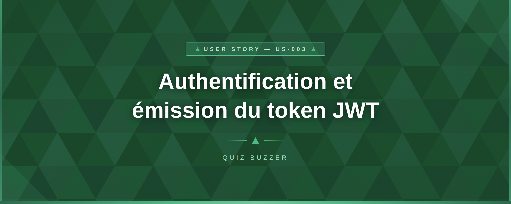
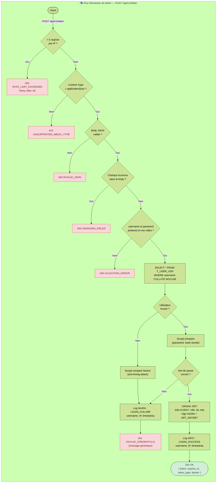
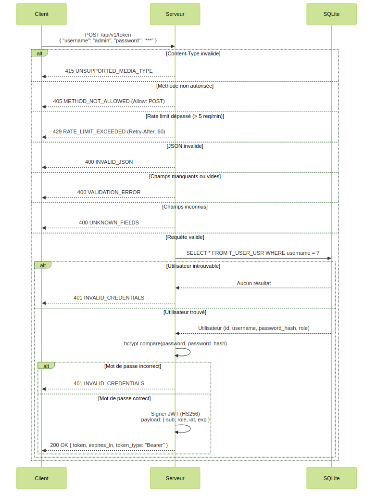

# US-003 — Authentification et émission du token JWT

## 📋 Contexte projet

Voir [VISION.md](VISION.md) pour la description complète du projet et de ses quatre applications.

---

## 🎯 User Story

> **En tant qu'** utilisateur (administrateur ou buzzer),
> **je veux** m'authentifier auprès du serveur avec mes identifiants (username / password),
> **afin d'** obtenir un token JWT me permettant d'accéder aux ressources protégées de l'API REST et du WebSocket.

---

## ✅ Critères d'acceptance

> 🧪 **Exigence de couverture** — Voir [Conventions techniques — Couverture des tests](CONVENTIONS-TECHNIQUES.md#-exigence-de-couverture-des-tests). Chaque CA doit être couvert par au moins un test automatisé. Couverture globale ≥ 90 %.

### Émission du token — `POST /api/v1/token`

| # | Critère | Résultat attendu |
|---|---|---|
| CA-1 | S'authentifier avec un username et un password valides | `200 OK` avec le token JWT, sa durée de validité et son type |
| CA-2 | Le token JWT est signé avec l'algorithme HS256 | Vérifiable avec le secret `JWT_SECRET` |
| CA-3 | Le payload JWT contient les claims `sub` (UUIDv7 utilisateur), `role` ("admin" ou "buzzer"), `iat` et `exp` | Claims conformes à la RFC 7519 |
| CA-4 | La durée de validité du token est de 1 heure par défaut | Configurable via la variable d'environnement `JWT_EXPIRATION` (en secondes) |
| CA-5 | L'endpoint n'est pas protégé par un Bearer token | Accessible sans authentification préalable |
| CA-6 | Le body ne doit contenir que les champs `username` et `password` | Champs inconnus → `400 UNKNOWN_FIELDS` |
| CA-7 | Le `Content-Type` doit être `application/json` | Sinon → `415 UNSUPPORTED_MEDIA_TYPE` |

### Gestion des erreurs d'authentification

| # | Critère | Résultat attendu |
|---|---|---|
| CA-8 | Username ou password incorrect | `401 INVALID_CREDENTIALS` — Message générique ne révélant pas lequel est faux |
| CA-9 | Champ `username` manquant ou vide | `400 VALIDATION_ERROR` |
| CA-10 | Champ `password` manquant ou vide | `400 VALIDATION_ERROR` |
| CA-11 | Corps de requête invalide (pas du JSON) | `400 INVALID_JSON` |
| CA-12 | Champs inconnus dans le body | `400 UNKNOWN_FIELDS` |

### Rate limiting spécifique

| # | Critère | Résultat attendu |
|---|---|---|
| CA-13 | Le endpoint `/token` est limité à 100 requêtes par minute **par adresse IP** | Dépassement → `429 RATE_LIMIT_EXCEEDED` avec header `Retry-After: 60` |

### Logging

| # | Critère | Résultat attendu |
|---|---|---|
| CA-14 | Les connexions réussies sont loggées | Log structuré JSON avec username, IP, timestamp, niveau `INFO` |
| CA-15 | Les connexions échouées sont loggées | Log structuré JSON avec username tenté, IP, timestamp, niveau `WARN` |

### Méthodes HTTP non supportées

| # | Critère | Résultat attendu |
|---|---|---|
| CA-16 | Méthode HTTP non supportée sur `/api/v1/token` | `405 METHOD_NOT_ALLOWED` avec header `Allow: POST` |

### Sécurité et transversalité

| # | Critère | Résultat attendu |
|---|---|---|
| CA-17 | Erreur serveur inattendue | `500 INTERNAL_SERVER_ERROR` (aucun détail technique exposé) |
| CA-18 | Tests unitaires et d'intégration | Couverture de tests ≥ 90% |

> **Note :** Les critères relatifs au seed des comptes utilisateurs (`npm run seed`) ont été extraits vers la **[US-002 — Seed des comptes utilisateurs](US-002-seed-users.md)**.

---

## 🔄 Diagramme de flux



---

## 🔀 Diagramme de séquences



---

## 🔧 Spécifications techniques

Voir les [Conventions techniques](CONVENTIONS-TECHNIQUES.md) pour la stack complète, les principes d'architecture (KISS, DRY, YAGNI, SOLID) et les conventions de données.

### Spécifications propres à cette US

| Élément | Choix |
|---|---|
| Hachage mot de passe | bcrypt avec sel automatique |
| Token | JWT signé HS256 |

### Schéma de la table

```sql
CREATE TABLE T_USER_USR
(
    USR_ID              TEXT PRIMARY KEY,
    USR_USERNAME        TEXT NOT NULL UNIQUE COLLATE NOCASE,
    USR_PASSWORD        TEXT NOT NULL,  -- hashed with bcrypt
    USR_ROLE            TEXT NOT NULL DEFAULT 'buzzer' CHECK (USR_ROLE IN ('admin', 'buzzer')),
    USR_CREATED_AT      TEXT NOT NULL,
    USR_LAST_UPDATED_AT TEXT DEFAULT NULL
);
```

### Politique de mots de passe

| Règle | Valeur |
|---|---|
| Longueur minimale | 12 caractères |
| Longueur maximale | 72 caractères (limite bcrypt) |
| Complexité | Aucune règle de complexité imposée (conformité OWASP) |
| Hachage | bcrypt avec sel automatique |

### Comptes utilisateurs

Voir [US-002 — Seed des comptes utilisateurs](US-002-seed-users.md) pour la liste complète des 11 comptes (1 admin + 10 buzzers) et leurs variables d'environnement.

### Configuration — Variables d'environnement

| Variable | Description | Obligatoire | Défaut |
|---|---|---|---|
| `JWT_SECRET` | Secret de signature JWT (min 32 caractères) | ✅ Oui | — |
| `JWT_EXPIRATION` | Durée de validité du token en secondes | Non | `3600` |

### Versioning API

Voir [Conventions techniques — Versioning API](CONVENTIONS-TECHNIQUES.md#-versioning-api).

---

## 📡 Endpoint

| Méthode | URL | Description | Auth | Code succès |
|---|---|---|---|---|
| `POST` | `/api/v1/token` | Obtenir un token JWT | Aucune | `200 OK` |

### Header `Allow`

| URL | Méthodes autorisées |
|---|---|
| `/api/v1/token` | `POST` |

### Format de la requête

```json
{
  "username": "admin",
  "password": "MonSuperMotDePasse!"
}
```

### Format de la réponse — Succès `200 OK`

```json
{
  "token": "eyJhbGciOiJIUzI1NiIsInR5cCI6IkpXVCJ9...",
  "expires_in": 3600,
  "token_type": "Bearer"
}
```

### Structure du payload JWT

Voir [Annexe — Authentification et autorisation — Payload JWT](AUTHENTIFICATION.md#-structure-du-payload-jwt) pour la structure complète des claims.

---

## 🔐 Mécanisme d'authentification

> **Source de vérité** — Cette US définit le mécanisme d'authentification. L'[Annexe — Authentification et autorisation](AUTHENTIFICATION.md) centralise la documentation de référence pour toutes les US qui réutilisent ce mécanisme.

### Flux d'émission du token

```
Client → POST /api/v1/token { username, password }
  → 1. Validation du body (champs requis, pas de champs inconnus)
  → 2. Recherche de l'utilisateur par username (COLLATE NOCASE)
  → 3. Vérification du mot de passe avec bcrypt.compare()
  → 4. Si échec (étape 2 ou 3) → 401 INVALID_CREDENTIALS (message générique)
  → 5. Génération du JWT (sub, role, iat, exp) signé avec HS256
  → 6. Logging de la connexion (succès ou échec)
  → 7. Retour du token + métadonnées
```

---

## 📝 Logging structuré

### Format JSON

**Connexion réussie :**

```json
{
  "timestamp": "2026-03-07T14:30:00.000Z",
  "level": "INFO",
  "event": "LOGIN_SUCCESS",
  "username": "admin",
  "ip": "192.168.1.100"
}
```

**Connexion échouée :**

```json
{
  "timestamp": "2026-03-07T14:30:05.000Z",
  "level": "WARN",
  "event": "LOGIN_FAILURE",
  "username": "admin",
  "ip": "192.168.1.105"
}
```

---

## 🚨 Catalogue des erreurs

### Codes standards
Voir le [Catalogue centralisé des codes d'erreur](error-codes.md#1️⃣-codes-derreur-standards-transversaux)

### Codes spécifiques à cette US

| Code erreur | Code HTTP | Message | Contexte |
|---|---|---|---|
| `INVALID_CREDENTIALS` | `401` | `"Invalid credentials."` | Username ou password incorrect (message générique) |

---

**Format standard des réponses d'erreur** — Voir [Format standard des réponses d'erreur](error-codes.md#-format-standard-des-réponses-derreur)

---

## 🌱 Seed — Initialisation des comptes

Voir [US-002 — Seed des comptes utilisateurs](US-002-seed-users.md) pour le script de seed, les variables d'environnement des mots de passe et le format du fichier `.env`.

---

## 📐 Périmètre

| Inclus | Exclu |
|---|---|
| Endpoint `POST /api/v1/token` (émission JWT) | Refresh token (YAGNI) |
| Table `T_USER_USR` et schéma | Endpoint de création de comptes utilisateurs |
| Hachage bcrypt des mots de passe | Seed des comptes (→ **US-002**) |
| Logging structuré JSON (succès + échecs) | Changement de mot de passe (US dédiée) |
| Rate limiting spécifique 100 req/min par IP | Déconnexion (gérée côté client) |
| Gestion complète des erreurs | Authentification WebSocket (US dédiée) |
| Middlewares `authenticate` et `authorize` (réutilisables) | CRUD des utilisateurs |
| Tests unitaires et d'intégration (couverture ≥ 90%) | Interface Angular de connexion |

---

## 🔍 Points de vigilance

### Sécurité du message d'erreur d'authentification

Le message "Invalid credentials." est volontairement **générique**. Il ne doit jamais révéler si c'est le username qui n'existe pas ou le password qui est incorrect. Cela empêche l'énumération des comptes utilisateurs.

### Temps de réponse constant (timing attack)

Même si le username n'existe pas, le serveur doit effectuer une comparaison bcrypt factice (avec un hash bidon) pour que le **temps de réponse soit identique** que le username existe ou non. Cela prévient les attaques par analyse du temps de réponse (timing attack).

### Limite de bcrypt

bcrypt tronque les mots de passe à **72 bytes**. La politique impose un maximum de 72 caractères (ASCII) pour rester cohérent. Les mots de passe plus longs seraient silencieusement tronqués, ce qui pourrait causer de la confusion.

### Fichier `.env` et sécurité

Le fichier `.env` contient des mots de passe en clair et le secret JWT. Il **ne doit jamais** être versionné dans Git. Le fichier `.gitignore` doit inclure `.env`. Un fichier `.env.example` (sans valeurs) est versionné comme template.

### Rate limiting par IP sur `/token`

Le rate limiting de 100 req/min est **par adresse IP**. Cela permet à plusieurs clients de s'authentifier simultanément (ex : 10 buzzers + 1 admin au démarrage d'une partie) tout en limitant les tentatives de brute force depuis une même IP.

### Middlewares réutilisables (DRY / SOLID)

Les middlewares `authenticate` et `authorize` définis dans cette US sont documentés dans l'[Annexe — Authentification et autorisation](AUTHENTIFICATION.md). Ils sont réutilisés par toutes les US avec des routes protégées (US-004 et suivantes).
