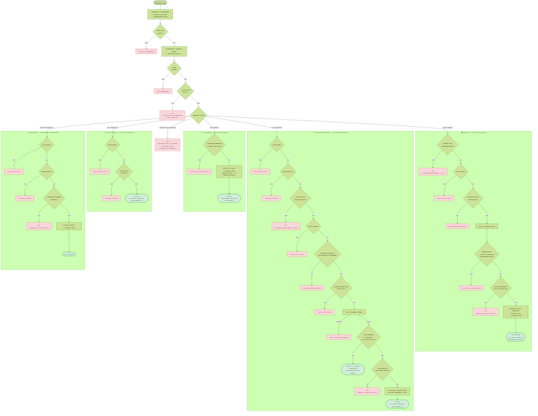

# US-003 — CRUD des thèmes de questions

## 📋 Contexte projet

Le projet **Quiz Buzzer** se décompose en quatre applications :

| Application | Technologie | Rôle |
|---|---|---|
| **Buzzers** | PlatformIO / ESP32-S3 | Périphériques physiques de jeu |
| **App mobile** | Android / NFC | Configuration WiFi des buzzers |
| **App maître de jeu** | Angular | Interface de gestion des parties |
| **Serveur (hub)** | Node.js / JavaScript | Communication WebSocket entre l'app Angular et les buzzers, gestion du workflow des parties |

---

## 🎯 User Story

> **En tant qu'** administrateur,
> **je veux** pouvoir créer, lire, modifier et supprimer des thèmes de questions,
> **afin de** catégoriser les questions du quiz.

---

## ✅ Critères d'acceptance

> 🧪 **Exigence de couverture** — Chaque critère d'acceptance listé ci-dessous doit être couvert par **au moins un test automatisé** (unitaire et/ou d'intégration). Un CA non couvert par un test est considéré comme **non livré**. La couverture globale du code de l'US doit être **≥ 90%**, mesurée via `jest --coverage`.

### Création — `POST /api/v1/themes`

| # | Critère | Résultat attendu |
|---|---|---|
| CA-1 | Créer un thème avec un nom valide | `201 Created` avec le thème créé (id, name, created_at, last_updated_at: null) |
| CA-2 | Le nom est normalisé avant validation (trim + collapse des espaces multiples) | `"  Science   fiction  " → "Science fiction"` |
| CA-3 | Le nom doit respecter la regex `/^[\p{Lu}][\p{L}\p{N} '\-]{1,38}[\p{L}\p{N}]$/u` | Entre 3 et 40 caractères, commence par une majuscule, finit par une lettre ou un chiffre |
| CA-4 | L'unicité du nom est insensible à la casse | `"Musique"` existe → `"MUSIQUE"` retourne `409 Conflict` |
| CA-5 | L'ID est un UUIDv7 généré côté Node.js | Format UUID standard (8-4-4-4-12) |
| CA-6 | Les horodatages sont en ISO 8601 UTC, générés côté Node.js | `created_at` rempli, `last_updated_at` à `null` |
| CA-7 | Le body ne doit contenir que le champ `name` | Champs inconnus → `400 UNKNOWN_FIELDS` |
| CA-8 | Le `Content-Type` doit être `application/json` | Sinon → `415 UNSUPPORTED_MEDIA_TYPE` |

### Lecture d'un thème — `GET /api/v1/themes/:id`

| # | Critère | Résultat attendu |
|---|---|---|
| CA-9 | Récupérer un thème par son ID | `200 OK` avec le thème (id, name, created_at, last_updated_at) |
| CA-10 | ID inexistant | `404 NOT_FOUND` |
| CA-11 | ID mal formé (pas un UUID valide) | `400 INVALID_UUID` |
| CA-12 | Un body éventuel est ignoré silencieusement | Aucune erreur |

### Lecture de la liste — `GET /api/v1/themes`

| # | Critère | Résultat attendu |
|---|---|---|
| CA-13 | Récupérer la liste des thèmes avec pagination | `200 OK` avec objet `{ data, page, limit, total, total_pages }` |
| CA-14 | Tri par date de création descendant (plus récents en premier) | Ordre garanti |
| CA-15 | Paramètres de pagination par défaut : `page=1`, `limit=20` | Appliqués si non fournis |
| CA-16 | Le paramètre `limit` est plafonné à `100` | `limit=200` → `400 INVALID_PAGINATION` |
| CA-17 | Paramètres de pagination invalides (négatifs, zéro, non numériques) | `400 INVALID_PAGINATION` |
| CA-18 | Page au-delà du total | `200 OK` avec `data: []` et métadonnées correctes |
| CA-19 | Aucun thème en base | `200 OK` avec `{ "data": [], "page": 1, "limit": 20, "total": 0, "total_pages": 0 }` |

### Modification — `PUT /api/v1/themes/:id`

| # | Critère | Résultat attendu |
|---|---|---|
| CA-20 | Modifier le nom d'un thème existant | `200 OK` avec le thème mis à jour, `last_updated_at` mis à jour |
| CA-21 | Les mêmes règles de validation et normalisation que le POST s'appliquent | Trim, collapse, regex, unicité |
| CA-22 | Le nom envoyé est identique à l'existant (comparaison insensible à la casse) | `200 OK` avec le thème inchangé, `last_updated_at` **non modifié** |
| CA-23 | L'ID peut être présent dans le body ; s'il l'est, il doit correspondre à l'URL | Sinon → `400 ID_MISMATCH` |
| CA-24 | Le nom est déjà pris par un autre thème | `409 THEME_ALREADY_EXISTS` |
| CA-25 | ID inexistant | `404 NOT_FOUND` |
| CA-26 | Le `Content-Type` doit être `application/json` | Sinon → `415 UNSUPPORTED_MEDIA_TYPE` |
| CA-27 | Le body ne doit contenir que les champs `name` (et optionnellement `id`) | Champs inconnus → `400 UNKNOWN_FIELDS` |

### Suppression — `DELETE /api/v1/themes/:id`

| # | Critère | Résultat attendu |
|---|---|---|
| CA-28 | Supprimer un thème existant sans questions liées | `204 No Content` sans body |
| CA-29 | ID inexistant | `404 NOT_FOUND` |
| CA-30 | Le thème a des questions associées | `409 THEME_HAS_QUESTIONS` |
| CA-31 | Un body éventuel est ignoré silencieusement | Aucune erreur |

### Sécurité et transversalité

| # | Critère | Résultat attendu |
|---|---|---|
| CA-32 | Toutes les routes sont protégées par un Bearer token | Token absent/invalide/expiré → `401 UNAUTHORIZED` |
| CA-33 | Seul l'administrateur peut effectuer des opérations | Rôle insuffisant → `403 FORBIDDEN` |
| CA-34 | Rate limiting : max 100 requêtes par minute | Dépassement → `429 RATE_LIMIT_EXCEEDED` avec header `Retry-After: 30` |
| CA-35 | Méthode HTTP non supportée sur une ressource | `405 METHOD_NOT_ALLOWED` avec header `Allow` adapté à la ressource |
| CA-36 | Erreur serveur inattendue | `500 INTERNAL_SERVER_ERROR` (aucun détail technique exposé) |
| CA-37 | Tests unitaires et d'intégration | Couverture de tests ≥ 90% |

---

## 🔄 Diagramme de flux



---

## 🧪 Cas de tests — requêtes cURL

> **Variables** à définir avant d'exécuter les commandes :
> ```bash
> BASE_URL=http://localhost:3000
> TOKEN=<votre_token_JWT_admin>           # Obtenu via POST /api/v1/token (US-002)
> TOKEN_BUZZER=<token_JWT_buzzer>         # Token avec rôle buzzer (pour CA-33)
> THEME_ID=<uuid_theme_créé>             # Renseigné après CA-1
> ```

### Création — `POST /api/v1/themes`

**CA-1** — Créer un thème avec un nom valide → `201 Created`

```bash
curl -s -w "\n→ HTTP %{http_code}\n" -X POST "$BASE_URL/api/v1/themes" \
  -H "Authorization: Bearer $TOKEN" \
  -H "Content-Type: application/json" \
  -d '{"name": "Musique"}'
```

**CA-2** — Nom normalisé (trim + collapse) → `201 Created` avec nom normalisé

```bash
curl -s -w "\n→ HTTP %{http_code}\n" -X POST "$BASE_URL/api/v1/themes" \
  -H "Authorization: Bearer $TOKEN" \
  -H "Content-Type: application/json" \
  -d '{"name": "  Science   fiction  "}'
# Vérifier que "name" dans la réponse vaut "Science fiction"
```

**CA-3** — Nom ne respectant pas la regex → `400 VALIDATION_ERROR`

```bash
curl -s -w "\n→ HTTP %{http_code}\n" -X POST "$BASE_URL/api/v1/themes" \
  -H "Authorization: Bearer $TOKEN" \
  -H "Content-Type: application/json" \
  -d '{"name": "m"}'
```

**CA-4** — Doublon de nom (insensible à la casse) → `409 THEME_ALREADY_EXISTS`

```bash
# Prérequis : le thème "Musique" existe déjà (cf. CA-1)
curl -s -w "\n→ HTTP %{http_code}\n" -X POST "$BASE_URL/api/v1/themes" \
  -H "Authorization: Bearer $TOKEN" \
  -H "Content-Type: application/json" \
  -d '{"name": "MUSIQUE"}'
```

**CA-7** — Champ inconnu dans le body → `400 UNKNOWN_FIELDS`

```bash
curl -s -w "\n→ HTTP %{http_code}\n" -X POST "$BASE_URL/api/v1/themes" \
  -H "Authorization: Bearer $TOKEN" \
  -H "Content-Type: application/json" \
  -d '{"name": "Sport", "couleur": "rouge"}'
```

**CA-8** — Content-Type incorrect → `415 UNSUPPORTED_MEDIA_TYPE`

```bash
curl -s -w "\n→ HTTP %{http_code}\n" -X POST "$BASE_URL/api/v1/themes" \
  -H "Authorization: Bearer $TOKEN" \
  -H "Content-Type: text/plain" \
  -d '{"name": "Sport"}'
```

### Lecture d'un thème — `GET /api/v1/themes/:id`

**CA-9** — Récupérer un thème par son ID → `200 OK`

```bash
curl -s -w "\n→ HTTP %{http_code}\n" -X GET "$BASE_URL/api/v1/themes/$THEME_ID" \
  -H "Authorization: Bearer $TOKEN"
```

**CA-10** — ID inexistant → `404 NOT_FOUND`

```bash
curl -s -w "\n→ HTTP %{http_code}\n" -X GET "$BASE_URL/api/v1/themes/018e4f5a-0000-0000-0000-000000000000" \
  -H "Authorization: Bearer $TOKEN"
```

**CA-11** — ID mal formé → `400 INVALID_UUID`

```bash
curl -s -w "\n→ HTTP %{http_code}\n" -X GET "$BASE_URL/api/v1/themes/not-a-uuid" \
  -H "Authorization: Bearer $TOKEN"
```

### Lecture de la liste — `GET /api/v1/themes`

**CA-13** — Lister les thèmes avec pagination → `200 OK`

```bash
curl -s -w "\n→ HTTP %{http_code}\n" -X GET "$BASE_URL/api/v1/themes" \
  -H "Authorization: Bearer $TOKEN"
```

**CA-16** — `limit` > 100 → `400 INVALID_PAGINATION`

```bash
curl -s -w "\n→ HTTP %{http_code}\n" -X GET "$BASE_URL/api/v1/themes?limit=200" \
  -H "Authorization: Bearer $TOKEN"
```

**CA-18** — Page au-delà du total → `200 OK` avec `data: []`

```bash
curl -s -w "\n→ HTTP %{http_code}\n" -X GET "$BASE_URL/api/v1/themes?page=999" \
  -H "Authorization: Bearer $TOKEN"
```

### Modification — `PUT /api/v1/themes/:id`

**CA-20** — Modifier le nom d'un thème existant → `200 OK`

```bash
curl -s -w "\n→ HTTP %{http_code}\n" -X PUT "$BASE_URL/api/v1/themes/$THEME_ID" \
  -H "Authorization: Bearer $TOKEN" \
  -H "Content-Type: application/json" \
  -d '{"name": "Musique classique"}'
```

**CA-23** — ID dans le body différent de l'URL → `400 ID_MISMATCH`

```bash
curl -s -w "\n→ HTTP %{http_code}\n" -X PUT "$BASE_URL/api/v1/themes/$THEME_ID" \
  -H "Authorization: Bearer $TOKEN" \
  -H "Content-Type: application/json" \
  -d '{"id": "018e4f5a-0000-0000-0000-000000000000", "name": "Musique classique"}'
```

**CA-25** — ID inexistant → `404 NOT_FOUND`

```bash
curl -s -w "\n→ HTTP %{http_code}\n" -X PUT "$BASE_URL/api/v1/themes/018e4f5a-0000-0000-0000-000000000000" \
  -H "Authorization: Bearer $TOKEN" \
  -H "Content-Type: application/json" \
  -d '{"name": "Inexistant"}'
```

### Suppression — `DELETE /api/v1/themes/:id`

**CA-28** — Supprimer un thème sans questions liées → `204 No Content`

```bash
curl -s -w "\n→ HTTP %{http_code}\n" -X DELETE "$BASE_URL/api/v1/themes/$THEME_ID" \
  -H "Authorization: Bearer $TOKEN"
```

**CA-29** — ID inexistant → `404 NOT_FOUND`

```bash
curl -s -w "\n→ HTTP %{http_code}\n" -X DELETE "$BASE_URL/api/v1/themes/018e4f5a-0000-0000-0000-000000000000" \
  -H "Authorization: Bearer $TOKEN"
```

**CA-30** — Thème avec questions associées → `409 THEME_HAS_QUESTIONS`

```bash
# Prérequis : $THEME_ID référence un thème ayant au moins une question liée
curl -s -w "\n→ HTTP %{http_code}\n" -X DELETE "$BASE_URL/api/v1/themes/$THEME_ID" \
  -H "Authorization: Bearer $TOKEN"
```

### Sécurité et transversalité

**CA-32** — Token absent → `401 UNAUTHORIZED`

```bash
curl -s -w "\n→ HTTP %{http_code}\n" -X GET "$BASE_URL/api/v1/themes"
```

**CA-33** — Rôle buzzer → `403 FORBIDDEN`

```bash
curl -s -w "\n→ HTTP %{http_code}\n" -X GET "$BASE_URL/api/v1/themes" \
  -H "Authorization: Bearer $TOKEN_BUZZER"
```

**CA-34** — Rate limiting dépassé (> 100 req/min) → `429 RATE_LIMIT_EXCEEDED` avec header `Retry-After: 30`

```bash
for i in $(seq 1 101); do
  curl -s -o /dev/null -w "%{http_code}\n" -X GET "$BASE_URL/api/v1/themes" \
    -H "Authorization: Bearer $TOKEN"
done
# La 101ème requête doit retourner 429 avec le header Retry-After: 30
```

**CA-35** — Méthode HTTP non supportée → `405 METHOD_NOT_ALLOWED` avec header `Allow` adapté

```bash
curl -s -v -w "\n→ HTTP %{http_code}\n" -X PATCH "$BASE_URL/api/v1/themes" \
  -H "Authorization: Bearer $TOKEN"
# Vérifier : code 405 et header "Allow: GET, POST"
```

---

## 🔧 Spécifications techniques

| Élément | Choix |
|---|---|
| Runtime | Node.js 24 LTS (dernière version stable disponible) |
| Langage | JavaScript (ES Modules) |
| Base de données | SQLite |
| Tests | Jest (dernière version stable disponible) |
| Identifiants | UUIDv7 généré côté Node.js |
| Horodatage | ISO 8601 UTC (millisecondes), généré côté Node.js |
| Principes d'architecture | YAGNI, KISS, DRY, SOLID |

> ⚠️ **Exigence fondamentale** — Toute implémentation de cette US doit scrupuleusement respecter les principes **KISS** (solutions simples), **DRY** (pas de duplication), **YAGNI** (pas de fonctionnalité prématurée) et **SOLID** (architecture modulaire et responsabilités séparées). Ces principes prévalent sur toute optimisation prématurée ou généralisation non justifiée par un besoin immédiat documenté.

### Schéma de la table

```sql
CREATE TABLE T_THEME_THM
(
    THM_ID              TEXT PRIMARY KEY,
    THM_NAME            TEXT NOT NULL UNIQUE COLLATE NOCASE,
    THM_CREATED_AT      TEXT NOT NULL,
    THM_LAST_UPDATED_AT TEXT DEFAULT NULL
);
```

### Validation du nom — Pipeline de normalisation

```
Entrée brute
  → 1. Trim (suppression espaces début/fin)
  → 2. Collapse (espaces multiples → espace simple)
  → 3. Vérification non vide
  → 4. Validation regex : /^[\p{Lu}][\p{L}\p{N} '\-]{1,38}[\p{L}\p{N}]$/u
  → 5. Vérification unicité (COLLATE NOCASE) en base
```

### Versioning API

```
Base URL : /api/v1
```

### Format JSON — Convention snake_case

**Thème unitaire :**

```json
{
  "id": "018e4f5a-8c3b-7d2e-9f1a-4b5c6d7e8f9a",
  "name": "Musique",
  "created_at": "2026-03-07T14:30:00.000Z",
  "last_updated_at": null
}
```

**Liste paginée :**

```json
{
  "data": [
    {
      "id": "018e4f5b-1a2b-7c3d-8e4f-5a6b7c8d9e0f",
      "name": "Sport",
      "created_at": "2026-03-07T14:30:00.000Z",
      "last_updated_at": "2026-03-07T15:45:00.000Z"
    },
    {
      "id": "018e4f5a-8c3b-7d2e-9f1a-4b5c6d7e8f9a",
      "name": "Musique",
      "created_at": "2026-03-06T10:00:00.000Z",
      "last_updated_at": null
    }
  ],
  "page": 1,
  "limit": 20,
  "total": 2,
  "total_pages": 1
}
```

---

## 📡 Endpoints

| Méthode | URL | Description | Auth | Code succès |
|---|---|---|---|---|
| `POST` | `/api/v1/themes` | Créer un thème | Bearer (admin) | `201 Created` |
| `GET` | `/api/v1/themes` | Lister les thèmes (paginé) | Bearer (admin) | `200 OK` |
| `GET` | `/api/v1/themes/:id` | Récupérer un thème | Bearer (admin) | `200 OK` |
| `PUT` | `/api/v1/themes/:id` | Modifier un thème | Bearer (admin) | `200 OK` |
| `DELETE` | `/api/v1/themes/:id` | Supprimer un thème | Bearer (admin) | `204 No Content` |

### Headers `Allow` par ressource

| URL | Méthodes autorisées |
|---|---|
| `/api/v1/themes` | `GET, POST` |
| `/api/v1/themes/:id` | `GET, PUT, DELETE` |

---

## 🔐 Authentification et autorisation

### Mécanisme

Toutes les routes de cette US sont protégées par un **JSON Web Token (JWT)** transmis via le header HTTP `Authorization`.

| Élément | Valeur |
|---|---|
| Type de token | JWT |
| Algorithme de signature | HS256 (symétrique) |
| Transmission | Header `Authorization: Bearer <token>` |
| Secret de signature | Variable d'environnement `JWT_SECRET` (min 32 caractères) |
| Durée de validité | 1 heure (3600s), configurable via variable d'environnement `JWT_EXPIRATION` |
| Renouvellement | Reconnexion via `POST /api/v1/token` (US-002) |

### Structure du payload JWT

```json
{
  "sub": "018e4f5a-8c3b-7d2e-9f1a-4b5c6d7e8f9a",
  "role": "admin",
  "iat": 1741358400,
  "exp": 1741362000
}
```

| Claim | Type | Description |
|---|---|---|
| `sub` (subject) | `string` | UUIDv7 de l'utilisateur (claim standard RFC 7519) |
| `role` | `string` | Rôle de l'utilisateur (`"admin"` pour cette US) |
| `iat` (issued at) | `number` | Timestamp Unix de l'émission (automatique) |
| `exp` (expiration) | `number` | Timestamp Unix d'expiration (automatique) |

### Architecture middleware — Chaîne de vérification

Deux middlewares distincts sont chaînés sur chaque route, conformément au **principe de responsabilité unique (SRP / SOLID)** :

**Middleware 1 — `authenticate`** (vérification du token)

```
Requête entrante
  → Header "Authorization" présent ?
    → Non → 401 UNAUTHORIZED
  → Format "Bearer <token>" valide ?
    → Non → 401 UNAUTHORIZED
  → Décodage et vérification du JWT (signature + expiration)
    → Échec → 401 UNAUTHORIZED
  → ✅ Injecte les claims décodés dans l'objet requête (req.user)
```

**Middleware 2 — `authorize(role)`** (vérification du rôle)

```
req.user disponible ?
  → Non → 401 UNAUTHORIZED (sécurité défensive)
  → req.user.role === rôle attendu ?
    → Non → 403 FORBIDDEN
    → ✅ Passe au handler suivant
```

**Application sur les routes :**

```javascript
router.post('/api/v1/themes',       authenticate, authorize('admin'), createTheme);
router.get('/api/v1/themes',        authenticate, authorize('admin'), listThemes);
router.get('/api/v1/themes/:id',    authenticate, authorize('admin'), getTheme);
router.put('/api/v1/themes/:id',    authenticate, authorize('admin'), updateTheme);
router.delete('/api/v1/themes/:id', authenticate, authorize('admin'), deleteTheme);
```

> **Réutilisabilité (DRY) :** Les middlewares `authenticate` et `authorize` sont conçus pour être réutilisés par toutes les futures US (questions, parties, etc.). Le middleware `authorize` accepte n'importe quel rôle en paramètre, permettant de supporter d'autres profils à l'avenir sans modification du middleware lui-même (**Open/Closed Principle — SOLID**).

---

## 🚨 Catalogue des erreurs

| Code erreur | Code HTTP | Message | Contexte |
|---|---|---|---|
| `VALIDATION_ERROR` | `400` | _(dynamique selon le cas)_ | Nom manquant, vide, trop court/long, format invalide |
| `INVALID_UUID` | `400` | `"The provided ID is not a valid UUID."` | ID mal formé dans l'URL |
| `INVALID_JSON` | `400` | `"Request body must be valid JSON."` | Corps non parseable |
| `UNKNOWN_FIELDS` | `400` | `"Unknown field(s): foo, bar."` | Champs non reconnus dans le body |
| `ID_MISMATCH` | `400` | `"The ID in the request body does not match the URL parameter."` | ID body ≠ ID URL |
| `INVALID_PAGINATION` | `400` | `"Invalid pagination parameters."` | page/limit invalides |
| `UNAUTHORIZED` | `401` | `"Authentication token is missing or invalid."` | Token absent/expiré/invalide |
| `FORBIDDEN` | `403` | `"You do not have permission to perform this action."` | Rôle insuffisant |
| `NOT_FOUND` | `404` | `"The requested theme was not found."` | Ressource inexistante |
| `METHOD_NOT_ALLOWED` | `405` | `"HTTP method PATCH is not allowed on this resource."` | Méthode non supportée (message dynamique) |
| `THEME_ALREADY_EXISTS` | `409` | `"A theme with this name already exists."` | Doublon de nom |
| `THEME_HAS_QUESTIONS` | `409` | `"Cannot delete this theme: questions are still associated with it."` | Suppression avec dépendances |
| `UNSUPPORTED_MEDIA_TYPE` | `415` | `"Content-Type must be 'application/json'."` | Content-Type incorrect |
| `RATE_LIMIT_EXCEEDED` | `429` | `"Too many requests. Please retry in 30 seconds."` | Dépassement rate limit (header `Retry-After: 30`) |
| `INTERNAL_SERVER_ERROR` | `500` | `"An unexpected error occurred. Please try again later."` | Erreur serveur (aucun détail technique exposé) |

### Format standard des réponses d'erreur

```json
{
  "status": 400,
  "error": "VALIDATION_ERROR",
  "message": "Theme name must start with an uppercase letter."
}
```

---

## 📐 Périmètre

| Inclus | Exclu |
|---|---|
| CRUD complet des thèmes (POST, GET, GET list, PUT, DELETE) | CRUD des questions (US dédiée) |
| Validation et normalisation du nom | Interface Angular de gestion des thèmes |
| Pagination de la liste | Recherche / filtrage des thèmes |
| Gestion complète des erreurs | Émission du token / endpoint `/token` (US-002) |
| Middlewares `authenticate` et `authorize` (réutilisables) | Déploiement / CI-CD |
| Rate limiting (100 req/min) | |
| Tests unitaires et d'intégration (couverture ≥ 90%) | |

---

## 🔍 Points de vigilance

### Unicité insensible à la casse

L'unicité du nom repose sur `COLLATE NOCASE` dans SQLite. La contrainte `UNIQUE` de la table gère nativement ce cas. Côté application, la vérification d'unicité avant insertion/mise à jour doit également être insensible à la casse pour fournir un message d'erreur clair (`409`) plutôt qu'une erreur SQL brute.

### PUT sans changement réel

Lorsqu'un `PUT` est effectué avec un nom identique à l'existant (comparaison insensible à la casse), la colonne `THM_LAST_UPDATED_AT` ne doit **pas** être mise à jour. Le serveur doit comparer le nom normalisé entrant avec le nom stocké (insensible à la casse) avant de décider de mettre à jour l'horodatage.

### Suppression avec dépendances

Avant toute suppression, le serveur doit vérifier l'existence de questions liées au thème via la clé étrangère. Si des questions existent, la suppression est refusée avec une erreur `409 THEME_HAS_QUESTIONS`. Cette vérification applicative est préférable à un `ON DELETE RESTRICT` seul, car elle permet de retourner un message d'erreur métier explicite.

### Cohérence UUIDv7 et horodatage

L'UUIDv7 et le `created_at` étant tous deux générés côté Node.js, il est recommandé de les générer au même instant pour garantir la cohérence entre le timestamp intégré dans l'UUIDv7 et la valeur de `created_at`.

### Sécurité des erreurs 500

Les erreurs internes ne doivent jamais exposer de détails techniques (stack trace, message SQL, etc.) dans la réponse API. Ces informations doivent être consignées uniquement dans les logs serveur.

### Middlewares réutilisables (DRY / SOLID)

Les middlewares `authenticate` et `authorize` sont conçus comme des composants indépendants et réutilisables. Ils ne contiennent aucune logique spécifique aux thèmes et pourront être appliqués tels quels sur les futures routes (questions, parties, etc.). Le middleware `authorize` est paramétrable par rôle, ce qui respecte le principe Open/Closed (SOLID) : il est ouvert à l'extension (nouveaux rôles) sans modification de son code.