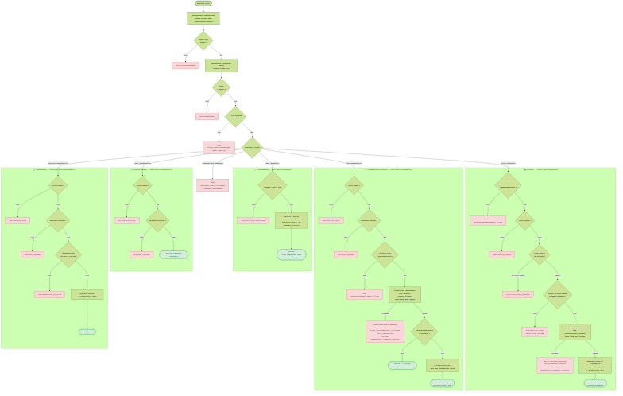
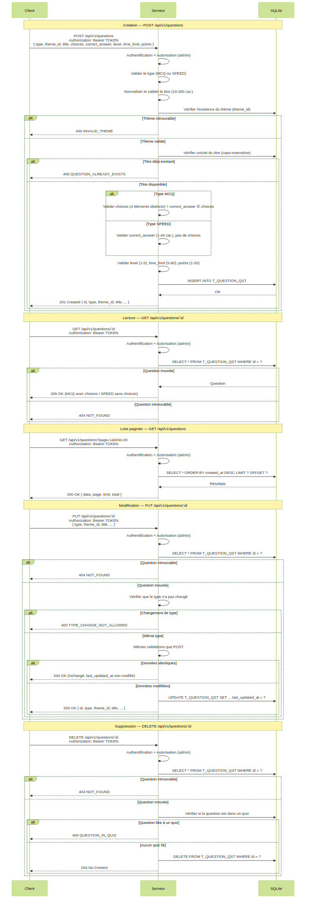

# US-005 — CRUD de base des questions

## 📋 Contexte projet

Le projet **Quiz Buzzer** se décompose en quatre applications :

| Application | Technologie | Rôle |
|---|---|---|
| **Buzzers** | PlatformIO / ESP32-S3 | Périphériques physiques de jeu |
| **App mobile** | Android / NFC | Configuration WiFi des buzzers |
| **App maître de jeu** | Angular | Interface de gestion des parties |
| **Serveur (hub)** | Node.js / JavaScript | Communication WebSocket entre l'app Angular et les buzzers, gestion du workflow des parties |

---

## 🎯 User Story

> **En tant qu'** administrateur,
> **je veux** pouvoir créer, lire, modifier (totalement) et supprimer des questions,
> **afin de** constituer la banque de questions du quiz.

---

## ✅ Critères d'acceptance

> 🧪 **Exigence de couverture** — Chaque critère d'acceptance listé ci-dessous doit être couvert par **au moins un test automatisé** (unitaire et/ou d'intégration). Un CA non couvert par un test est considéré comme **non livré**. La couverture globale du code de l'US doit être **≥ 90%**, mesurée via `jest --coverage`.

> **Note :** Le filtrage avancé de la liste (`theme_id`, `type`, `level`, `level_min`/`max`, `time_limit_min`/`max`, `points_min`/`max`) est spécifié dans **[US-006 — Filtrage avancé de la liste des questions](US-006-questions-filtrage.md)**. La modification partielle PATCH (JSON Merge Patch RFC 7396) est spécifiée dans **[US-007 — Modification partielle des questions](US-007-questions-patch.md)**.

### Création — `POST /api/v1/questions`

| # | Critère | Résultat attendu |
|---|---|---|
| CA-1 | Créer une question MCQ avec tous les champs valides | `201 Created` avec la question créée (id, type, theme_id, title, choices, correct_answer, level, time_limit, points, image_path: null, audio_path: null, created_at, last_updated_at: null) |
| CA-2 | Créer une question SPEED avec tous les champs valides | `201 Created` avec la question créée (id, type, theme_id, title, correct_answer, level, time_limit, points, image_path: null, audio_path: null, created_at, last_updated_at: null) — `choices` absent de la réponse |
| CA-3 | Le titre est normalisé avant validation (trim + collapse des espaces multiples) | `"  Quelle est   la capitale  " → "Quelle est la capitale"` |
| CA-4 | Le titre doit commencer par une majuscule Unicode et faire entre 10 et 250 caractères (émojis acceptés) | Sinon → `400 VALIDATION_ERROR` |
| CA-5 | L'unicité du titre est insensible à la casse | Titre existant → `409 QUESTION_ALREADY_EXISTS` |
| CA-6 | Le champ `type` doit valoir `"MCQ"` ou `"SPEED"` | Sinon → `400 VALIDATION_ERROR` |
| CA-7 | Le champ `theme_id` doit référencer un thème existant | Sinon → `400 INVALID_THEME` |
| CA-8 | Le champ `theme_id` doit être un UUID valide | Sinon → `400 INVALID_UUID` |
| CA-9 | Pour une question MCQ, `choices` est obligatoire : tableau d'exactement 4 chaînes non vides (1–40 caractères chacune), toutes distinctes (insensible à la casse) | Sinon → `400 VALIDATION_ERROR` |
| CA-10 | Pour une question MCQ, `correct_answer` est obligatoire et doit correspondre exactement (insensible à la casse) à l'un des 4 `choices` | Sinon → `400 VALIDATION_ERROR` |
| CA-11 | Pour une question SPEED, `choices` doit être absent du body | Présent → `400 VALIDATION_ERROR` |
| CA-12 | Pour une question SPEED, `correct_answer` est obligatoire (1–40 caractères) | Sinon → `400 VALIDATION_ERROR` |
| CA-13 | Le champ `level` doit être un entier entre 1 et 5 | Sinon → `400 VALIDATION_ERROR` |
| CA-14 | Le champ `time_limit` doit être un entier entre 5 et 60 (en secondes) | Sinon → `400 VALIDATION_ERROR` |
| CA-15 | Le champ `points` doit être un entier entre 1 et 50 | Sinon → `400 VALIDATION_ERROR` |
| CA-16 | L'ID est un UUIDv7 généré côté Node.js | Format UUID standard (8-4-4-4-12) |
| CA-17 | Les horodatages sont en ISO 8601 UTC, générés côté Node.js | `created_at` rempli, `last_updated_at` à `null` |
| CA-18 | Les champs `image_path` et `audio_path` ne sont pas acceptés dans le body du POST | Présents → `400 UNKNOWN_FIELDS` |
| CA-19 | Le body ne doit contenir que les champs autorisés selon le type | Champs inconnus → `400 UNKNOWN_FIELDS` |
| CA-20 | Le `Content-Type` doit être `application/json` | Sinon → `415 UNSUPPORTED_MEDIA_TYPE` |

### Lecture d'une question — `GET /api/v1/questions/:id`

| # | Critère | Résultat attendu |
|---|---|---|
| CA-21 | Récupérer une question MCQ par son ID | `200 OK` avec la question complète (incluant `choices`) |
| CA-22 | Récupérer une question SPEED par son ID | `200 OK` avec la question (sans `choices`) |
| CA-23 | ID inexistant | `404 NOT_FOUND` |
| CA-24 | ID mal formé (pas un UUID valide) | `400 INVALID_UUID` |
| CA-25 | Un body éventuel est ignoré silencieusement | Aucune erreur |

### Lecture de la liste — `GET /api/v1/questions`

| # | Critère | Résultat attendu |
|---|---|---|
| CA-26 | Récupérer la liste des questions avec pagination | `200 OK` avec objet `{ data, page, limit, total, total_pages }` |
| CA-27 | Tri par date de création descendant (plus récents en premier) | Ordre garanti |
| CA-28 | Paramètres de pagination par défaut : `page=1`, `limit=20` | Appliqués si non fournis |
| CA-29 | Le paramètre `limit` est plafonné à `100` | `limit=200` → `400 INVALID_PAGINATION` |
| CA-30 | Paramètres de pagination invalides (négatifs, zéro, non numériques) | `400 INVALID_PAGINATION` |
| CA-31 | Page au-delà du total | `200 OK` avec `data: []` et métadonnées correctes |
| CA-32 | Aucune question en base | `200 OK` avec `{ "data": [], "page": 1, "limit": 20, "total": 0, "total_pages": 0 }` |

### Modification complète — `PUT /api/v1/questions/:id`

| # | Critère | Résultat attendu |
|---|---|---|
| CA-33 | Modifier une question MCQ avec tous les champs valides | `200 OK` avec la question mise à jour, `last_updated_at` mis à jour |
| CA-34 | Modifier une question SPEED avec tous les champs valides | `200 OK` avec la question mise à jour, `last_updated_at` mis à jour |
| CA-35 | Toutes les règles de validation du POST s'appliquent | Trim, collapse, regex, unicité, cohérence type/champs |
| CA-36 | Le `type` envoyé doit correspondre au type actuel de la question | Changement de type → `400 TYPE_CHANGE_NOT_ALLOWED` |
| CA-37 | Les données envoyées sont identiques à l'existant | `200 OK` avec la question inchangée, `last_updated_at` **non modifié** |
| CA-38 | L'ID peut être présent dans le body ; s'il l'est, il doit correspondre à l'URL | Sinon → `400 ID_MISMATCH` |
| CA-39 | Le titre est déjà pris par une autre question | `409 QUESTION_ALREADY_EXISTS` |
| CA-40 | ID inexistant | `404 NOT_FOUND` |
| CA-41 | Le `Content-Type` doit être `application/json` | Sinon → `415 UNSUPPORTED_MEDIA_TYPE` |
| CA-42 | Le body ne doit contenir que les champs autorisés (tous les champs métier requis, `id` optionnel ; **`image_path` et `audio_path` ne sont pas gérés par ce endpoint**) | Champs inconnus (dont `image_path`/`audio_path`) → `400 UNKNOWN_FIELDS` |
| CA-43 | Le PUT exige tous les champs métier : `type`, `theme_id`, `title`, `correct_answer`, `level`, `time_limit`, `points` (+ `choices` si MCQ). **Les champs médias `image_path` et `audio_path` ne sont ni créés, ni modifiés, ni réinitialisés par ce PUT et conservent leur valeur actuelle**. | Champ métier manquant → `400 VALIDATION_ERROR` |

### Suppression — `DELETE /api/v1/questions/:id`

| # | Critère | Résultat attendu |
|---|---|---|
| CA-44 | Supprimer une question existante | `204 No Content` sans body |
| CA-45 | ID inexistant | `404 NOT_FOUND` |
| CA-46 | ID mal formé | `400 INVALID_UUID` |
| CA-47 | Un body éventuel est ignoré silencieusement | Aucune erreur |

### Garde de suppression des thèmes (implémentation du TODO CA-30 de l'US-004)

| # | Critère | Résultat attendu |
|---|---|---|
| CA-48 | Suppression d'un thème qui a des questions associées | `409 THEME_HAS_QUESTIONS` avec message `"Cannot delete this theme: questions are still associated with it."` |
| CA-49 | Suppression d'un thème sans questions associées | `204 No Content` (comportement inchangé) |

### Sécurité et transversalité

| # | Critère | Résultat attendu |
|---|---|---|
| CA-50 | Toutes les routes sont protégées par un Bearer token | Token absent/invalide/expiré → `401 UNAUTHORIZED` |
| CA-51 | Seul l'administrateur peut effectuer des opérations | Rôle insuffisant → `403 FORBIDDEN` |
| CA-52 | Rate limiting : max 100 requêtes par minute | Dépassement → `429 RATE_LIMIT_EXCEEDED` avec header `Retry-After: 60` |
| CA-53 | Méthode HTTP non supportée sur une ressource | `405 METHOD_NOT_ALLOWED` avec header `Allow` adapté à la ressource |
| CA-54 | Erreur serveur inattendue | `500 INTERNAL_SERVER_ERROR` (aucun détail technique exposé) |
| CA-55 | Tests unitaires et d'intégration | Couverture de tests ≥ 90% |

---

## 🔄 Diagramme de flux



---

## 🔀 Diagramme de séquences



---

## 🧪 Cas de tests — requêtes cURL

> **Variables** à définir avant d'exécuter les commandes :
> ```bash
> BASE_URL=http://localhost:3000
> TOKEN=<votre_token_JWT_admin>                              # Obtenu via POST /api/v1/token (US-003)
> THEME_ID=018e4f5a-8c3b-7d2e-9f1a-4b5c6d7e8f9a            # UUID d'un thème existant en base
> THEME_EMPTY_ID=018e4f5b-1a2b-7c3d-8e4f-5a6b7c8d9e0f      # UUID d'un thème sans question liée
> TOKEN_USER=<token_JWT_avec_role_user>                      # Token non-admin (pour CA-51)
> QUESTION_MCQ_ID=018e4f5c-2b3c-7d4e-9f5a-6b7c8d9e0f1a     # UUID d'une question MCQ existante
> QUESTION_SPD_ID=018e4f5d-3c4d-7e5f-0a6b-7c8d9e0f1a2b     # UUID d'une question SPEED existante
> ```

### Création — `POST /api/v1/questions`

**CA-1** — Créer une question MCQ avec tous les champs valides → `201 Created`

```bash
curl -s -w "\n→ HTTP %{http_code}\n" -X POST "$BASE_URL/api/v1/questions" \
  -H "Authorization: Bearer $TOKEN" \
  -H "Content-Type: application/json" \
  -d '{
    "type": "MCQ",
    "theme_id": "018e4f5a-8c3b-7d2e-9f1a-4b5c6d7e8f9a",
    "title": "Quelle est la capitale de la France ?",
    "choices": ["Paris", "Lyon", "Marseille", "Toulouse"],
    "correct_answer": "Paris",
    "level": 1,
    "time_limit": 30,
    "points": 10
  }'
```

**CA-2** — Créer une question SPEED avec tous les champs valides → `201 Created` (`choices` absent de la réponse)

```bash
curl -s -w "\n→ HTTP %{http_code}\n" -X POST "$BASE_URL/api/v1/questions" \
  -H "Authorization: Bearer $TOKEN" \
  -H "Content-Type: application/json" \
  -d '{
    "type": "SPEED",
    "theme_id": "018e4f5a-8c3b-7d2e-9f1a-4b5c6d7e8f9a",
    "title": "Quel est le plus grand océan du monde ?",
    "correct_answer": "Pacifique",
    "level": 2,
    "time_limit": 15,
    "points": 20
  }'
```

**CA-3** — Titre normalisé (trim + collapse des espaces multiples) → `201 Created` avec titre normalisé

```bash
curl -s -w "\n→ HTTP %{http_code}\n" -X POST "$BASE_URL/api/v1/questions" \
  -H "Authorization: Bearer $TOKEN" \
  -H "Content-Type: application/json" \
  -d '{
    "type": "SPEED",
    "theme_id": "018e4f5a-8c3b-7d2e-9f1a-4b5c6d7e8f9a",
    "title": "  Quel est   le plus long   fleuve du monde  ?",
    "correct_answer": "Nil",
    "level": 2,
    "time_limit": 20,
    "points": 15
  }'
# Vérifier que "title" dans la réponse vaut "Quel est le plus long fleuve du monde ?"
```

**CA-4** — Titre ne commençant pas par une majuscule Unicode → `400 VALIDATION_ERROR`

```bash
curl -s -w "\n→ HTTP %{http_code}\n" -X POST "$BASE_URL/api/v1/questions" \
  -H "Authorization: Bearer $TOKEN" \
  -H "Content-Type: application/json" \
  -d '{
    "type": "SPEED",
    "theme_id": "018e4f5a-8c3b-7d2e-9f1a-4b5c6d7e8f9a",
    "title": "quel est le plus long fleuve du monde ?",
    "correct_answer": "Nil",
    "level": 2,
    "time_limit": 20,
    "points": 15
  }'
```

**CA-5** — Doublon de titre (insensible à la casse) → `409 QUESTION_ALREADY_EXISTS`

```bash
# Prérequis : la question "Quelle est la capitale de la France ?" existe déjà (cf. CA-1)
curl -s -w "\n→ HTTP %{http_code}\n" -X POST "$BASE_URL/api/v1/questions" \
  -H "Authorization: Bearer $TOKEN" \
  -H "Content-Type: application/json" \
  -d '{
    "type": "MCQ",
    "theme_id": "018e4f5a-8c3b-7d2e-9f1a-4b5c6d7e8f9a",
    "title": "QUELLE EST LA CAPITALE DE LA FRANCE ?",
    "choices": ["Paris", "Lyon", "Marseille", "Toulouse"],
    "correct_answer": "Paris",
    "level": 1,
    "time_limit": 30,
    "points": 10
  }'
```

**CA-6** — Type invalide → `400 VALIDATION_ERROR`

```bash
curl -s -w "\n→ HTTP %{http_code}\n" -X POST "$BASE_URL/api/v1/questions" \
  -H "Authorization: Bearer $TOKEN" \
  -H "Content-Type: application/json" \
  -d '{
    "type": "OPEN",
    "theme_id": "018e4f5a-8c3b-7d2e-9f1a-4b5c6d7e8f9a",
    "title": "Qui a peint la Joconde ?",
    "correct_answer": "Léonard de Vinci",
    "level": 3,
    "time_limit": 30,
    "points": 10
  }'
```

**CA-7** — `theme_id` inexistant → `400 INVALID_THEME`

```bash
curl -s -w "\n→ HTTP %{http_code}\n" -X POST "$BASE_URL/api/v1/questions" \
  -H "Authorization: Bearer $TOKEN" \
  -H "Content-Type: application/json" \
  -d '{
    "type": "SPEED",
    "theme_id": "018e4f5a-0000-0000-0000-000000000000",
    "title": "Qui a peint la Joconde ?",
    "correct_answer": "Léonard de Vinci",
    "level": 3,
    "time_limit": 30,
    "points": 10
  }'
```

**CA-8** — `theme_id` mal formé (pas un UUID valide) → `400 INVALID_UUID`

```bash
curl -s -w "\n→ HTTP %{http_code}\n" -X POST "$BASE_URL/api/v1/questions" \
  -H "Authorization: Bearer $TOKEN" \
  -H "Content-Type: application/json" \
  -d '{
    "type": "SPEED",
    "theme_id": "not-a-valid-uuid",
    "title": "Qui a peint la Joconde ?",
    "correct_answer": "Léonard de Vinci",
    "level": 3,
    "time_limit": 30,
    "points": 10
  }'
```

**CA-9** — MCQ avec `choices` invalide (3 éléments au lieu de 4) → `400 VALIDATION_ERROR`

```bash
curl -s -w "\n→ HTTP %{http_code}\n" -X POST "$BASE_URL/api/v1/questions" \
  -H "Authorization: Bearer $TOKEN" \
  -H "Content-Type: application/json" \
  -d '{
    "type": "MCQ",
    "theme_id": "018e4f5a-8c3b-7d2e-9f1a-4b5c6d7e8f9a",
    "title": "Dans quel pays se trouve la Tour Eiffel ?",
    "choices": ["France", "Italie", "Espagne"],
    "correct_answer": "France",
    "level": 1,
    "time_limit": 30,
    "points": 10
  }'
```

**CA-10** — MCQ avec `correct_answer` absent des `choices` → `400 VALIDATION_ERROR`

```bash
curl -s -w "\n→ HTTP %{http_code}\n" -X POST "$BASE_URL/api/v1/questions" \
  -H "Authorization: Bearer $TOKEN" \
  -H "Content-Type: application/json" \
  -d '{
    "type": "MCQ",
    "theme_id": "018e4f5a-8c3b-7d2e-9f1a-4b5c6d7e8f9a",
    "title": "Dans quel pays se trouve la Tour Eiffel ?",
    "choices": ["France", "Italie", "Espagne", "Portugal"],
    "correct_answer": "Allemagne",
    "level": 1,
    "time_limit": 30,
    "points": 10
  }'
```

**CA-11** — SPEED avec `choices` présent → `400 VALIDATION_ERROR`

```bash
curl -s -w "\n→ HTTP %{http_code}\n" -X POST "$BASE_URL/api/v1/questions" \
  -H "Authorization: Bearer $TOKEN" \
  -H "Content-Type: application/json" \
  -d '{
    "type": "SPEED",
    "theme_id": "018e4f5a-8c3b-7d2e-9f1a-4b5c6d7e8f9a",
    "title": "Dans quel pays se trouve la Tour Eiffel ?",
    "choices": ["France", "Italie", "Espagne", "Portugal"],
    "correct_answer": "France",
    "level": 1,
    "time_limit": 30,
    "points": 10
  }'
```

**CA-12** — SPEED sans `correct_answer` → `400 VALIDATION_ERROR`

```bash
curl -s -w "\n→ HTTP %{http_code}\n" -X POST "$BASE_URL/api/v1/questions" \
  -H "Authorization: Bearer $TOKEN" \
  -H "Content-Type: application/json" \
  -d '{
    "type": "SPEED",
    "theme_id": "018e4f5a-8c3b-7d2e-9f1a-4b5c6d7e8f9a",
    "title": "Dans quel pays se trouve la Tour Eiffel ?",
    "level": 1,
    "time_limit": 30,
    "points": 10
  }'
```

**CA-13** — `level` hors plage (valeur > 5) → `400 VALIDATION_ERROR`

```bash
curl -s -w "\n→ HTTP %{http_code}\n" -X POST "$BASE_URL/api/v1/questions" \
  -H "Authorization: Bearer $TOKEN" \
  -H "Content-Type: application/json" \
  -d '{
    "type": "SPEED",
    "theme_id": "018e4f5a-8c3b-7d2e-9f1a-4b5c6d7e8f9a",
    "title": "Quelle est la vitesse de la lumière ?",
    "correct_answer": "300 000 km/s",
    "level": 6,
    "time_limit": 30,
    "points": 10
  }'
```

**CA-14** — `time_limit` hors plage (valeur < 5) → `400 VALIDATION_ERROR`

```bash
curl -s -w "\n→ HTTP %{http_code}\n" -X POST "$BASE_URL/api/v1/questions" \
  -H "Authorization: Bearer $TOKEN" \
  -H "Content-Type: application/json" \
  -d '{
    "type": "SPEED",
    "theme_id": "018e4f5a-8c3b-7d2e-9f1a-4b5c6d7e8f9a",
    "title": "Quelle est la vitesse de la lumière ?",
    "correct_answer": "300 000 km/s",
    "level": 3,
    "time_limit": 2,
    "points": 10
  }'
```

**CA-15** — `points` hors plage (valeur > 50) → `400 VALIDATION_ERROR`

```bash
curl -s -w "\n→ HTTP %{http_code}\n" -X POST "$BASE_URL/api/v1/questions" \
  -H "Authorization: Bearer $TOKEN" \
  -H "Content-Type: application/json" \
  -d '{
    "type": "SPEED",
    "theme_id": "018e4f5a-8c3b-7d2e-9f1a-4b5c6d7e8f9a",
    "title": "Quelle est la vitesse de la lumière ?",
    "correct_answer": "300 000 km/s",
    "level": 3,
    "time_limit": 30,
    "points": 100
  }'
```

**CA-16** — L'ID retourné est un UUIDv7 → vérifier le format dans la réponse `201`

```bash
curl -s -X POST "$BASE_URL/api/v1/questions" \
  -H "Authorization: Bearer $TOKEN" \
  -H "Content-Type: application/json" \
  -d '{
    "type": "SPEED",
    "theme_id": "018e4f5a-8c3b-7d2e-9f1a-4b5c6d7e8f9a",
    "title": "Combien de planètes compte le système solaire ?",
    "correct_answer": "8",
    "level": 1,
    "time_limit": 10,
    "points": 5
  }'
# Vérifier que le champ "id" de la réponse respecte le format UUID (8-4-4-4-12)
# et que le 4ème bloc commence par "7" (version UUIDv7)
```

**CA-17** — Horodatages ISO 8601 UTC → `created_at` rempli, `last_updated_at` à `null`

```bash
curl -s -X POST "$BASE_URL/api/v1/questions" \
  -H "Authorization: Bearer $TOKEN" \
  -H "Content-Type: application/json" \
  -d '{
    "type": "SPEED",
    "theme_id": "018e4f5a-8c3b-7d2e-9f1a-4b5c6d7e8f9a",
    "title": "Quel est le symbole chimique de l'\''or ?",
    "correct_answer": "Au",
    "level": 2,
    "time_limit": 15,
    "points": 10
  }'
# Vérifier : "created_at" est une date ISO 8601 UTC (ex. "2026-03-09T14:30:00.000Z")
# et "last_updated_at" vaut null
```

**CA-18** — `image_path` ou `audio_path` dans le body du POST → `400 UNKNOWN_FIELDS`

```bash
curl -s -w "\n→ HTTP %{http_code}\n" -X POST "$BASE_URL/api/v1/questions" \
  -H "Authorization: Bearer $TOKEN" \
  -H "Content-Type: application/json" \
  -d '{
    "type": "SPEED",
    "theme_id": "018e4f5a-8c3b-7d2e-9f1a-4b5c6d7e8f9a",
    "title": "Quel est le symbole chimique de l'\''argent ?",
    "correct_answer": "Ag",
    "level": 2,
    "time_limit": 15,
    "points": 10,
    "image_path": "/images/argent.jpg"
  }'
```

**CA-19** — Champ inconnu dans le body → `400 UNKNOWN_FIELDS`

```bash
curl -s -w "\n→ HTTP %{http_code}\n" -X POST "$BASE_URL/api/v1/questions" \
  -H "Authorization: Bearer $TOKEN" \
  -H "Content-Type: application/json" \
  -d '{
    "type": "SPEED",
    "theme_id": "018e4f5a-8c3b-7d2e-9f1a-4b5c6d7e8f9a",
    "title": "Quel est le symbole chimique de l'\''argent ?",
    "correct_answer": "Ag",
    "level": 2,
    "time_limit": 15,
    "points": 10,
    "difficulty": "easy"
  }'
```

**CA-20** — `Content-Type` incorrect → `415 UNSUPPORTED_MEDIA_TYPE`

```bash
curl -s -w "\n→ HTTP %{http_code}\n" -X POST "$BASE_URL/api/v1/questions" \
  -H "Authorization: Bearer $TOKEN" \
  -H "Content-Type: text/plain" \
  -d '{"type":"SPEED","theme_id":"018e4f5a-8c3b-7d2e-9f1a-4b5c6d7e8f9a","title":"Test du content type post","correct_answer":"Test","level":1,"time_limit":10,"points":5}'
```

### Lecture d'une question — `GET /api/v1/questions/:id`

**CA-21** — Récupérer une question MCQ → `200 OK` avec `choices`

```bash
curl -s -w "\n→ HTTP %{http_code}\n" -X GET "$BASE_URL/api/v1/questions/$QUESTION_MCQ_ID" \
  -H "Authorization: Bearer $TOKEN"
```

**CA-22** — Récupérer une question SPEED → `200 OK` sans `choices`

```bash
curl -s -w "\n→ HTTP %{http_code}\n" -X GET "$BASE_URL/api/v1/questions/$QUESTION_SPD_ID" \
  -H "Authorization: Bearer $TOKEN"
```

**CA-23** — ID inexistant → `404 NOT_FOUND`

```bash
curl -s -w "\n→ HTTP %{http_code}\n" -X GET "$BASE_URL/api/v1/questions/018e4f5a-0000-0000-0000-000000000000" \
  -H "Authorization: Bearer $TOKEN"
```

**CA-24** — ID mal formé → `400 INVALID_UUID`

```bash
curl -s -w "\n→ HTTP %{http_code}\n" -X GET "$BASE_URL/api/v1/questions/not-a-valid-uuid" \
  -H "Authorization: Bearer $TOKEN"
```

**CA-25** — Body éventuel ignoré silencieusement → aucune erreur

```bash
curl -s -w "\n→ HTTP %{http_code}\n" -X GET "$BASE_URL/api/v1/questions/$QUESTION_MCQ_ID" \
  -H "Authorization: Bearer $TOKEN" \
  -H "Content-Type: application/json" \
  -d '{"ignored": "body"}'
```

### Lecture de la liste — `GET /api/v1/questions`

> **Note :** Les cas de tests de filtrage avancé (CA-1 à CA-12 de l'US-006) sont documentés dans **[US-006 — Filtrage avancé de la liste des questions](US-006-questions-filtrage.md)**.

**CA-26** — Récupérer la liste paginée → `200 OK` avec `{ data, page, limit, total, total_pages }`

```bash
curl -s -w "\n→ HTTP %{http_code}\n" -X GET "$BASE_URL/api/v1/questions" \
  -H "Authorization: Bearer $TOKEN"
```

**CA-27** — Tri par date de création descendant → vérifier que `data[0].created_at` ≥ `data[1].created_at`

```bash
curl -s -X GET "$BASE_URL/api/v1/questions" \
  -H "Authorization: Bearer $TOKEN"
# Inspecter la réponse : data[0].created_at doit être >= data[1].created_at
```

**CA-28** — Paramètres de pagination par défaut (`page=1`, `limit=20`) appliqués si non fournis

```bash
curl -s -X GET "$BASE_URL/api/v1/questions" \
  -H "Authorization: Bearer $TOKEN"
# Vérifier "page": 1 et "limit": 20 dans la réponse
```

**CA-29** — `limit` > 100 → `400 INVALID_PAGINATION`

```bash
curl -s -w "\n→ HTTP %{http_code}\n" -X GET "$BASE_URL/api/v1/questions?limit=200" \
  -H "Authorization: Bearer $TOKEN"
```

**CA-30** — `page` invalide (valeur négative) → `400 INVALID_PAGINATION`

```bash
curl -s -w "\n→ HTTP %{http_code}\n" -X GET "$BASE_URL/api/v1/questions?page=-1" \
  -H "Authorization: Bearer $TOKEN"
```

**CA-31** — Page au-delà du total → `200 OK` avec `data: []` et métadonnées correctes

```bash
curl -s -w "\n→ HTTP %{http_code}\n" -X GET "$BASE_URL/api/v1/questions?page=9999" \
  -H "Authorization: Bearer $TOKEN"
```

**CA-32** — Aucune question en base → `200 OK` avec `{ "data": [], "page": 1, "limit": 20, "total": 0, "total_pages": 0 }`

```bash
# À exécuter sur une base vide (ou après avoir supprimé toutes les questions)
curl -s -w "\n→ HTTP %{http_code}\n" -X GET "$BASE_URL/api/v1/questions" \
  -H "Authorization: Bearer $TOKEN"
```

### Modification complète — `PUT /api/v1/questions/:id`

**CA-33** — Modifier une question MCQ avec tous les champs valides → `200 OK`, `last_updated_at` mis à jour

```bash
curl -s -w "\n→ HTTP %{http_code}\n" -X PUT "$BASE_URL/api/v1/questions/$QUESTION_MCQ_ID" \
  -H "Authorization: Bearer $TOKEN" \
  -H "Content-Type: application/json" \
  -d '{
    "type": "MCQ",
    "theme_id": "018e4f5a-8c3b-7d2e-9f1a-4b5c6d7e8f9a",
    "title": "Quelle est la capitale de la France (mise à jour) ?",
    "choices": ["Paris", "Lyon", "Bordeaux", "Toulouse"],
    "correct_answer": "Paris",
    "level": 2,
    "time_limit": 20,
    "points": 15
  }'
```

**CA-34** — Modifier une question SPEED avec tous les champs valides → `200 OK`, `last_updated_at` mis à jour

```bash
curl -s -w "\n→ HTTP %{http_code}\n" -X PUT "$BASE_URL/api/v1/questions/$QUESTION_SPD_ID" \
  -H "Authorization: Bearer $TOKEN" \
  -H "Content-Type: application/json" \
  -d '{
    "type": "SPEED",
    "theme_id": "018e4f5a-8c3b-7d2e-9f1a-4b5c6d7e8f9a",
    "title": "Quel est le plus grand océan du monde (mise à jour) ?",
    "correct_answer": "Pacifique",
    "level": 3,
    "time_limit": 20,
    "points": 25
  }'
```

**CA-35** — Règles de validation du POST s'appliquent (ex. titre trop court) → `400 VALIDATION_ERROR`

```bash
curl -s -w "\n→ HTTP %{http_code}\n" -X PUT "$BASE_URL/api/v1/questions/$QUESTION_SPD_ID" \
  -H "Authorization: Bearer $TOKEN" \
  -H "Content-Type: application/json" \
  -d '{
    "type": "SPEED",
    "theme_id": "018e4f5a-8c3b-7d2e-9f1a-4b5c6d7e8f9a",
    "title": "Court",
    "correct_answer": "Test",
    "level": 1,
    "time_limit": 30,
    "points": 10
  }'
```

**CA-36** — Changement de type → `400 TYPE_CHANGE_NOT_ALLOWED`

```bash
# QUESTION_MCQ_ID est de type MCQ, on tente de la passer en SPEED
curl -s -w "\n→ HTTP %{http_code}\n" -X PUT "$BASE_URL/api/v1/questions/$QUESTION_MCQ_ID" \
  -H "Authorization: Bearer $TOKEN" \
  -H "Content-Type: application/json" \
  -d '{
    "type": "SPEED",
    "theme_id": "018e4f5a-8c3b-7d2e-9f1a-4b5c6d7e8f9a",
    "title": "Quelle est la capitale de la France ?",
    "correct_answer": "Paris",
    "level": 1,
    "time_limit": 30,
    "points": 10
  }'
```

**CA-37** — Données identiques à l'existant → `200 OK`, `last_updated_at` non modifié

```bash
# Envoyer exactement les mêmes données que la question actuelle
curl -s -w "\n→ HTTP %{http_code}\n" -X PUT "$BASE_URL/api/v1/questions/$QUESTION_SPD_ID" \
  -H "Authorization: Bearer $TOKEN" \
  -H "Content-Type: application/json" \
  -d '{
    "type": "SPEED",
    "theme_id": "018e4f5a-8c3b-7d2e-9f1a-4b5c6d7e8f9a",
    "title": "Quel est le plus grand océan du monde ?",
    "correct_answer": "Pacifique",
    "level": 2,
    "time_limit": 15,
    "points": 20
  }'
# Vérifier que last_updated_at n'a pas changé par rapport à avant l'appel
```

**CA-38** — `id` dans le body ne correspond pas à l'URL → `400 ID_MISMATCH`

```bash
curl -s -w "\n→ HTTP %{http_code}\n" -X PUT "$BASE_URL/api/v1/questions/$QUESTION_SPD_ID" \
  -H "Authorization: Bearer $TOKEN" \
  -H "Content-Type: application/json" \
  -d '{
    "id": "018e4f5a-0000-0000-0000-000000000001",
    "type": "SPEED",
    "theme_id": "018e4f5a-8c3b-7d2e-9f1a-4b5c6d7e8f9a",
    "title": "Quel est le plus grand océan du monde ?",
    "correct_answer": "Pacifique",
    "level": 2,
    "time_limit": 15,
    "points": 20
  }'
```

**CA-39** — Titre déjà pris par une autre question → `409 QUESTION_ALREADY_EXISTS`

```bash
# QUESTION_SPD_ID est SPEED, tenter de lui donner le titre de la MCQ (QUESTION_MCQ_ID)
curl -s -w "\n→ HTTP %{http_code}\n" -X PUT "$BASE_URL/api/v1/questions/$QUESTION_SPD_ID" \
  -H "Authorization: Bearer $TOKEN" \
  -H "Content-Type: application/json" \
  -d '{
    "type": "SPEED",
    "theme_id": "018e4f5a-8c3b-7d2e-9f1a-4b5c6d7e8f9a",
    "title": "Quelle est la capitale de la France ?",
    "correct_answer": "Paris",
    "level": 2,
    "time_limit": 15,
    "points": 20
  }'
```

**CA-40** — ID inexistant → `404 NOT_FOUND`

```bash
curl -s -w "\n→ HTTP %{http_code}\n" -X PUT "$BASE_URL/api/v1/questions/018e4f5a-0000-0000-0000-000000000000" \
  -H "Authorization: Bearer $TOKEN" \
  -H "Content-Type: application/json" \
  -d '{
    "type": "SPEED",
    "theme_id": "018e4f5a-8c3b-7d2e-9f1a-4b5c6d7e8f9a",
    "title": "Question inexistante à modifier ?",
    "correct_answer": "Test",
    "level": 1,
    "time_limit": 30,
    "points": 10
  }'
```

**CA-41** — `Content-Type` incorrect → `415 UNSUPPORTED_MEDIA_TYPE`

```bash
curl -s -w "\n→ HTTP %{http_code}\n" -X PUT "$BASE_URL/api/v1/questions/$QUESTION_SPD_ID" \
  -H "Authorization: Bearer $TOKEN" \
  -H "Content-Type: text/plain" \
  -d '{"type":"SPEED","theme_id":"018e4f5a-8c3b-7d2e-9f1a-4b5c6d7e8f9a","title":"Test du content type put","correct_answer":"Test","level":1,"time_limit":30,"points":10}'
```

**CA-42** — `image_path` dans le body du PUT → `400 UNKNOWN_FIELDS`

```bash
curl -s -w "\n→ HTTP %{http_code}\n" -X PUT "$BASE_URL/api/v1/questions/$QUESTION_SPD_ID" \
  -H "Authorization: Bearer $TOKEN" \
  -H "Content-Type: application/json" \
  -d '{
    "type": "SPEED",
    "theme_id": "018e4f5a-8c3b-7d2e-9f1a-4b5c6d7e8f9a",
    "title": "Quel est le plus grand océan du monde ?",
    "correct_answer": "Pacifique",
    "level": 2,
    "time_limit": 15,
    "points": 20,
    "image_path": "/images/ocean.jpg"
  }'
```

**CA-43** — Champ métier manquant dans le PUT → `400 VALIDATION_ERROR`

```bash
# correct_answer, level, time_limit et points sont absents
curl -s -w "\n→ HTTP %{http_code}\n" -X PUT "$BASE_URL/api/v1/questions/$QUESTION_SPD_ID" \
  -H "Authorization: Bearer $TOKEN" \
  -H "Content-Type: application/json" \
  -d '{
    "type": "SPEED",
    "theme_id": "018e4f5a-8c3b-7d2e-9f1a-4b5c6d7e8f9a",
    "title": "Quel est le plus grand océan du monde ?"
  }'
```

### Suppression — `DELETE /api/v1/questions/:id`

**CA-44** — Supprimer une question existante → `204 No Content`

```bash
curl -s -w "\n→ HTTP %{http_code}\n" -X DELETE "$BASE_URL/api/v1/questions/$QUESTION_SPD_ID" \
  -H "Authorization: Bearer $TOKEN"
```

**CA-45** — ID inexistant → `404 NOT_FOUND`

```bash
curl -s -w "\n→ HTTP %{http_code}\n" -X DELETE "$BASE_URL/api/v1/questions/018e4f5a-0000-0000-0000-000000000000" \
  -H "Authorization: Bearer $TOKEN"
```

**CA-46** — ID mal formé → `400 INVALID_UUID`

```bash
curl -s -w "\n→ HTTP %{http_code}\n" -X DELETE "$BASE_URL/api/v1/questions/not-a-valid-uuid" \
  -H "Authorization: Bearer $TOKEN"
```

**CA-47** — Body éventuel ignoré silencieusement → aucune erreur

```bash
curl -s -w "\n→ HTTP %{http_code}\n" -X DELETE "$BASE_URL/api/v1/questions/$QUESTION_SPD_ID" \
  -H "Authorization: Bearer $TOKEN" \
  -H "Content-Type: application/json" \
  -d '{"ignored": "body"}'
```

### Garde de suppression des thèmes

**CA-48** — Suppression d'un thème avec questions associées → `409 THEME_HAS_QUESTIONS`

```bash
# THEME_ID doit référencer un thème ayant au moins une question liée
curl -s -w "\n→ HTTP %{http_code}\n" -X DELETE "$BASE_URL/api/v1/themes/$THEME_ID" \
  -H "Authorization: Bearer $TOKEN"
```

**CA-49** — Suppression d'un thème sans questions → `204 No Content`

```bash
# THEME_EMPTY_ID référence un thème sans aucune question liée
curl -s -w "\n→ HTTP %{http_code}\n" -X DELETE "$BASE_URL/api/v1/themes/$THEME_EMPTY_ID" \
  -H "Authorization: Bearer $TOKEN"
```

### Sécurité et transversalité

**CA-50a** — Token absent → `401 UNAUTHORIZED`

```bash
curl -s -w "\n→ HTTP %{http_code}\n" -X GET "$BASE_URL/api/v1/questions"
```

**CA-50b** — Token invalide → `401 UNAUTHORIZED`

```bash
curl -s -w "\n→ HTTP %{http_code}\n" -X GET "$BASE_URL/api/v1/questions" \
  -H "Authorization: Bearer token_invalide"
```

**CA-51** — Rôle insuffisant (non admin) → `403 FORBIDDEN`

```bash
# TOKEN_USER est un token JWT valide avec rôle "user" (non admin)
curl -s -w "\n→ HTTP %{http_code}\n" -X GET "$BASE_URL/api/v1/questions" \
  -H "Authorization: Bearer $TOKEN_USER"
```

**CA-52** — Rate limiting dépassé (> 100 req/min) → `429 RATE_LIMIT_EXCEEDED` avec header `Retry-After: 60`

```bash
for i in $(seq 1 101); do
  curl -s -o /dev/null -w "%{http_code}\n" -X GET "$BASE_URL/api/v1/questions" \
    -H "Authorization: Bearer $TOKEN"
done
# La 101ème requête doit retourner 429 avec le header Retry-After: 60
```

**CA-53** — Méthode HTTP non supportée → `405 METHOD_NOT_ALLOWED` avec header `Allow` adapté

```bash
# DELETE sur la collection /api/v1/questions n'est pas supporté
curl -s -v -w "\n→ HTTP %{http_code}\n" -X DELETE "$BASE_URL/api/v1/questions" \
  -H "Authorization: Bearer $TOKEN"
# Vérifier : code 405 et header "Allow: GET, POST"
```

**CA-54** — Erreur serveur inattendue → `500 INTERNAL_SERVER_ERROR` sans détail technique

```bash
# Simuler une panne (ex. arrêter la base de données) puis envoyer une requête valide
curl -s -w "\n→ HTTP %{http_code}\n" -X GET "$BASE_URL/api/v1/questions" \
  -H "Authorization: Bearer $TOKEN"
# Résultat attendu : {"status":500,"error":"INTERNAL_SERVER_ERROR","message":"An unexpected error occurred. Please try again later."}
# Aucun détail technique (stack trace, message SQL, etc.) ne doit être exposé
```

**CA-55** — Couverture de tests ≥ 90%

```bash
# Depuis le répertoire du serveur Node.js
npm run test -- --coverage
# Inspecter le rapport Jest : lignes, fonctions et branches couvertes ≥ 90%
```

---

## 🔧 Spécifications techniques

| Élément | Choix |
|---|---|
| Runtime | Node.js 24 LTS (dernière version stable disponible) |
| Langage | JavaScript (ES Modules) |
| Base de données | SQLite |
| Tests | Jest (dernière version stable disponible) |
| Identifiants | UUIDv7 généré côté Node.js |
| Horodatage | ISO 8601 UTC (millisecondes), généré côté Node.js |
| Principes d'architecture | YAGNI, KISS, DRY, SOLID |

> ⚠️ **Exigence fondamentale** — Toute implémentation de cette US doit scrupuleusement respecter les principes **KISS** (solutions simples), **DRY** (pas de duplication), **YAGNI** (pas de fonctionnalité prématurée) et **SOLID** (architecture modulaire et responsabilités séparées). Ces principes prévalent sur toute optimisation prématurée ou généralisation non justifiée par un besoin immédiat documenté.

### Schéma de la table

```sql
CREATE TABLE T_QUESTION_QST
(
    QST_ID              TEXT PRIMARY KEY,
    QST_TYPE            TEXT NOT NULL CHECK (QST_TYPE IN ('MCQ', 'SPEED')),
    QST_THEME_ID        TEXT NOT NULL REFERENCES T_THEME_THM (THM_ID),
    QST_TITLE           TEXT NOT NULL UNIQUE COLLATE NOCASE,
    QST_CHOICE_A        TEXT DEFAULT NULL,
    QST_CHOICE_B        TEXT DEFAULT NULL,
    QST_CHOICE_C        TEXT DEFAULT NULL,
    QST_CHOICE_D        TEXT DEFAULT NULL,
    QST_CORRECT_ANSWER  TEXT NOT NULL,
    QST_LEVEL           INTEGER NOT NULL CHECK (QST_LEVEL BETWEEN 1 AND 5),
    QST_TIME_LIMIT      INTEGER NOT NULL CHECK (QST_TIME_LIMIT BETWEEN 5 AND 60),
    QST_POINTS          INTEGER NOT NULL CHECK (QST_POINTS BETWEEN 1 AND 50),
    QST_IMAGE_PATH      TEXT DEFAULT NULL,
    QST_AUDIO_PATH      TEXT DEFAULT NULL,
    QST_CREATED_AT      TEXT NOT NULL,
    QST_LAST_UPDATED_AT TEXT DEFAULT NULL
);
```

### Validation du titre — Pipeline de normalisation

```
Entrée brute
  → 1. Trim (suppression espaces début/fin)
  → 2. Collapse (espaces multiples → espace simple)
  → 3. Vérification non vide
  → 4. Vérification longueur (10–250 caractères)
  → 5. Vérification commence par une majuscule Unicode (\p{Lu})
  → 6. Vérification unicité (COLLATE NOCASE) en base
```

### Validation du correct_answer et des choices

```
correct_answer :
  → 1. Trim
  → 2. Vérification non vide (1–40 caractères)

choices (MCQ uniquement) :
  → 1. Tableau d'exactement 4 éléments
  → 2. Chaque élément : trim, non vide, 1–40 caractères
  → 3. Unicité des 4 choix (insensible à la casse)
  → 4. correct_answer doit correspondre à l'un des 4 choices (insensible à la casse)
```

### Versioning API

```
Base URL : /api/v1
```

### Format JSON — Convention snake_case

**Question MCQ unitaire :**

```json
{
  "id": "018e4f5c-2b3c-7d4e-9f5a-6b7c8d9e0f1a",
  "type": "MCQ",
  "theme_id": "018e4f5a-8c3b-7d2e-9f1a-4b5c6d7e8f9a",
  "title": "Quelle est la capitale de la France ?",
  "choices": ["Paris", "Lyon", "Marseille", "Toulouse"],
  "correct_answer": "Paris",
  "level": 1,
  "time_limit": 30,
  "points": 10,
  "image_path": null,
  "audio_path": null,
  "created_at": "2026-03-09T14:30:00.000Z",
  "last_updated_at": null
}
```

**Question SPEED unitaire :**

```json
{
  "id": "018e4f5d-3c4d-7e5f-0a6b-7c8d9e0f1a2b",
  "type": "SPEED",
  "theme_id": "018e4f5a-8c3b-7d2e-9f1a-4b5c6d7e8f9a",
  "title": "Quel est le plus grand océan du monde ?",
  "correct_answer": "Pacifique",
  "level": 2,
  "time_limit": 15,
  "points": 20,
  "image_path": null,
  "audio_path": null,
  "created_at": "2026-03-09T14:35:00.000Z",
  "last_updated_at": null
}
```

**Liste paginée :**

```json
{
  "data": [
    {
      "id": "018e4f5d-3c4d-7e5f-0a6b-7c8d9e0f1a2b",
      "type": "SPEED",
      "theme_id": "018e4f5a-8c3b-7d2e-9f1a-4b5c6d7e8f9a",
      "title": "Quel est le plus grand océan du monde ?",
      "correct_answer": "Pacifique",
      "level": 2,
      "time_limit": 15,
      "points": 20,
      "image_path": null,
      "audio_path": null,
      "created_at": "2026-03-09T14:35:00.000Z",
      "last_updated_at": null
    },
    {
      "id": "018e4f5c-2b3c-7d4e-9f5a-6b7c8d9e0f1a",
      "type": "MCQ",
      "theme_id": "018e4f5a-8c3b-7d2e-9f1a-4b5c6d7e8f9a",
      "title": "Quelle est la capitale de la France ?",
      "choices": ["Paris", "Lyon", "Marseille", "Toulouse"],
      "correct_answer": "Paris",
      "level": 1,
      "time_limit": 30,
      "points": 10,
      "image_path": null,
      "audio_path": null,
      "created_at": "2026-03-09T14:30:00.000Z",
      "last_updated_at": null
    }
  ],
  "page": 1,
  "limit": 20,
  "total": 2,
  "total_pages": 1
}
```

---

## 📡 Endpoints

| Méthode | URL | Description | Auth | Code succès |
|---|---|---|---|---|
| `POST` | `/api/v1/questions` | Créer une question | Bearer (admin) | `201 Created` |
| `GET` | `/api/v1/questions` | Lister les questions (paginé) | Bearer (admin) | `200 OK` |
| `GET` | `/api/v1/questions/:id` | Récupérer une question | Bearer (admin) | `200 OK` |
| `PUT` | `/api/v1/questions/:id` | Modifier entièrement une question | Bearer (admin) | `200 OK` |
| `DELETE` | `/api/v1/questions/:id` | Supprimer une question | Bearer (admin) | `204 No Content` |

> **Note :** Le filtrage avancé (`theme_id`, `type`, `level`, plages) est spécifié dans **[US-006](US-006-questions-filtrage.md)**. La modification partielle PATCH est spécifiée dans **[US-007](US-007-questions-patch.md)**.

### Headers `Allow` par ressource

| URL | Méthodes autorisées |
|---|---|
| `/api/v1/questions` | `GET, POST` |
| `/api/v1/questions/:id` | `GET, PUT, PATCH, DELETE` |

> **Note :** Le header `Allow` pour `/api/v1/questions/:id` inclut `PATCH`, mais la méthode `PATCH` est implémentée dans **[US-007](US-007-questions-patch.md)**. Si cette US est livrée seule, seules les méthodes `GET`, `PUT`, `DELETE` sont disponibles.

### Paramètres de pagination — `GET /api/v1/questions`

| Paramètre | Type | Description |
|---|---|---|
| `page` | `integer` | Numéro de page (défaut : 1) |
| `limit` | `integer` | Nombre d'éléments par page (défaut : 20, max : 100) |

---

## 🔐 Authentification et autorisation

### Mécanisme

Toutes les routes de cette US sont protégées par un **JSON Web Token (JWT)** transmis via le header HTTP `Authorization`.

| Élément | Valeur |
|---|---|
| Type de token | JWT |
| Algorithme de signature | HS256 (symétrique) |
| Transmission | Header `Authorization: Bearer <token>` |
| Secret de signature | Variable d'environnement `JWT_SECRET` (min 32 caractères) |
| Durée de validité | 1 heure (3600s), configurable via variable d'environnement `JWT_EXPIRATION` |
| Renouvellement | Reconnexion via `POST /api/v1/token` (US-003) |

### Structure du payload JWT

```json
{
  "sub": "018e4f5a-8c3b-7d2e-9f1a-4b5c6d7e8f9a",
  "role": "admin",
  "iat": 1741358400,
  "exp": 1741362000
}
```

| Claim | Type | Description |
|---|---|---|
| `sub` (subject) | `string` | UUIDv7 de l'utilisateur (claim standard RFC 7519) |
| `role` | `string` | Rôle de l'utilisateur (`"admin"` pour cette US) |
| `iat` (issued at) | `number` | Timestamp Unix de l'émission (automatique) |
| `exp` (expiration) | `number` | Timestamp Unix d'expiration (automatique) |

### Architecture middleware — Réutilisation de l'US-004

Les middlewares `authenticate` et `authorize('admin')` créés dans l'US-004 sont réutilisés tels quels sur toutes les routes de cette US, conformément aux principes DRY et Open/Closed (SOLID).

**Application sur les routes :**

```javascript
router.post('/api/v1/questions',       authenticate, authorize('admin'), createQuestion);
router.get('/api/v1/questions',        authenticate, authorize('admin'), listQuestions);
router.get('/api/v1/questions/:id',    authenticate, authorize('admin'), getQuestion);
router.put('/api/v1/questions/:id',    authenticate, authorize('admin'), updateQuestion);
router.delete('/api/v1/questions/:id', authenticate, authorize('admin'), deleteQuestion);
```

---

## 🚨 Catalogue des erreurs

### Codes standards
Voir le [Catalogue centralisé des codes d'erreur](error-codes.md#1️⃣-codes-derreur-standards-transversaux)

### Codes spécifiques à cette US

| Code erreur | Code HTTP | Message | Contexte |
|---|---|---|---|
| `INVALID_THEME` | `400` | `"The provided theme_id does not reference an existing theme."` | Référence de thème inexistant |
| `TYPE_CHANGE_NOT_ALLOWED` | `400` | `"The question type cannot be changed."` | Tentative de changement de type (MCQ ↔ SPEED) via PUT |
| `QUESTION_ALREADY_EXISTS` | `409` | `"A question with this title already exists."` | Doublon de titre (comparaison insensible à la casse) |
| `THEME_HAS_QUESTIONS` | `409` | `"Cannot delete this theme: questions are still associated with it."` | Suppression d'un thème avec questions liées |

---

**Format standard des réponses d'erreur** — Voir [Format standard des réponses d'erreur](error-codes.md#-format-standard-des-réponses-derreur)

---

## 📐 Périmètre

| Inclus | Exclu |
|---|---|
| CRUD de base des questions (POST, GET, GET list, PUT, DELETE) | Filtrage avancé de la liste (→ **US-006**) |
| Validation et normalisation du titre | Modification partielle PATCH (→ **US-007**) |
| Validation des choices, correct_answer, level, time_limit, points | Upload et gestion des fichiers médias (US dédiée) |
| Cohérence type/champs (MCQ vs SPEED) | Interface Angular de gestion des questions |
| Pagination de la liste (page, limit) | Recherche full-text dans les questions |
| Garde de suppression des thèmes (implémentation TODO CA-30 US-004) | Déploiement / CI-CD |
| Création de la table `T_QUESTION_QST` dans le schéma de la base | |
| Champs `image_path` et `audio_path` (null par défaut, modifiables via US-007) | |
| Gestion complète des erreurs | |
| Réutilisation des middlewares `authenticate` et `authorize` | |
| Rate limiting (100 req/min) | |
| Tests unitaires et d'intégration (couverture ≥ 90%) | |

---

## 🔍 Points de vigilance

### Unicité insensible à la casse du titre

L'unicité du titre repose sur `COLLATE NOCASE` dans SQLite. La contrainte `UNIQUE` de la table gère nativement ce cas. Côté application, la vérification d'unicité avant insertion/mise à jour doit également être insensible à la casse pour fournir un message d'erreur clair (`409`) plutôt qu'une erreur SQL brute.

### Cohérence type / champs conditionnels

Le champ `choices` (4 colonnes en base) n'a de sens que pour les questions MCQ. Pour les questions SPEED, ces colonnes doivent rester à `NULL`. L'API ne doit **jamais** retourner le champ `choices` dans la réponse JSON d'une question SPEED. Inversement, une question MCQ doit toujours retourner `choices` sous forme de tableau de 4 chaînes.

### Validation croisée correct_answer / choices

Pour les questions MCQ, le `correct_answer` doit correspondre exactement (insensible à la casse) à l'un des 4 `choices`. Cette validation s'applique :
- Au **POST** : `correct_answer` doit être dans `choices`.
- Au **PUT** : `correct_answer` doit être dans les nouveaux `choices`.

### Immutabilité du type

Le champ `type` ne peut pas être modifié après la création. En PUT, le `type` doit être fourni mais doit correspondre au type actuel.

### PUT sans changement réel

Lorsqu'un `PUT` est effectué avec des données identiques à l'existant, la colonne `QST_LAST_UPDATED_AT` ne doit **pas** être mise à jour. Le serveur doit comparer l'état normalisé entrant avec l'état stocké avant de décider de mettre à jour l'horodatage.

### Intégrité référentielle — FK vers T_THEME_THM

Le champ `QST_THEME_ID` est une clé étrangère vers `T_THEME_THM.THM_ID`. La vérification de l'existence du thème doit être effectuée côté application (avant insertion/mise à jour) pour retourner un message d'erreur métier explicite (`400 INVALID_THEME`) plutôt qu'une erreur SQL de contrainte FK.

### Garde de suppression des thèmes

L'implémentation du TODO CA-30 de l'US-004 consiste à vérifier, avant toute suppression d'un thème, s'il existe des questions associées via une requête `SELECT COUNT(*) FROM T_QUESTION_QST WHERE QST_THEME_ID = ?`. Si le compteur est > 0, la suppression est refusée avec une erreur `409 THEME_HAS_QUESTIONS`.

### Cohérence UUIDv7 et horodatage

L'UUIDv7 et le `created_at` étant tous deux générés côté Node.js, il est recommandé de les générer au même instant pour garantir la cohérence entre le timestamp intégré dans l'UUIDv7 et la valeur de `created_at`.

### Sécurité des erreurs 500

Les erreurs internes ne doivent jamais exposer de détails techniques (stack trace, message SQL, etc.) dans la réponse API. Ces informations doivent être consignées uniquement dans les logs serveur.

### US de complétion

- **Filtrage avancé** de la liste (`theme_id`, `type`, `level`, plages) : voir **[US-006](US-006-questions-filtrage.md)**.
- **Modification partielle** PATCH (JSON Merge Patch RFC 7396, `image_path`, `audio_path`) : voir **[US-007](US-007-questions-patch.md)**.
