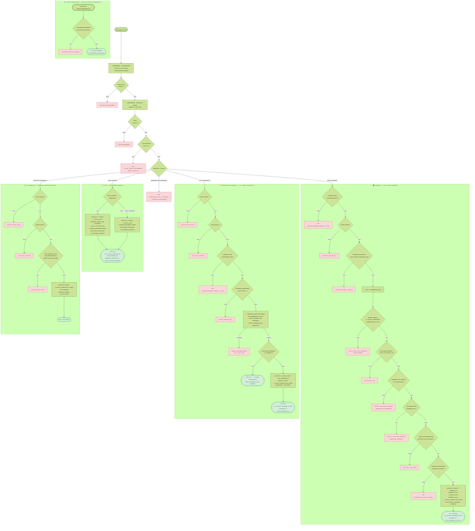

# US-006 — CRUD des quiz

## 📋 Contexte projet

Le projet **Quiz Buzzer** se décompose en quatre applications :

| Application | Technologie | Rôle |
|---|---|---|
| **Buzzers** | PlatformIO / ESP32-S3 | Périphériques physiques de jeu |
| **App mobile** | Android / NFC | Configuration WiFi des buzzers |
| **App maître de jeu** | Angular | Interface de gestion des parties |
| **Serveur (hub)** | Node.js / JavaScript | Communication WebSocket entre l'app Angular et les buzzers, gestion du workflow des parties |

---

## 🎯 User Story

> **En tant qu'** administrateur,
> **je veux** pouvoir créer, lister, modifier et supprimer des quiz (ensembles ordonnés de questions),
> **afin de** les sélectionner lors de la création d'une partie.

---

## ✅ Critères d'acceptance

### Création — `POST /api/v1/quizzes`

| # | Critère | Résultat attendu |
|---|---|---|
| CA-1 | Créer un quiz avec un nom valide et au moins 10 questions | `201 Created` avec le quiz créé (`id`, `name`, `question_count`, `created_at`, `last_updated_at: null`) |
| CA-2 | Le nom est normalisé avant validation (trim + collapse des espaces multiples) | `"  Mon   quiz  " → "Mon quiz"` |
| CA-3 | Le nom doit respecter la regex `/^[\p{Lu}][\p{L}\p{N} '\-]{1,38}[\p{L}\p{N}]$/u` | Entre 3 et 40 caractères, commence par une majuscule, finit par une lettre ou un chiffre. Sinon → `400 VALIDATION_ERROR` |
| CA-4 | L'unicité du nom est insensible à la casse | `"Culture générale"` existe → `"CULTURE GÉNÉRALE"` retourne `409 CONFLICT` |
| CA-5 | `question_ids` doit être un tableau d'au moins 10 éléments | Moins de 10 éléments → `400 VALIDATION_ERROR` |
| CA-6 | `question_ids` ne doit pas contenir de doublons | Doublon détecté → `400 VALIDATION_ERROR` |
| CA-7 | Chaque `question_id` doit être un UUID valide | Sinon → `400 INVALID_UUID` |
| CA-8 | Chaque `question_id` doit référencer une question existante en base | Sinon → `404 QUESTION_NOT_FOUND` |
| CA-9 | L'ordre des questions reflète exactement l'ordre du tableau `question_ids` | Garanti par la colonne `QQN_ORDER` |
| CA-10 | L'ID du quiz est un UUIDv7 généré côté Node.js | Format UUID standard (8-4-4-4-12) |
| CA-11 | Les horodatages sont en ISO 8601 UTC, générés côté Node.js | `created_at` rempli, `last_updated_at` à `null` |
| CA-12 | Le body ne doit contenir que les champs `name` et `question_ids` | Champs inconnus → `400 UNKNOWN_FIELDS` |
| CA-13 | Le `Content-Type` doit être `application/json` | Sinon → `415 UNSUPPORTED_MEDIA_TYPE` |
| CA-14 | Body non parseable | `400 INVALID_BODY` |

### Lecture de la liste — `GET /api/v1/quizzes`

| # | Critère | Résultat attendu |
|---|---|---|
| CA-15 | Récupérer la liste de tous les quiz | `200 OK` avec tableau de quiz (voir format ci-dessous) |
| CA-16 | Aucun quiz en base | `200 OK` avec `[]` |
| CA-17 | Tri par date de création décroissante (plus récents en premier) | Ordre garanti |
| CA-18 | Filtrage optionnel par nom (paramètre `?name=...`, recherche insensible à la casse, contient) | Seuls les quiz dont le nom contient la chaîne sont retournés |
| CA-19 | Chaque quiz retourné contient : `id`, `name`, `created_at`, `last_updated_at` et `question_summary` | `question_summary` : total + décompte par niveau et par type (`MCQ` / `SPEED`) |

### Modification complète — `PUT /api/v1/quizzes/:id`

| # | Critère | Résultat attendu |
|---|---|---|
| CA-20 | Modifier un quiz avec un nom valide et une liste valide de questions | `200 OK` avec le quiz mis à jour, `last_updated_at` mis à jour |
| CA-21 | Modifier le nom seul (sans changer les questions) est autorisé | `200 OK` |
| CA-22 | Toutes les règles de validation du POST s'appliquent (nom, question_ids, doublons, UUID, existence) | Mêmes codes d'erreur |
| CA-23 | La liste de questions remplace entièrement l'ancienne liste | L'ordre et le contenu reflètent exactement le nouveau tableau `question_ids` |
| CA-24 | Si les données envoyées sont identiques à l'existant | `200 OK` avec le quiz inchangé, `last_updated_at` **non modifié** |
| CA-25 | L'ID peut être présent dans le body ; s'il l'est, il doit correspondre à l'URL | Sinon → `400 ID_MISMATCH` |
| CA-26 | ID inexistant dans l'URL | `404 NOT_FOUND` |
| CA-27 | ID mal formé dans l'URL | `400 INVALID_UUID` |
| CA-28 | Le `Content-Type` doit être `application/json` | Sinon → `415 UNSUPPORTED_MEDIA_TYPE` |

### Suppression — `DELETE /api/v1/quizzes/:id`

| # | Critère | Résultat attendu |
|---|---|---|
| CA-29 | Supprimer un quiz non référencé par une partie active | `204 No Content` sans body |
| CA-30 | La suppression efface en cascade les entrées dans `T_QUIZ_QUESTION_QQN` | Les liaisons quiz-questions sont supprimées |
| CA-31 | Supprimer un quiz référencé par une partie dont l'état n'est pas `COMPLETED` | `403 FORBIDDEN` avec code `QUIZ_IN_USE` |
| CA-32 | Supprimer un quiz référencé uniquement par des parties en état `COMPLETED` | `204 No Content` (la partie est terminée, le quiz peut être supprimé) |
| CA-33 | ID inexistant | `404 NOT_FOUND` |
| CA-34 | ID mal formé | `400 INVALID_UUID` |
| CA-35 | Un body éventuel est ignoré silencieusement | Aucune erreur |

### Garde de suppression des questions (implémentation transversale)

| # | Critère | Résultat attendu |
|---|---|---|
| CA-36 | Suppression d'une question appartenant à au moins un quiz | `409 QUESTION_IN_QUIZ` avec message `"Cannot delete this question: it belongs to one or more quizzes."` |
| CA-37 | Suppression d'une question n'appartenant à aucun quiz | `204 No Content` (comportement inchangé, US-004) |

### Sécurité et transversalité

| # | Critère | Résultat attendu |
|---|---|---|
| CA-38 | Toutes les routes sont protégées par un Bearer token | Token absent/invalide/expiré → `401 UNAUTHORIZED` |
| CA-39 | Seul l'administrateur peut effectuer des opérations | Rôle insuffisant → `403 FORBIDDEN` |
| CA-40 | Rate limiting : max 100 requêtes par minute par IP | Dépassement → `429 RATE_LIMIT_EXCEEDED` avec header `Retry-After: 30` |
| CA-41 | Méthode HTTP non supportée | `405 METHOD_NOT_ALLOWED` avec header `Allow` adapté |
| CA-42 | Erreur serveur inattendue | `500 INTERNAL_SERVER_ERROR` (aucun détail technique exposé) |
| CA-43 | Tests unitaires et d'intégration | Couverture ≥ 90% |

---

## 🔄 Diagramme de flux



---

## 🧪 Cas de tests — requêtes cURL

> **Variables** à définir avant d'exécuter les commandes :
> ```bash
> BASE_URL=http://localhost:3000
> TOKEN=<votre_token_JWT_admin>           # Obtenu via POST /api/v1/token (US-002)
> TOKEN_BUZZER=<token_JWT_buzzer>         # Token avec rôle buzzer (pour CA-39)
> Q1=018e4f5a-0001-7000-8000-000000000001 # UUID de question existante n°1
> Q2=018e4f5a-0002-7000-8000-000000000002 # UUID de question existante n°2
> # ... jusqu'à Q10
> QUIZ_ID=<uuid_quiz_créé>               # Renseigné après CA-1
> ```

### Création — `POST /api/v1/quizzes`

**CA-1** — Créer un quiz valide avec 10 questions → `201 Created`

```bash
curl -s -w "\n→ HTTP %{http_code}\n" -X POST "$BASE_URL/api/v1/quizzes" \
  -H "Authorization: Bearer $TOKEN" \
  -H "Content-Type: application/json" \
  -d '{
    "name": "Culture générale saison 1",
    "question_ids": ["'$Q1'","'$Q2'","'$Q3'","'$Q4'","'$Q5'",
                     "'$Q6'","'$Q7'","'$Q8'","'$Q9'","'$Q10'"]
  }'
```

**CA-3** — Nom ne commençant pas par une majuscule → `400 VALIDATION_ERROR`

```bash
curl -s -w "\n→ HTTP %{http_code}\n" -X POST "$BASE_URL/api/v1/quizzes" \
  -H "Authorization: Bearer $TOKEN" \
  -H "Content-Type: application/json" \
  -d '{"name": "culture générale", "question_ids": ["'$Q1'","'$Q2'","'$Q3'","'$Q4'","'$Q5'","'$Q6'","'$Q7'","'$Q8'","'$Q9'","'$Q10'"]}'
```

**CA-4** — Nom déjà existant (insensible à la casse) → `409 CONFLICT`

```bash
curl -s -w "\n→ HTTP %{http_code}\n" -X POST "$BASE_URL/api/v1/quizzes" \
  -H "Authorization: Bearer $TOKEN" \
  -H "Content-Type: application/json" \
  -d '{"name": "CULTURE GÉNÉRALE SAISON 1", "question_ids": ["'$Q1'","'$Q2'","'$Q3'","'$Q4'","'$Q5'","'$Q6'","'$Q7'","'$Q8'","'$Q9'","'$Q10'"]}'
```

**CA-5** — Moins de 10 questions → `400 VALIDATION_ERROR`

```bash
curl -s -w "\n→ HTTP %{http_code}\n" -X POST "$BASE_URL/api/v1/quizzes" \
  -H "Authorization: Bearer $TOKEN" \
  -H "Content-Type: application/json" \
  -d '{"name": "Quiz trop court", "question_ids": ["'$Q1'","'$Q2'","'$Q3'"]}'
```

**CA-6** — Doublons dans `question_ids` → `400 VALIDATION_ERROR`

```bash
curl -s -w "\n→ HTTP %{http_code}\n" -X POST "$BASE_URL/api/v1/quizzes" \
  -H "Authorization: Bearer $TOKEN" \
  -H "Content-Type: application/json" \
  -d '{"name": "Quiz avec doublons", "question_ids": ["'$Q1'","'$Q1'","'$Q2'","'$Q3'","'$Q4'","'$Q5'","'$Q6'","'$Q7'","'$Q8'","'$Q9'"]}'
```

**CA-8** — `question_id` inexistant en base → `404 QUESTION_NOT_FOUND`

```bash
curl -s -w "\n→ HTTP %{http_code}\n" -X POST "$BASE_URL/api/v1/quizzes" \
  -H "Authorization: Bearer $TOKEN" \
  -H "Content-Type: application/json" \
  -d '{"name": "Quiz question fantome", "question_ids": ["018e4f5a-0000-0000-0000-000000000000","'$Q2'","'$Q3'","'$Q4'","'$Q5'","'$Q6'","'$Q7'","'$Q8'","'$Q9'","'$Q10'"]}'
```

### Lecture de la liste — `GET /api/v1/quizzes`

**CA-15** — Lister tous les quiz → `200 OK`

```bash
curl -s -w "\n→ HTTP %{http_code}\n" -X GET "$BASE_URL/api/v1/quizzes" \
  -H "Authorization: Bearer $TOKEN"
```

**CA-16** — Aucun quiz en base → `200 OK` avec `[]`

```bash
# À exécuter sur une base vide
curl -s -w "\n→ HTTP %{http_code}\n" -X GET "$BASE_URL/api/v1/quizzes" \
  -H "Authorization: Bearer $TOKEN"
# Vérifier : réponse "[]"
```

**CA-18** — Filtrage par nom (contient, insensible à la casse)

```bash
curl -s -w "\n→ HTTP %{http_code}\n" -X GET "$BASE_URL/api/v1/quizzes?name=culture" \
  -H "Authorization: Bearer $TOKEN"
```

### Modification — `PUT /api/v1/quizzes/:id`

**CA-20** — Modifier nom et questions → `200 OK`

```bash
curl -s -w "\n→ HTTP %{http_code}\n" -X PUT "$BASE_URL/api/v1/quizzes/$QUIZ_ID" \
  -H "Authorization: Bearer $TOKEN" \
  -H "Content-Type: application/json" \
  -d '{
    "name": "Culture générale saison 1 (révisé)",
    "question_ids": ["'$Q10'","'$Q9'","'$Q8'","'$Q7'","'$Q6'",
                     "'$Q5'","'$Q4'","'$Q3'","'$Q2'","'$Q1'"]
  }'
```

**CA-25** — ID dans le body ne correspond pas à l'URL → `400 ID_MISMATCH`

```bash
curl -s -w "\n→ HTTP %{http_code}\n" -X PUT "$BASE_URL/api/v1/quizzes/$QUIZ_ID" \
  -H "Authorization: Bearer $TOKEN" \
  -H "Content-Type: application/json" \
  -d '{"id": "018e4f5a-0000-0000-0000-000000000000", "name": "Test", "question_ids": ["'$Q1'","'$Q2'","'$Q3'","'$Q4'","'$Q5'","'$Q6'","'$Q7'","'$Q8'","'$Q9'","'$Q10'"]}'
```

### Suppression — `DELETE /api/v1/quizzes/:id`

**CA-29** — Supprimer un quiz non utilisé → `204 No Content`

```bash
curl -s -w "\n→ HTTP %{http_code}\n" -X DELETE "$BASE_URL/api/v1/quizzes/$QUIZ_ID" \
  -H "Authorization: Bearer $TOKEN"
```

**CA-31** — Supprimer un quiz référencé par une partie active → `403 FORBIDDEN`

```bash
# Prérequis : $QUIZ_ID est référencé par une partie en état PENDING ou OPEN
curl -s -w "\n→ HTTP %{http_code}\n" -X DELETE "$BASE_URL/api/v1/quizzes/$QUIZ_ID" \
  -H "Authorization: Bearer $TOKEN"
# Attendu : {"status":403,"error":"QUIZ_IN_USE","message":"Cannot delete this quiz: it is referenced by an active game."}
```

**CA-36** — Supprimer une question appartenant à un quiz → `409 QUESTION_IN_QUIZ`

```bash
curl -s -w "\n→ HTTP %{http_code}\n" -X DELETE "$BASE_URL/api/v1/questions/$Q1" \
  -H "Authorization: Bearer $TOKEN"
# Attendu : {"status":409,"error":"QUESTION_IN_QUIZ","message":"Cannot delete this question: it belongs to one or more quizzes."}
```

### Sécurité et transversalité

**CA-38** — Token absent → `401 UNAUTHORIZED`

```bash
curl -s -w "\n→ HTTP %{http_code}\n" -X GET "$BASE_URL/api/v1/quizzes"
```

**CA-39** — Rôle buzzer → `403 FORBIDDEN`

```bash
curl -s -w "\n→ HTTP %{http_code}\n" -X GET "$BASE_URL/api/v1/quizzes" \
  -H "Authorization: Bearer $TOKEN_BUZZER"
```

**CA-41** — Méthode non supportée → `405 METHOD_NOT_ALLOWED`

```bash
curl -s -v -w "\n→ HTTP %{http_code}\n" -X PATCH "$BASE_URL/api/v1/quizzes" \
  -H "Authorization: Bearer $TOKEN"
# Vérifier : 405 et header "Allow: GET, POST"
```

---

## 🔧 Spécifications techniques

| Élément | Choix |
|---|---|
| Runtime | Node.js 24 LTS (dernière version stable disponible) |
| Langage | JavaScript (ES Modules) |
| Base de données | SQLite |
| Tests | Jest (dernière version stable disponible) |
| Identifiants | UUIDv7 généré côté Node.js |
| Horodatage | ISO 8601 UTC (millisecondes), généré côté Node.js |
| Principes d'architecture | YAGNI, KISS, DRY, SOLID |

> ⚠️ **Exigence fondamentale** — Toute implémentation de cette US doit scrupuleusement respecter les principes **KISS** (solutions simples), **DRY** (pas de duplication), **YAGNI** (pas de fonctionnalité prématurée) et **SOLID** (architecture modulaire et responsabilités séparées). Ces principes prévalent sur toute optimisation prématurée ou généralisation non justifiée par un besoin immédiat documenté.

### Schéma des tables

```sql
CREATE TABLE IF NOT EXISTS T_QUIZ_QUZ
(
    QUZ_ID              TEXT PRIMARY KEY,
    QUZ_NAME            TEXT NOT NULL UNIQUE COLLATE NOCASE,
    QUZ_CREATED_AT      TEXT NOT NULL,
    QUZ_LAST_UPDATED_AT TEXT DEFAULT NULL
);

CREATE TABLE IF NOT EXISTS T_QUIZ_QUESTION_QQN
(
    QQN_QUIZ_ID     TEXT    NOT NULL REFERENCES T_QUIZ_QUZ (QUZ_ID),
    QQN_QUESTION_ID TEXT    NOT NULL REFERENCES T_QUESTION_QST (QST_ID),
    QQN_ORDER       INTEGER NOT NULL,
    PRIMARY KEY (QQN_QUIZ_ID, QQN_ORDER)
);
```

### Format JSON — Réponse liste

```json
[
  {
    "id": "018e4f5c-0000-7000-8000-000000000001",
    "name": "Culture générale saison 1",
    "created_at": "2026-03-11T10:00:00.000Z",
    "last_updated_at": null,
    "question_summary": {
      "total": 20,
      "by_level": {
        "1": { "MCQ": 2, "SPEED": 1 },
        "2": { "MCQ": 3, "SPEED": 2 },
        "3": { "MCQ": 5, "SPEED": 3 },
        "4": { "MCQ": 2, "SPEED": 1 },
        "5": { "MCQ": 1, "SPEED": 0 }
      }
    }
  }
]
```

### Format JSON — Réponse création / modification

```json
{
  "id": "018e4f5c-0000-7000-8000-000000000001",
  "name": "Culture générale saison 1",
  "question_count": 10,
  "created_at": "2026-03-11T10:00:00.000Z",
  "last_updated_at": null
}
```

---

## 📡 Endpoints

| Méthode | URL | Description | Auth | Code succès |
|---|---|---|---|---|
| `POST` | `/api/v1/quizzes` | Créer un quiz | Bearer (admin) | `201 Created` |
| `GET` | `/api/v1/quizzes` | Lister les quiz | Bearer (admin) | `200 OK` |
| `PUT` | `/api/v1/quizzes/:id` | Modifier entièrement un quiz | Bearer (admin) | `200 OK` |
| `DELETE` | `/api/v1/quizzes/:id` | Supprimer un quiz | Bearer (admin) | `204 No Content` |

### Headers `Allow` par ressource

| URL | Méthodes autorisées |
|---|---|
| `/api/v1/quizzes` | `GET, POST` |
| `/api/v1/quizzes/:id` | `PUT, DELETE` |

---

## 🔐 Authentification et autorisation

### Mécanisme

Toutes les routes de cette US sont protégées par un **JSON Web Token (JWT)** transmis via le header HTTP `Authorization`.

| Élément | Valeur |
|---|---|
| Type de token | JWT |
| Algorithme de signature | HS256 (symétrique) |
| Transmission | Header `Authorization: Bearer <token>` |
| Secret de signature | Variable d'environnement `JWT_SECRET` (min 32 caractères) |
| Durée de validité | 1 heure (3600s), configurable via variable d'environnement `JWT_EXPIRATION` |
| Renouvellement | Reconnexion via `POST /api/v1/token` (US-002) |

### Structure du payload JWT

```json
{
  "sub": "018e4f5a-8c3b-7d2e-9f1a-4b5c6d7e8f9a",
  "role": "admin",
  "iat": 1741358400,
  "exp": 1741362000
}
```

| Claim | Type | Description |
|---|---|---|
| `sub` (subject) | `string` | UUIDv7 de l'utilisateur (claim standard RFC 7519) |
| `role` | `string` | Rôle de l'utilisateur (`"admin"` pour cette US) |
| `iat` (issued at) | `number` | Timestamp Unix de l'émission (automatique) |
| `exp` (expiration) | `number` | Timestamp Unix d'expiration (automatique) |

### Architecture middleware — Réutilisation de l'US-003

Les middlewares `authenticate` et `authorize('admin')` créés dans l'US-003 sont réutilisés tels quels sur toutes les routes de cette US, conformément aux principes DRY et Open/Closed (SOLID).

**Application sur les routes :**

```javascript
router.post('/api/v1/quizzes',       authenticate, authorize('admin'), createQuiz);
router.get('/api/v1/quizzes',        authenticate, authorize('admin'), listQuizzes);
router.put('/api/v1/quizzes/:id',    authenticate, authorize('admin'), updateQuiz);
router.delete('/api/v1/quizzes/:id', authenticate, authorize('admin'), deleteQuiz);
```

---

## 🚨 Catalogue des erreurs

| Code erreur | Code HTTP | Message | Contexte |
|---|---|---|---|
| `VALIDATION_ERROR` | `400` | _(dynamique)_ | Nom invalide, moins de 10 questions, doublons |
| `INVALID_UUID` | `400` | `"The provided ID is not a valid UUID."` | UUID mal formé |
| `INVALID_BODY` | `400` | `"Request body must be a JSON object."` | Body non parseable |
| `UNKNOWN_FIELDS` | `400` | `"Unknown field(s): foo."` | Champs non reconnus |
| `ID_MISMATCH` | `400` | `"The ID in the request body does not match the URL parameter."` | ID body ≠ ID URL |
| `UNAUTHORIZED` | `401` | `"Authentication token is missing or invalid."` | Token absent/expiré/invalide |
| `FORBIDDEN` | `403` | `"You do not have permission to perform this action."` | Rôle insuffisant |
| `QUIZ_IN_USE` | `403` | `"Cannot delete this quiz: it is referenced by an active game."` | Quiz utilisé par une partie non terminée |
| `NOT_FOUND` | `404` | `"The requested quiz was not found."` | Quiz inexistant |
| `QUESTION_NOT_FOUND` | `404` | `"Question not found: <id>."` | Question référencée inexistante |
| `METHOD_NOT_ALLOWED` | `405` | _(dynamique)_ | Méthode non supportée |
| `CONFLICT` | `409` | `"A quiz with this name already exists."` | Nom déjà utilisé |
| `QUESTION_IN_QUIZ` | `409` | `"Cannot delete this question: it belongs to one or more quizzes."` | Question utilisée dans un quiz |
| `UNSUPPORTED_MEDIA_TYPE` | `415` | `"Content-Type must be 'application/json'."` | Content-Type incorrect |
| `RATE_LIMIT_EXCEEDED` | `429` | `"Too many requests. Please retry in 30 seconds."` | Rate limit dépassé |
| `INTERNAL_SERVER_ERROR` | `500` | `"An unexpected error occurred. Please try again later."` | Erreur serveur |

---

## 📐 Périmètre

| Inclus | Exclu |
|---|---|
| CRUD quiz : POST, GET liste, PUT, DELETE | GET quiz par ID (YAGNI) |
| Validation nom (normalisation, unicité, regex) | Pagination de la liste (YAGNI) |
| Validation `question_ids` (min 10, doublons, existence) | Interface Angular |
| Ordre des questions garanti (`QQN_ORDER`) | Gestion des parties (US suivante) |
| Résumé des questions par niveau et type dans la liste | |
| Garde de suppression : quiz → questions, parties → quiz | |
| Suppression en cascade de `T_QUIZ_QUESTION_QQN` | |
| Tests unitaires et d'intégration (couverture ≥ 90%) | |

---

## 🔍 Points de vigilance

### Intégrité référentielle en cascade

La suppression d'un quiz doit supprimer les lignes correspondantes dans `T_QUIZ_QUESTION_QQN` **dans la même transaction** pour garantir la cohérence. SQLite supporte `ON DELETE CASCADE` mais la vérification métier (partie active) doit être effectuée **avant** la suppression, côté application.

### Remplacement de la liste des questions (PUT)

Le PUT remplace intégralement la liste. L'implémentation doit supprimer toutes les entrées existantes de `T_QUIZ_QUESTION_QQN` pour ce quiz, puis réinsérer les nouvelles — **dans la même transaction**.

### Détection d'identité (pas de mise à jour inutile)

Avant de mettre à jour, comparer le nom normalisé et la liste ordonnée des `question_ids` avec l'état actuel. Si identiques → retourner `200 OK` sans écriture et sans modifier `last_updated_at`.

### `question_summary` calculé à la volée

Le résumé des questions par niveau et type est calculé via une jointure SQL au moment du `GET /api/v1/quizzes`, sans colonne dénormalisée. Cela garantit la cohérence si les questions sont modifiées ultérieurement.

### Garde sur `DELETE /api/v1/questions/:id`

La contrainte de CA-36 est implémentée dans le handler `DELETE /api/v1/questions/:id` existant (US-004). Une vérification `SELECT COUNT(*) FROM T_QUIZ_QUESTION_QQN WHERE QQN_QUESTION_ID = ?` doit être ajoutée avant la suppression.