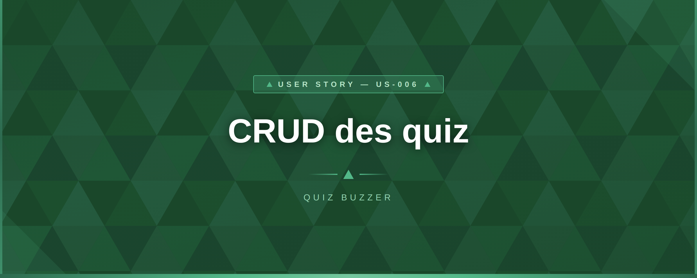

# US-008 — Modification partielle des questions (PATCH)

## 📋 Contexte projet

Le projet **Quiz Buzzer** se décompose en quatre applications :

| Application | Technologie | Rôle |
|---|---|---|
| **Buzzers** | PlatformIO / ESP32-S3 | Périphériques physiques de jeu |
| **App mobile** | Android / NFC | Configuration WiFi des buzzers |
| **App maître de jeu** | Angular | Interface de gestion des parties |
| **Serveur (hub)** | Node.js / JavaScript | Communication WebSocket entre l'app Angular et les buzzers, gestion du workflow des parties |

---

## 🎯 User Story

> **En tant qu'** administrateur,
> **je veux** modifier partiellement une question en envoyant uniquement les champs à mettre à jour,
> **afin de** corriger une question sans devoir renvoyer l'intégralité de ses données.

---

## ✅ Critères d'acceptance

> 🧪 **Exigence de couverture** — Chaque critère d'acceptance listé ci-dessous doit être couvert par **au moins un test automatisé** (unitaire et/ou d'intégration). Un CA non couvert par un test est considéré comme **non livré**. La couverture globale du code de l'US doit être **≥ 90%**, mesurée via `jest --coverage`.

### Modification partielle — `PATCH /api/v1/questions/:id`

| # | Critère | Résultat attendu |
|---|---|---|
| CA-1 | Modifier partiellement une question (un ou plusieurs champs) | `200 OK` avec la question mise à jour, `last_updated_at` mis à jour |
| CA-2 | Format JSON Merge Patch (RFC 7396) : champ absent = non modifié | Seuls les champs présents dans le body sont modifiés |
| CA-3 | Un champ obligatoire envoyé à `null` | `400 VALIDATION_ERROR` (les champs obligatoires ne peuvent pas être nullifiés) |
| CA-4 | `choices` envoyé à `null` sur une question MCQ | `400 VALIDATION_ERROR` |
| CA-5 | Le champ `type` n'est pas modifiable via PATCH | Présent → `400 TYPE_CHANGE_NOT_ALLOWED` |
| CA-6 | Le champ `id` n'est pas modifiable via PATCH | Présent → `400 UNKNOWN_FIELDS` |
| CA-7 | Modification du `theme_id` vers un thème existant | `200 OK`, le `theme_id` est mis à jour |
| CA-8 | Modification du `theme_id` vers un thème inexistant | `400 INVALID_THEME` |
| CA-9 | Modification du `title` : mêmes règles de validation que le POST | Trim, collapse, majuscule, longueur, unicité |
| CA-10 | Modification de `choices` : mêmes règles que le POST (4 éléments, 1–40 car., distincts) | Validation complète |
| CA-11 | PATCH avec `choices` sur une question SPEED | `400 VALIDATION_ERROR` (une question SPEED ne peut pas avoir de `choices`) |
| CA-12 | Modification de `correct_answer` : doit correspondre à un des `choices` actuels (ou des nouveaux `choices` si fournis dans le même PATCH) | Sinon → `400 VALIDATION_ERROR` |
| CA-13 | Modification de `level`, `time_limit`, `points` : mêmes règles que le POST | Plages respectées |
| CA-14 | Modification de `image_path` : doit être une chaîne non vide ou `null` (pour supprimer) | Chaîne vide → `400 VALIDATION_ERROR` |
| CA-15 | Modification de `audio_path` : doit être une chaîne non vide ou `null` (pour supprimer) | Chaîne vide → `400 VALIDATION_ERROR` |
| CA-16 | Les données envoyées sont identiques à l'existant | `200 OK` avec la question inchangée, `last_updated_at` **non modifié** |
| CA-17 | ID inexistant | `404 NOT_FOUND` |
| CA-18 | Le `Content-Type` doit être `application/json` | Sinon → `415 UNSUPPORTED_MEDIA_TYPE` |
| CA-19 | Body vide `{}` | `200 OK` avec la question inchangée (aucune modification) |

### Sécurité et transversalité

| # | Critère | Résultat attendu |
|---|---|---|
| CA-20 | Toutes les routes sont protégées par un Bearer token | Token absent/invalide/expiré → `401 UNAUTHORIZED` |
| CA-21 | Seul l'administrateur peut effectuer des opérations | Rôle insuffisant → `403 FORBIDDEN` |
| CA-22 | Rate limiting : max 100 requêtes par minute | Dépassement → `429 RATE_LIMIT_EXCEEDED` avec header `Retry-After: 30` |
| CA-23 | Méthode HTTP non supportée sur une ressource | `405 METHOD_NOT_ALLOWED` avec header `Allow: GET, PUT, PATCH, DELETE` |
| CA-24 | Erreur serveur inattendue | `500 INTERNAL_SERVER_ERROR` (aucun détail technique exposé) |
| CA-25 | Tests unitaires et d'intégration | Couverture de tests ≥ 90% |

---

## 🔄 Diagramme de flux


---

## 🧪 Cas de tests — requêtes cURL

> **Variables** à définir avant d'exécuter les commandes :
> ```bash
> BASE_URL=http://localhost:3000
> TOKEN=<votre_token_JWT_admin>           # Obtenu via POST /api/v1/token (US-002)
> TOKEN_BUZZER=<token_JWT_buzzer>         # Token avec rôle buzzer (pour CA-21)
> QUESTION_ID=<uuid_question_créée>      # Renseigné après création via POST (US-004)
> THEME_ID=018e4f5a-8c3b-7d2e-9f1a-4b5c6d7e8f9a
> ```

### Modification partielle — `PATCH /api/v1/questions/:id`

**CA-1** — Modifier un seul champ (`level`) → `200 OK` avec la question mise à jour

```bash
curl -s -w "\n→ HTTP %{http_code}\n" -X PATCH "$BASE_URL/api/v1/questions/$QUESTION_ID" \
  -H "Authorization: Bearer $TOKEN" \
  -H "Content-Type: application/json" \
  -d '{"level": 4}'
```

**CA-2** — Seul le champ envoyé est modifié (les autres restent inchangés) → `200 OK`

```bash
# Vérifier que seul "level" a changé dans la réponse
curl -s -w "\n→ HTTP %{http_code}\n" -X PATCH "$BASE_URL/api/v1/questions/$QUESTION_ID" \
  -H "Authorization: Bearer $TOKEN" \
  -H "Content-Type: application/json" \
  -d '{"points": 200}'
```

**CA-3** — Champ obligatoire à `null` → `400 VALIDATION_ERROR`

```bash
curl -s -w "\n→ HTTP %{http_code}\n" -X PATCH "$BASE_URL/api/v1/questions/$QUESTION_ID" \
  -H "Authorization: Bearer $TOKEN" \
  -H "Content-Type: application/json" \
  -d '{"title": null}'
```

**CA-5** — `type` présent dans le body → `400 TYPE_CHANGE_NOT_ALLOWED`

```bash
curl -s -w "\n→ HTTP %{http_code}\n" -X PATCH "$BASE_URL/api/v1/questions/$QUESTION_ID" \
  -H "Authorization: Bearer $TOKEN" \
  -H "Content-Type: application/json" \
  -d '{"type": "SPEED"}'
```

**CA-6** — `id` présent dans le body → `400 UNKNOWN_FIELDS`

```bash
curl -s -w "\n→ HTTP %{http_code}\n" -X PATCH "$BASE_URL/api/v1/questions/$QUESTION_ID" \
  -H "Authorization: Bearer $TOKEN" \
  -H "Content-Type: application/json" \
  -d '{"id": "018e4f5a-0000-0000-0000-000000000001", "level": 2}'
```

**CA-7** — Modification du `theme_id` vers un thème existant → `200 OK`

```bash
curl -s -w "\n→ HTTP %{http_code}\n" -X PATCH "$BASE_URL/api/v1/questions/$QUESTION_ID" \
  -H "Authorization: Bearer $TOKEN" \
  -H "Content-Type: application/json" \
  -d "{\"theme_id\": \"$THEME_ID\"}"
```

**CA-8** — Modification du `theme_id` vers un thème inexistant → `400 INVALID_THEME`

```bash
curl -s -w "\n→ HTTP %{http_code}\n" -X PATCH "$BASE_URL/api/v1/questions/$QUESTION_ID" \
  -H "Authorization: Bearer $TOKEN" \
  -H "Content-Type: application/json" \
  -d '{"theme_id": "018e4f5a-0000-0000-0000-000000000000"}'
```

**CA-12** — `correct_answer` ne correspond pas aux `choices` → `400 VALIDATION_ERROR`

```bash
curl -s -w "\n→ HTTP %{http_code}\n" -X PATCH "$BASE_URL/api/v1/questions/$QUESTION_ID" \
  -H "Authorization: Bearer $TOKEN" \
  -H "Content-Type: application/json" \
  -d '{"correct_answer": "Réponse inexistante dans choices"}'
```

**CA-14** — `image_path` à chaîne vide → `400 VALIDATION_ERROR`

```bash
curl -s -w "\n→ HTTP %{http_code}\n" -X PATCH "$BASE_URL/api/v1/questions/$QUESTION_ID" \
  -H "Authorization: Bearer $TOKEN" \
  -H "Content-Type: application/json" \
  -d '{"image_path": ""}'
```

**CA-14** — `image_path` à `null` (suppression) → `200 OK`

```bash
curl -s -w "\n→ HTTP %{http_code}\n" -X PATCH "$BASE_URL/api/v1/questions/$QUESTION_ID" \
  -H "Authorization: Bearer $TOKEN" \
  -H "Content-Type: application/json" \
  -d '{"image_path": null}'
```

**CA-16** — Données identiques à l'existant → `200 OK`, `last_updated_at` non modifié

```bash
# Récupérer d'abord la question, puis envoyer exactement les mêmes valeurs
curl -s -w "\n→ HTTP %{http_code}\n" -X PATCH "$BASE_URL/api/v1/questions/$QUESTION_ID" \
  -H "Authorization: Bearer $TOKEN" \
  -H "Content-Type: application/json" \
  -d '{"level": 3}'
# Vérifier que "last_updated_at" est identique avant et après
```

**CA-17** — ID inexistant → `404 NOT_FOUND`

```bash
curl -s -w "\n→ HTTP %{http_code}\n" -X PATCH "$BASE_URL/api/v1/questions/018e4f5a-0000-0000-0000-000000000000" \
  -H "Authorization: Bearer $TOKEN" \
  -H "Content-Type: application/json" \
  -d '{"level": 2}'
```

**CA-18** — Content-Type incorrect → `415 UNSUPPORTED_MEDIA_TYPE`

```bash
curl -s -w "\n→ HTTP %{http_code}\n" -X PATCH "$BASE_URL/api/v1/questions/$QUESTION_ID" \
  -H "Authorization: Bearer $TOKEN" \
  -H "Content-Type: text/plain" \
  -d '{"level": 2}'
```

**CA-19** — Body vide `{}` → `200 OK` sans modification

```bash
curl -s -w "\n→ HTTP %{http_code}\n" -X PATCH "$BASE_URL/api/v1/questions/$QUESTION_ID" \
  -H "Authorization: Bearer $TOKEN" \
  -H "Content-Type: application/json" \
  -d '{}'
```

### Sécurité et transversalité

**CA-20** — Token absent → `401 UNAUTHORIZED`

```bash
curl -s -w "\n→ HTTP %{http_code}\n" -X PATCH "$BASE_URL/api/v1/questions/$QUESTION_ID" \
  -H "Content-Type: application/json" \
  -d '{"level": 2}'
```

**CA-21** — Rôle buzzer → `403 FORBIDDEN`

```bash
curl -s -w "\n→ HTTP %{http_code}\n" -X PATCH "$BASE_URL/api/v1/questions/$QUESTION_ID" \
  -H "Authorization: Bearer $TOKEN_BUZZER" \
  -H "Content-Type: application/json" \
  -d '{"level": 2}'
```

**CA-22** — Rate limiting dépassé (> 100 req/min) → `429 RATE_LIMIT_EXCEEDED` avec header `Retry-After: 30`

```bash
for i in $(seq 1 101); do
  curl -s -o /dev/null -w "%{http_code}\n" -X PATCH "$BASE_URL/api/v1/questions/$QUESTION_ID" \
    -H "Authorization: Bearer $TOKEN" \
    -H "Content-Type: application/json" \
    -d '{"level": 2}'
done
# La 101ème requête doit retourner 429 avec le header Retry-After: 30
```

**CA-23** — Méthode HTTP non supportée → `405 METHOD_NOT_ALLOWED` avec header `Allow` adapté

```bash
curl -s -v -w "\n→ HTTP %{http_code}\n" -X OPTIONS "$BASE_URL/api/v1/questions/$QUESTION_ID" \
  -H "Authorization: Bearer $TOKEN"
# Vérifier : code 405 et header "Allow: GET, PUT, PATCH, DELETE"
```

---

## 🔧 Spécifications techniques

| Élément | Choix |
|---|---|
| Runtime | Node.js 24 LTS (dernière version stable disponible) |
| Langage | JavaScript (ES Modules) |
| Base de données | SQLite |
| Tests | Jest (dernière version stable disponible) |
| Identifiants | UUIDv7 généré côté Node.js |
| Horodatage | ISO 8601 UTC (millisecondes), généré côté Node.js |
| Principes d'architecture | YAGNI, KISS, DRY, SOLID |

> ⚠️ **Exigence fondamentale** — Toute implémentation de cette US doit scrupuleusement respecter les principes **KISS** (solutions simples), **DRY** (pas de duplication), **YAGNI** (pas de fonctionnalité prématurée) et **SOLID** (architecture modulaire et responsabilités séparées). Ces principes prévalent sur toute optimisation prématurée ou généralisation non justifiée par un besoin immédiat documenté.

### Sémantique JSON Merge Patch (RFC 7396)

```
Body entrant
  → Champ absent      → champ non modifié (conservé tel quel en base)
  → Champ présent     → champ mis à jour avec la nouvelle valeur
  → Champ à null      → suppression de la valeur (uniquement pour image_path et audio_path)
                         champs obligatoires à null → 400 VALIDATION_ERROR
```

### Validation croisée `correct_answer` / `choices`

La validation de `correct_answer` porte sur l'**état résultant** de la question (fusion des données existantes avec les champs du body PATCH) :

```
État résultant = données existantes ← écrasées par les champs présents dans le body
correct_answer résultant ∈ choices résultants ?
  → Non → 400 VALIDATION_ERROR
  → Oui → OK
```

### Détection d'absence de changement réel

Avant d'effectuer la mise à jour en base, le serveur compare l'état résultant (fusion) avec l'état existant. Si les données sont identiques, aucun `UPDATE` n'est exécuté et `last_updated_at` n'est **pas** modifié.

### Versioning API

```
Base URL : /api/v1
```

### Structure des fichiers

```
src/
  routes/
    questionRoute.js         ← endpoint PATCH /api/v1/questions/:id (ajouté par US-008)
  routes/__tests__/
    questionRoute.test.js    ← tests d'intégration CA-1 à CA-25
  utils/
    mergeQuestion.js         ← logique de fusion JSON Merge Patch et validation croisée
  utils/__tests__/
    mergeQuestion.test.js    ← tests unitaires
```

---

## 📡 Endpoints

| Méthode | URL | Description | Auth | Code succès |
|---|---|---|---|---|
| `PATCH` | `/api/v1/questions/:id` | Modifier partiellement une question | Bearer (admin) | `200 OK` |

### Headers `Allow` par ressource

| URL | Méthodes autorisées |
|---|---|
| `/api/v1/questions` | `GET, POST` |
| `/api/v1/questions/:id` | `GET, PUT, PATCH, DELETE` |

---

## 🔐 Authentification et autorisation

### Mécanisme

Toutes les routes de cette US sont protégées par un **JSON Web Token (JWT)** transmis via le header HTTP `Authorization`.

| Élément | Valeur |
|---|---|
| Type de token | JWT |
| Algorithme de signature | HS256 (symétrique) |
| Transmission | Header `Authorization: Bearer <token>` |
| Secret de signature | Variable d'environnement `JWT_SECRET` (min 32 caractères) |
| Durée de validité | 1 heure (3600s), configurable via variable d'environnement `JWT_EXPIRATION` |
| Renouvellement | Reconnexion via `POST /api/v1/token` (US-002) |

### Structure du payload JWT

```json
{
  "sub": "018e4f5a-8c3b-7d2e-9f1a-4b5c6d7e8f9a",
  "role": "admin",
  "iat": 1741358400,
  "exp": 1741362000
}
```

| Claim | Type | Description |
|---|---|---|
| `sub` (subject) | `string` | UUIDv7 de l'utilisateur (claim standard RFC 7519) |
| `role` | `string` | Rôle de l'utilisateur (`"admin"` pour cette US) |
| `iat` (issued at) | `number` | Timestamp Unix de l'émission (automatique) |
| `exp` (expiration) | `number` | Timestamp Unix d'expiration (automatique) |

### Architecture middleware — Réutilisation de l'US-003

Les middlewares `authenticate` et `authorize` définis dans l'US-003 sont réutilisés tels quels sur l'endpoint de cette US, conformément au principe **DRY** :

```javascript
router.patch('/api/v1/questions/:id', authenticate, authorize('admin'), patchQuestion);
```

> **Réutilisabilité (DRY) :** Les middlewares `authenticate` et `authorize` sont conçus pour être réutilisés par toutes les US. Le middleware `authorize` accepte n'importe quel rôle en paramètre, permettant de supporter d'autres profils à l'avenir sans modification du middleware lui-même (**Open/Closed Principle — SOLID**).

---

## 🚨 Catalogue des erreurs

| Code erreur | Code HTTP | Message | Contexte |
|---|---|---|---|
| `VALIDATION_ERROR` | `400` | _(dynamique selon le cas)_ | Champ obligatoire à null, `choices` invalides, `correct_answer` invalide, chaîne vide pour `image_path`/`audio_path` |
| `INVALID_UUID` | `400` | `"The provided ID is not a valid UUID."` | ID mal formé dans l'URL |
| `INVALID_JSON` | `400` | `"Request body must be valid JSON."` | Corps non parseable |
| `UNKNOWN_FIELDS` | `400` | `"Unknown field(s): foo."` | Champs non reconnus dans le body (dont `id`) |
| `INVALID_THEME` | `400` | `"The provided theme_id does not reference an existing theme."` | `theme_id` inexistant en base |
| `TYPE_CHANGE_NOT_ALLOWED` | `400` | `"The question type cannot be changed."` | `type` présent dans le body |
| `UNAUTHORIZED` | `401` | `"Authentication token is missing or invalid."` | Token absent/expiré/invalide |
| `FORBIDDEN` | `403` | `"You do not have permission to perform this action."` | Rôle insuffisant |
| `NOT_FOUND` | `404` | `"The requested question was not found."` | Question inexistante |
| `METHOD_NOT_ALLOWED` | `405` | _(dynamique)_ | Méthode non supportée (message dynamique) |
| `QUESTION_ALREADY_EXISTS` | `409` | `"A question with this title already exists."` | Titre en doublon |
| `UNSUPPORTED_MEDIA_TYPE` | `415` | `"Content-Type must be 'application/json'."` | Content-Type incorrect |
| `RATE_LIMIT_EXCEEDED` | `429` | `"Too many requests. Please retry in 30 seconds."` | Dépassement rate limit (header `Retry-After: 30`) |
| `INTERNAL_SERVER_ERROR` | `500` | `"An unexpected error occurred. Please try again later."` | Erreur serveur (aucun détail technique exposé) |

### Format standard des réponses d'erreur

```json
{
  "status": 400,
  "error": "TYPE_CHANGE_NOT_ALLOWED",
  "message": "The question type cannot be changed."
}
```

---

## 📐 Périmètre

| Inclus | Exclu |
|---|---|
| Modification partielle via PATCH (RFC 7396 JSON Merge Patch) | CRUD complet des questions (US-004) |
| Validation des champs présents dans le body uniquement | Filtrage avancé de la liste (US-007) |
| Validation croisée `correct_answer`/`choices` sur l'état résultant | Interface Angular |
| Immutabilité du `type` via PATCH | Déploiement / CI-CD |
| Suppression de `image_path`/`audio_path` via `null` | |
| Détection d'absence de changement réel (pas de mise à jour inutile) | |
| Réutilisation des middlewares `authenticate` et `authorize` | |
| Rate limiting (100 req/min) | |
| Tests unitaires et d'intégration (couverture ≥ 90%) | |

---

## 🔍 Points de vigilance

### Sémantique JSON Merge Patch (RFC 7396)

Contrairement à `PUT` (remplacement complet), `PATCH` suit la sémantique JSON Merge Patch : un champ absent du body signifie « ne pas modifier » et non « supprimer ». Cette sémantique doit être rigoureusement respectée pour éviter des effacements accidentels de données.

### Body vide `{}` : cas normal

Un body vide `{}` est une requête PATCH valide qui ne modifie rien. Le serveur doit répondre `200 OK` avec la question inchangée. Ce cas ne doit pas déclencher d'erreur.

### Validation croisée sur l'état résultant

La validation de `correct_answer` doit porter sur l'**état résultant** de la question, c'est-à-dire après fusion des données existantes avec le body PATCH. Si le body contient à la fois de nouveaux `choices` et un nouveau `correct_answer`, la cohérence est vérifiée sur les nouvelles valeurs. Si seul `correct_answer` est fourni, il est validé par rapport aux `choices` existants.

### Immutabilité du `type`

Le champ `type` est immutable après création. Sa présence dans le body PATCH doit déclencher immédiatement un `400 TYPE_CHANGE_NOT_ALLOWED`, quelle que soit la valeur fournie (même si elle est identique à l'existant).

### `last_updated_at` non modifié si aucun changement réel

Lorsque les données résultantes de la fusion sont identiques aux données existantes, aucun `UPDATE` SQL ne doit être exécuté et `last_updated_at` ne doit **pas** être mis à jour. Cela garantit que `last_updated_at` reflète toujours une modification effective.

### Dépendance avec US-004

Cette US étend l'infrastructure de l'US-004 (table `T_QUESTION_QST`, middlewares, validateurs). La logique de fusion PATCH doit être isolée dans un utilitaire dédié (`mergeQuestion.js`) pour respecter le **principe de responsabilité unique (SRP — SOLID)** et permettre la réutilisation.
