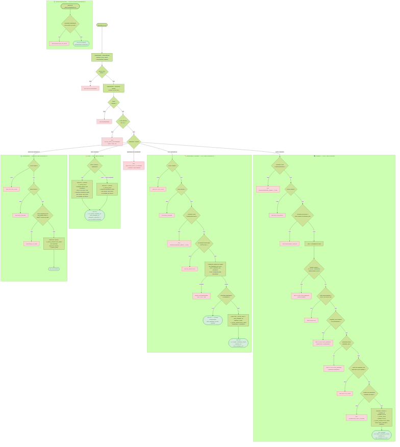
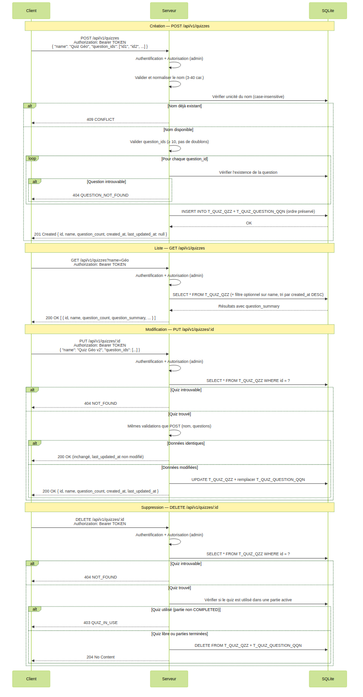

# US-008 — CRUD des quiz

## 📋 Contexte projet

Voir [VISION.md](VISION.md) pour la description complète du projet et de ses quatre applications.

---

## 🎯 User Story

> **En tant qu'** administrateur,
> **je veux** pouvoir créer, lister, modifier et supprimer des quiz (ensembles ordonnés de questions),
> **afin de** les sélectionner lors de la création d'une partie.

---

## ✅ Critères d'acceptance

> 🧪 **Exigence de couverture** — Voir [Conventions techniques — Couverture des tests](CONVENTIONS-TECHNIQUES.md#-exigence-de-couverture-des-tests). Chaque CA doit être couvert par au moins un test automatisé. Couverture globale ≥ 90 %.

### Création — `POST /api/v1/quizzes`

| # | Critère | Résultat attendu |
|---|---|---|
| CA-1 | Créer un quiz avec un nom valide et au moins 10 questions | `201 Created` avec le quiz créé (`id`, `name`, `question_count`, `created_at`, `last_updated_at: null`) |
| CA-2 | Le nom est normalisé avant validation (trim + collapse des espaces multiples) | `"  Mon   quiz  " → "Mon quiz"` |
| CA-3 | Le nom doit respecter la regex `/^[\p{Lu}][\p{L}\p{N} '\-]{1,38}[\p{L}\p{N}]$/u` | Entre 3 et 40 caractères, commence par une majuscule, finit par une lettre ou un chiffre. Sinon → `400 VALIDATION_ERROR` |
| CA-4 | L'unicité du nom est insensible à la casse | `"Culture générale"` existe → `"CULTURE GÉNÉRALE"` retourne `409 QUIZ_ALREADY_EXISTS` |
| CA-5 | `question_ids` doit être un tableau d'au moins 10 éléments | Moins de 10 éléments → `400 VALIDATION_ERROR` |
| CA-6 | `question_ids` ne doit pas contenir de doublons | Doublon détecté → `400 VALIDATION_ERROR` |
| CA-7 | Chaque `question_id` doit être un UUID valide | Sinon → `400 INVALID_UUID` |
| CA-8 | Chaque `question_id` doit référencer une question existante en base | Sinon → `404 QUESTION_NOT_FOUND` |
| CA-9 | L'ordre des questions reflète exactement l'ordre du tableau `question_ids` | Garanti par la colonne `QQN_ORDER` |
| CA-10 | L'ID du quiz est un UUIDv7 généré côté Node.js | Format UUID standard (8-4-4-4-12) |
| CA-11 | Les horodatages sont en ISO 8601 UTC, générés côté Node.js | `created_at` rempli, `last_updated_at` à `null` |
| CA-12 | Le body ne doit contenir que les champs `name` et `question_ids` | Champs inconnus → `400 UNKNOWN_FIELDS` |
| CA-13 | Le `Content-Type` doit être `application/json` | Sinon → `415 UNSUPPORTED_MEDIA_TYPE` |
| CA-14 | Body non parseable | `400 INVALID_BODY` |

### Lecture de la liste — `GET /api/v1/quizzes`

| # | Critère | Résultat attendu |
|---|---|---|
| CA-15 | Récupérer la liste de tous les quiz avec pagination | `200 OK` avec objet `{ data, page, limit, total, total_pages }` |
| CA-16 | Aucun quiz en base | `200 OK` avec `{ "data": [], "page": 1, "limit": 20, "total": 0, "total_pages": 0 }` |
| CA-17 | Tri par date de création décroissante (plus récents en premier) | Ordre garanti |
| CA-18 | Filtrage optionnel par nom (paramètre `?name=...`, recherche insensible à la casse, contient) | Seuls les quiz dont le nom contient la chaîne sont retournés |
| CA-19 | Chaque quiz retourné contient : `id`, `name`, `created_at`, `last_updated_at` et `question_summary` | `question_summary` : total + décompte par niveau et par type (`MCQ` / `SPEED`) |
| CA-20 | Paramètres de pagination par défaut : `page=1`, `limit=20` | Appliqués si non fournis |
| CA-21 | Le paramètre `limit` est plafonné à `100` | `limit=200` → `400 INVALID_PAGINATION` |
| CA-22 | Paramètres de pagination invalides (négatifs, zéro, non numériques) | `400 INVALID_PAGINATION` |
| CA-23 | Page au-delà du total | `200 OK` avec `data: []` et métadonnées correctes |

### Lecture par ID — `GET /api/v1/quizzes/:id`

> 🔄 **Ajout ultérieur** — Initialement exclu par YAGNI (US-008), cet endpoint est nécessaire pour :
> - Valider l'existence du quiz lors de la création d'une partie (US-010)
> - Récupérer les questions ordonnées pour l'affichage du quiz au maître du jeu (US-011)

| # | Critère | Résultat attendu |
|---|---|---|
| CA-24 | Récupérer un quiz par son ID | `200 OK` avec le quiz complet (id, name, question_ids ordonnées, created_at, last_updated_at) |
| CA-25 | ID inexistant | `404 NOT_FOUND` |
| CA-26 | ID mal formé | `400 INVALID_UUID` |

### Modification complète — `PUT /api/v1/quizzes/:id`

| # | Critère | Résultat attendu |
|---|---|---|
| CA-27 | Modifier un quiz avec un nom valide et une liste valide de questions | `200 OK` avec le quiz mis à jour, `last_updated_at` mis à jour |
| CA-28 | Modifier le nom seul (sans changer les questions) est autorisé | `200 OK` |
| CA-29 | Toutes les règles de validation du POST s'appliquent (nom, question_ids, doublons, UUID, existence) | Mêmes codes d'erreur |
| CA-30 | La liste de questions remplace entièrement l'ancienne liste | L'ordre et le contenu reflètent exactement le nouveau tableau `question_ids` |
| CA-31 | Si les données envoyées sont identiques à l'existant | `200 OK` avec le quiz inchangé, `last_updated_at` **non modifié** |
| CA-32 | L'ID peut être présent dans le body ; s'il l'est, il doit correspondre à l'URL | Sinon → `400 ID_MISMATCH` |
| CA-33 | ID inexistant dans l'URL | `404 NOT_FOUND` |
| CA-34 | ID mal formé dans l'URL | `400 INVALID_UUID` |
| CA-35 | Le `Content-Type` doit être `application/json` | Sinon → `415 UNSUPPORTED_MEDIA_TYPE` |

### Suppression — `DELETE /api/v1/quizzes/:id`

> ⚠️ **Garde d'intégrité avec parties actives** — Les CA-38 et CA-39 définissent une règle métier : un quiz ne peut être supprimé que s'il n'est pas associé à une partie active (`PENDING` ou `OPEN`). Cette vérification dépend de la création de la table `T_GAME_GAM` en **US-010**. Le contrôle `QUIZ_IN_USE` doit être implémenté lors d'US-010.

| # | Critère | Résultat attendu |
|---|---|---|
| CA-36 | Supprimer un quiz non référencé par une partie active | `204 No Content` sans body |
| CA-37 | La suppression efface en cascade les entrées dans `T_QUIZ_QUESTION_QQN` | Les liaisons quiz-questions sont supprimées |
| CA-38 | Supprimer un quiz référencé par une partie dont l'état n'est pas `COMPLETED` | `403 FORBIDDEN` avec code `QUIZ_IN_USE` |
| CA-39 | Supprimer un quiz référencé uniquement par des parties en état `COMPLETED` | `204 No Content` (la partie est terminée, le quiz peut être supprimé) |
| CA-40 | ID inexistant | `404 NOT_FOUND` |
| CA-41 | ID mal formé | `400 INVALID_UUID` |
| CA-42 | Un body éventuel est ignoré silencieusement | Aucune erreur |

### Garde de suppression des questions (implémentation transversale — dépend de US-005)

> ⚠️ **Dépendance d'implémentation** — Ces critères modifient le comportement de `DELETE /api/v1/questions/:id` défini dans **[US-005 — CRUD de base des questions](US-005-crud-questions.md)**. Ils doivent être implémentés **après** US-005, en ajoutant une vérification dans le handler de suppression de questions existant.

| # | Critère | Résultat attendu |
|---|---|---|
| CA-43 | Suppression d'une question appartenant à au moins un quiz | `409 QUESTION_IN_QUIZ` avec message `"Cannot delete this question: it belongs to one or more quizzes."` |
| CA-44 | Suppression d'une question n'appartenant à aucun quiz | `204 No Content` (comportement inchangé, US-005) |

### Sécurité et transversalité

Voir [Annexe — Critères de sécurité transversaux](SECURITE-TRANSVERSALE.md)

Les critères suivants s'appliquent à toutes les routes de cette US :

| # | Critère | Résultat attendu |
|---|---|---|
| CA-45 | Bearer token (voir annexe CA-Bearer) | Token absent/invalide/expiré → `401 UNAUTHORIZED` |
| CA-46 | Rôle administrateur (voir annexe CA-Forbidden) | Rôle insuffisant → `403 FORBIDDEN` |
| CA-47 | Rate limiting (voir annexe CA-RateLimit) | Dépassement → `429 RATE_LIMIT_EXCEEDED` avec header `Retry-After: 60` |
| CA-48 | Méthode HTTP (voir annexe CA-MethodNotAllowed) | `405 METHOD_NOT_ALLOWED` avec header `Allow` adapté |
| CA-49 | Erreur serveur (voir annexe CA-InternalError) | `500 INTERNAL_SERVER_ERROR` sans détails techniques |
| CA-50 | Tests unitaires et d'intégration | Couverture ≥ 90% |

---

## 🔄 Diagramme de flux



---

## 🔀 Diagramme de séquences



---

## 🧪 Cas de tests — requêtes cURL

> **Variables** à définir avant d'exécuter les commandes :
> ```bash
> BASE_URL=http://localhost:3000
> TOKEN=<votre_token_JWT_admin>           # Obtenu via POST /api/v1/token (US-003)
> TOKEN_BUZZER=<token_JWT_buzzer>         # Token avec rôle buzzer (pour CA-39)
> Q1=018e4f5a-0001-7000-8000-000000000001 # UUID de question existante n°1
> Q2=018e4f5a-0002-7000-8000-000000000002 # UUID de question existante n°2
> # ... jusqu'à Q10
> QUIZ_ID=<uuid_quiz_créé>               # Renseigné après CA-1
> ```

### Création — `POST /api/v1/quizzes`

**CA-1** — Créer un quiz valide avec 10 questions → `201 Created`

```bash
curl -s -w "\n→ HTTP %{http_code}\n" -X POST "$BASE_URL/api/v1/quizzes" \
  -H "Authorization: Bearer $TOKEN" \
  -H "Content-Type: application/json" \
  -d '{
    "name": "Culture générale saison 1",
    "question_ids": ["'$Q1'","'$Q2'","'$Q3'","'$Q4'","'$Q5'",
                     "'$Q6'","'$Q7'","'$Q8'","'$Q9'","'$Q10'"]
  }'
```

**CA-3** — Nom ne commençant pas par une majuscule → `400 VALIDATION_ERROR`

```bash
curl -s -w "\n→ HTTP %{http_code}\n" -X POST "$BASE_URL/api/v1/quizzes" \
  -H "Authorization: Bearer $TOKEN" \
  -H "Content-Type: application/json" \
  -d '{"name": "culture générale", "question_ids": ["'$Q1'","'$Q2'","'$Q3'","'$Q4'","'$Q5'","'$Q6'","'$Q7'","'$Q8'","'$Q9'","'$Q10'"]}'
```

**CA-4** — Nom déjà existant (insensible à la casse) → `409 QUIZ_ALREADY_EXISTS`

```bash
curl -s -w "\n→ HTTP %{http_code}\n" -X POST "$BASE_URL/api/v1/quizzes" \
  -H "Authorization: Bearer $TOKEN" \
  -H "Content-Type: application/json" \
  -d '{"name": "CULTURE GÉNÉRALE SAISON 1", "question_ids": ["'$Q1'","'$Q2'","'$Q3'","'$Q4'","'$Q5'","'$Q6'","'$Q7'","'$Q8'","'$Q9'","'$Q10'"]}'
```

**CA-5** — Moins de 10 questions → `400 VALIDATION_ERROR`

```bash
curl -s -w "\n→ HTTP %{http_code}\n" -X POST "$BASE_URL/api/v1/quizzes" \
  -H "Authorization: Bearer $TOKEN" \
  -H "Content-Type: application/json" \
  -d '{"name": "Quiz trop court", "question_ids": ["'$Q1'","'$Q2'","'$Q3'"]}'
```

**CA-6** — Doublons dans `question_ids` → `400 VALIDATION_ERROR`

```bash
curl -s -w "\n→ HTTP %{http_code}\n" -X POST "$BASE_URL/api/v1/quizzes" \
  -H "Authorization: Bearer $TOKEN" \
  -H "Content-Type: application/json" \
  -d '{"name": "Quiz avec doublons", "question_ids": ["'$Q1'","'$Q1'","'$Q2'","'$Q3'","'$Q4'","'$Q5'","'$Q6'","'$Q7'","'$Q8'","'$Q9'"]}'
```

**CA-8** — `question_id` inexistant en base → `404 QUESTION_NOT_FOUND`

```bash
curl -s -w "\n→ HTTP %{http_code}\n" -X POST "$BASE_URL/api/v1/quizzes" \
  -H "Authorization: Bearer $TOKEN" \
  -H "Content-Type: application/json" \
  -d '{"name": "Quiz question fantome", "question_ids": ["018e4f5a-0000-0000-0000-000000000000","'$Q2'","'$Q3'","'$Q4'","'$Q5'","'$Q6'","'$Q7'","'$Q8'","'$Q9'","'$Q10'"]}'
```

### Lecture de la liste — `GET /api/v1/quizzes`

**CA-15** — Lister tous les quiz avec pagination → `200 OK`

```bash
curl -s -w "\n→ HTTP %{http_code}\n" -X GET "$BASE_URL/api/v1/quizzes" \
  -H "Authorization: Bearer $TOKEN"
```

**CA-16** — Aucun quiz en base → `200 OK` avec pagination vide

```bash
# À exécuter sur une base vide
curl -s -w "\n→ HTTP %{http_code}\n" -X GET "$BASE_URL/api/v1/quizzes" \
  -H "Authorization: Bearer $TOKEN"
# Vérifier : réponse { "data": [], "page": 1, "limit": 20, "total": 0, "total_pages": 0 }
```

**CA-18** — Filtrage par nom (contient, insensible à la casse)

```bash
curl -s -w "\n→ HTTP %{http_code}\n" -X GET "$BASE_URL/api/v1/quizzes?name=culture" \
  -H "Authorization: Bearer $TOKEN"
```

**CA-20** — Paramètres de pagination par défaut → `200 OK` avec page=1, limit=20

```bash
curl -s -w "\n→ HTTP %{http_code}\n" -X GET "$BASE_URL/api/v1/quizzes" \
  -H "Authorization: Bearer $TOKEN"
```

**CA-21** — `limit` > 100 → `400 INVALID_PAGINATION`

```bash
curl -s -w "\n→ HTTP %{http_code}\n" -X GET "$BASE_URL/api/v1/quizzes?limit=200" \
  -H "Authorization: Bearer $TOKEN"
```

**CA-23** — Page au-delà du total → `200 OK` avec `data: []`

```bash
curl -s -w "\n→ HTTP %{http_code}\n" -X GET "$BASE_URL/api/v1/quizzes?page=999" \
  -H "Authorization: Bearer $TOKEN"
```

### Lecture par ID — `GET /api/v1/quizzes/:id`

**CA-24** — Récupérer un quiz avec toutes ses questions → `200 OK`

```bash
curl -s -w "\n→ HTTP %{http_code}\n" -X GET "$BASE_URL/api/v1/quizzes/$QUIZ_ID" \
  -H "Authorization: Bearer $TOKEN"
```

**CA-25** — ID inexistant → `404 NOT_FOUND`

```bash
curl -s -w "\n→ HTTP %{http_code}\n" -X GET "$BASE_URL/api/v1/quizzes/018e4f5a-0000-0000-0000-000000000000" \
  -H "Authorization: Bearer $TOKEN"
```

**CA-26** — ID mal formé → `400 INVALID_UUID`

```bash
curl -s -w "\n→ HTTP %{http_code}\n" -X GET "$BASE_URL/api/v1/quizzes/pas-un-uuid" \
  -H "Authorization: Bearer $TOKEN"
```

### Modification — `PUT /api/v1/quizzes/:id`

**CA-27** — Modifier nom et questions → `200 OK`

```bash
curl -s -w "\n→ HTTP %{http_code}\n" -X PUT "$BASE_URL/api/v1/quizzes/$QUIZ_ID" \
  -H "Authorization: Bearer $TOKEN" \
  -H "Content-Type: application/json" \
  -d '{
    "name": "Culture générale saison 1 (révisé)",
    "question_ids": ["'$Q10'","'$Q9'","'$Q8'","'$Q7'","'$Q6'",
                     "'$Q5'","'$Q4'","'$Q3'","'$Q2'","'$Q1'"]
  }'
```

**CA-32** — ID dans le body ne correspond pas à l'URL → `400 ID_MISMATCH`

```bash
curl -s -w "\n→ HTTP %{http_code}\n" -X PUT "$BASE_URL/api/v1/quizzes/$QUIZ_ID" \
  -H "Authorization: Bearer $TOKEN" \
  -H "Content-Type: application/json" \
  -d '{"id": "018e4f5a-0000-0000-0000-000000000000", "name": "Test", "question_ids": ["'$Q1'","'$Q2'","'$Q3'","'$Q4'","'$Q5'","'$Q6'","'$Q7'","'$Q8'","'$Q9'","'$Q10'"]}'
```

### Suppression — `DELETE /api/v1/quizzes/:id`

**CA-36** — Supprimer un quiz non utilisé → `204 No Content`

```bash
curl -s -w "\n→ HTTP %{http_code}\n" -X DELETE "$BASE_URL/api/v1/quizzes/$QUIZ_ID" \
  -H "Authorization: Bearer $TOKEN"
```

**CA-38** — Supprimer un quiz référencé par une partie active → `403 FORBIDDEN`

```bash
# Prérequis : $QUIZ_ID est référencé par une partie en état PENDING ou OPEN
curl -s -w "\n→ HTTP %{http_code}\n" -X DELETE "$BASE_URL/api/v1/quizzes/$QUIZ_ID" \
  -H "Authorization: Bearer $TOKEN"
# Attendu : {"status":403,"error":"QUIZ_IN_USE","message":"Cannot delete this quiz: it is referenced by an active game."}
```

**CA-43** — Supprimer une question appartenant à un quiz → `409 QUESTION_IN_QUIZ`

```bash
curl -s -w "\n→ HTTP %{http_code}\n" -X DELETE "$BASE_URL/api/v1/questions/$Q1" \
  -H "Authorization: Bearer $TOKEN"
# Attendu : {"status":409,"error":"QUESTION_IN_QUIZ","message":"Cannot delete this question: it belongs to one or more quizzes."}
```

### Sécurité et transversalité

Voir [Annexe — Critères de sécurité transversaux](SECURITE-TRANSVERSALE.md) pour tous les cas de test de sécurité.

**Exemples rapides contextualisés à cette US** :

```bash
# CA-38 — Token absent
curl -s -w "\n→ HTTP %{http_code}\n" -X GET "$BASE_URL/api/v1/quizzes"
# Attendu : 401 UNAUTHORIZED

# CA-39 — Rôle insuffisant
curl -s -w "\n→ HTTP %{http_code}\n" -X GET "$BASE_URL/api/v1/quizzes" \
  -H "Authorization: Bearer $TOKEN_BUZZER"
# Attendu : 403 FORBIDDEN
```

Consulter l'annexe pour les autres cas (rate limiting, méthode non supportée, erreur serveur).

---

## 🔧 Spécifications techniques

Voir les [Conventions techniques](CONVENTIONS-TECHNIQUES.md) pour la stack complète, les principes d'architecture (KISS, DRY, YAGNI, SOLID) et les conventions de données.

### Schéma des tables

```sql
CREATE TABLE IF NOT EXISTS T_QUIZ_QUZ
(
    QUZ_ID              TEXT PRIMARY KEY,
    QUZ_NAME            TEXT NOT NULL UNIQUE COLLATE NOCASE,
    QUZ_CREATED_AT      TEXT NOT NULL,
    QUZ_LAST_UPDATED_AT TEXT DEFAULT NULL
);

CREATE TABLE IF NOT EXISTS T_QUIZ_QUESTION_QQN
(
    QQN_QUIZ_ID     TEXT    NOT NULL REFERENCES T_QUIZ_QUZ (QUZ_ID),
    QQN_QUESTION_ID TEXT    NOT NULL REFERENCES T_QUESTION_QST (QST_ID),
    QQN_ORDER       INTEGER NOT NULL,
    PRIMARY KEY (QQN_QUIZ_ID, QQN_ORDER)
);
```

### Format JSON — Réponse liste (paginée)

```json
{
  "data": [
    {
      "id": "018e4f5c-0000-7000-8000-000000000001",
      "name": "Culture générale saison 1",
      "created_at": "2026-03-11T10:00:00.000Z",
      "last_updated_at": null,
      "question_summary": {
        "total": 20,
        "by_level": {
          "1": { "MCQ": 2, "SPEED": 1 },
          "2": { "MCQ": 3, "SPEED": 2 },
          "3": { "MCQ": 5, "SPEED": 3 },
          "4": { "MCQ": 2, "SPEED": 1 },
          "5": { "MCQ": 1, "SPEED": 0 }
        }
      }
    }
  ],
  "page": 1,
  "limit": 20,
  "total": 1,
  "total_pages": 1
}
```

### Format JSON — Réponse création / modification

```json
{
  "id": "018e4f5c-0000-7000-8000-000000000001",
  "name": "Culture générale saison 1",
  "question_count": 10,
  "created_at": "2026-03-11T10:00:00.000Z",
  "last_updated_at": null
}
```

### Format JSON — Réponse GET par ID

```json
{
  "id": "018e4f5c-0000-7000-8000-000000000001",
  "name": "Culture générale saison 1",
  "question_ids": [
    "018e4f5a-0001-7000-8000-000000000001",
    "018e4f5a-0002-7000-8000-000000000002",
    "018e4f5a-0003-7000-8000-000000000003",
    "018e4f5a-0004-7000-8000-000000000004",
    "018e4f5a-0005-7000-8000-000000000005",
    "018e4f5a-0006-7000-8000-000000000006",
    "018e4f5a-0007-7000-8000-000000000007",
    "018e4f5a-0008-7000-8000-000000000008",
    "018e4f5a-0009-7000-8000-000000000009",
    "018e4f5a-0010-7000-8000-000000000010"
  ],
  "created_at": "2026-03-11T10:00:00.000Z",
  "last_updated_at": null
}
```

---

## 📡 Endpoints

| Méthode | URL | Description | Auth | Code succès |
|---|---|---|---|---|
| `POST` | `/api/v1/quizzes` | Créer un quiz | Bearer (admin) | `201 Created` |
| `GET` | `/api/v1/quizzes` | Lister les quiz | Bearer (admin) | `200 OK` |
| `GET` | `/api/v1/quizzes/:id` | Récupérer un quiz par ID | Bearer (admin) | `200 OK` |
| `PUT` | `/api/v1/quizzes/:id` | Modifier entièrement un quiz | Bearer (admin) | `200 OK` |
| `DELETE` | `/api/v1/quizzes/:id` | Supprimer un quiz | Bearer (admin) | `204 No Content` |

### Headers `Allow` par ressource

| URL | Méthodes autorisées |
|---|---|
| `/api/v1/quizzes` | `GET, POST` |
| `/api/v1/quizzes/:id` | `GET, PUT, DELETE` |

---

## 🔐 Authentification et autorisation

Voir l'[Annexe — Authentification et autorisation](AUTHENTIFICATION.md) pour le mécanisme JWT, la structure du payload et l'architecture middleware.

Les middlewares `authenticate` et `authorize('admin')` définis en [US-003](US-003-authentication-token.md) sont réutilisés sur toutes les routes de cette US.

---

## 🚨 Catalogue des erreurs

### Codes standards
Voir le [Catalogue centralisé des codes d'erreur](error-codes.md#1️⃣-codes-derreur-standards-transversaux)

### Codes spécifiques à cette US

| Code erreur | Code HTTP | Message | Contexte |
|---|---|---|---|
| `QUIZ_ALREADY_EXISTS` | `409` | `"A quiz with this name already exists."` | Doublon de nom de quiz (comparaison insensible à la casse) |
| `QUESTION_NOT_FOUND` | `404` | `"Question not found: <id>."` | Question référencée dans le quiz inexistante |
| `QUESTION_IN_QUIZ` | `409` | `"Cannot delete this question: it belongs to one or more quizzes."` | Suppression d'une question utilisée dans un quiz |
| `QUIZ_IN_USE` | `403` | `"Cannot delete this quiz: it is referenced by an active game."` | Suppression d'un quiz référencé par une partie active (`PENDING` ou `OPEN`) |

---

**Format standard des réponses d'erreur** — Voir [Format standard des réponses d'erreur](error-codes.md#-format-standard-des-réponses-derreur)

---

## 📐 Périmètre

| Inclus | Exclu |
|---|---|
| CRUD quiz : POST, GET liste, GET par ID, PUT, DELETE | Interface Angular |
| Validation nom (normalisation, unicité, regex) | Gestion des parties (US suivante) |
| Validation `question_ids` (min 10, doublons, existence) | |
| Ordre des questions garanti (`QQN_ORDER`) | |
| Résumé des questions par niveau et type dans la liste | |
| Pagination de la liste (défaut : page=1, limit=20, max 100) | |
| Filtrage optionnel par nom | |
| Récupération complète du quiz avec ses questions ordonnées (GET par ID) | |
| Garde de suppression : quiz → questions, parties → quiz | |
| Suppression en cascade de `T_QUIZ_QUESTION_QQN` | |
| Tests unitaires et d'intégration (couverture ≥ 90%) | |

---

## 🔍 Points de vigilance

### Intégrité référentielle en cascade

La suppression d'un quiz doit supprimer les lignes correspondantes dans `T_QUIZ_QUESTION_QQN` **dans la même transaction** pour garantir la cohérence. SQLite supporte `ON DELETE CASCADE` mais la vérification métier (partie active) doit être effectuée **avant** la suppression, côté application.

### Remplacement de la liste des questions (PUT)

Le PUT remplace intégralement la liste. L'implémentation doit supprimer toutes les entrées existantes de `T_QUIZ_QUESTION_QQN` pour ce quiz, puis réinsérer les nouvelles — **dans la même transaction**.

### Détection d'identité (pas de mise à jour inutile)

Avant de mettre à jour, comparer le nom normalisé et la liste ordonnée des `question_ids` avec l'état actuel. Si identiques → retourner `200 OK` sans écriture et sans modifier `last_updated_at`.

### `question_summary` calculé à la volée

Le résumé des questions par niveau et type est calculé via une jointure SQL au moment du `GET /api/v1/quizzes`, sans colonne dénormalisée. Cela garantit la cohérence si les questions sont modifiées ultérieurement.

### Garde sur `DELETE /api/v1/questions/:id`

La contrainte de CA-36 est implémentée dans le handler `DELETE /api/v1/questions/:id` existant (**US-005**). Une vérification `SELECT COUNT(*) FROM T_QUIZ_QUESTION_QQN WHERE QQN_QUESTION_ID = ?` doit être ajoutée avant la suppression. **Cette US-008 doit être implémentée avant que CA-36 puisse être actif** : sans la table `T_QUIZ_QUESTION_QQN`, la vérification n'est pas possible.

> **Ordre d'implémentation recommandé :**
> 1. Implémenter **US-005** (CRUD questions, sans la garde CA-36/CA-37)
> 2. Implémenter **US-008** (CRUD quiz, création de la table `T_QUIZ_QUESTION_QQN`)
> 3. Ajouter la garde CA-36/CA-37 dans le handler `DELETE /api/v1/questions/:id`