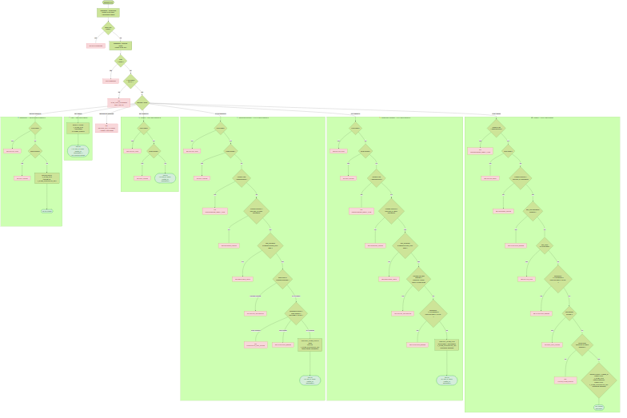
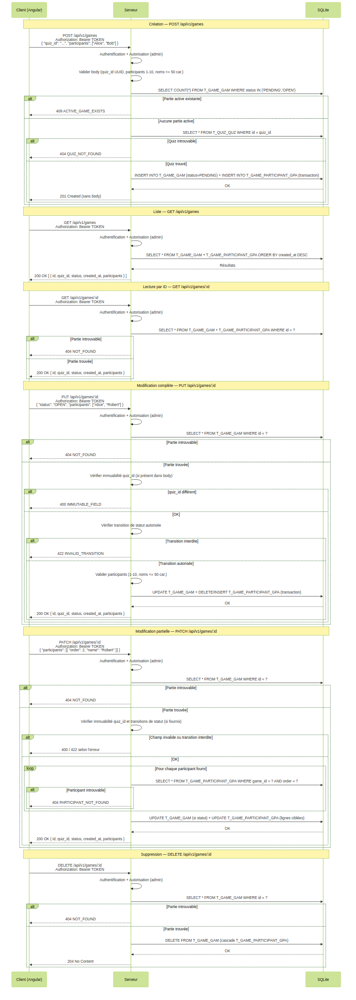

# US-010 — CRUD des parties

## 📋 Contexte projet

Le projet **Quiz Buzzer** se décompose en quatre applications :

| Application | Technologie | Rôle |
|---|---|---|
| **Buzzers** | PlatformIO / ESP32-S3 | Périphériques physiques de jeu |
| **App mobile** | Android / NFC | Configuration WiFi des buzzers |
| **App maître de jeu** | Angular | Interface de gestion des parties |
| **Serveur (hub)** | Node.js / JavaScript | Communication WebSocket entre l'app Angular et les buzzers, gestion du workflow des parties |

---

## 🎯 User Story

> **En tant qu'** administrateur,
> **je veux** créer, consulter, modifier et supprimer des parties en associant un quiz et des participants,
> **afin de** gérer le cycle de vie complet d'une session de jeu avec les buzzers.

---

## ✅ Critères d'acceptance

> 🧪 **Exigence de couverture** — Chaque critère d'acceptance listé ci-dessous doit être couvert par **au moins un test automatisé** (unitaire et/ou d'intégration). Un CA non couvert par un test est considéré comme **non livré**. La couverture globale du code de l'US doit être **≥ 90%**, mesurée via `jest --coverage`.

### Création — `POST /api/v1/games`

| # | Critère | Résultat attendu |
|---|---|---|
| CA-1 | Créer une partie avec un `quiz_id` valide et une liste valide de participants | `201 Created` sans body |
| CA-2 | Le statut initial de la partie est `PENDING` | Garanti côté serveur, non fourni par le client |
| CA-3 | L'ID de la partie est un UUIDv7 généré côté Node.js | Format UUID standard (8-4-4-4-12), version 7 |
| CA-4 | L'horodatage `created_at` est en ISO 8601 UTC (millisecondes), généré côté Node.js | Exemple : "2026-03-14T10:00:00.000Z" |
| CA-5 | `quiz_id` doit être un UUID valide | Sinon → `400 INVALID_UUID` |
| CA-6 | `quiz_id` doit référencer un quiz existant en base | Sinon → `404 QUIZ_NOT_FOUND` |
| CA-7 | Il ne peut exister qu'une seule partie active (`PENDING` ou `OPEN`) à la fois | Si une partie active existe → `409 ACTIVE_GAME_EXISTS` |
| CA-8 | `participants` doit être un tableau de 1 à 10 éléments | Tableau vide ou plus de 10 éléments → `400 VALIDATION_ERROR` |
| CA-9 | Chaque nom de participant est une chaîne non vide d'au maximum 50 caractères | Sinon → `400 VALIDATION_ERROR` |
| CA-10 | Les participants sont insérés dans `T_GAME_PARTICIPANT_GPA` avec leur ordre (1-based) | Garanti par la colonne `GPA_ORDER` |
| CA-11 | Le body ne doit contenir que les champs `quiz_id` et `participants` | Champs inconnus → `400 UNKNOWN_FIELDS` |
| CA-12 | Le `Content-Type` doit être `application/json` | Sinon → `415 UNSUPPORTED_MEDIA_TYPE` |
| CA-13 | Body non parseable | `400 INVALID_BODY` |
| CA-14 | `quiz_id` ou `participants` absent du body | `400 VALIDATION_ERROR` avec message explicite |

### Lecture de la liste — `GET /api/v1/games`

| # | Critère | Résultat attendu |
|---|---|---|
| CA-15 | Récupérer la liste de toutes les parties | `200 OK` avec tableau de parties (voir format ci-dessous) |
| CA-16 | Aucune partie en base | `200 OK` avec `[]` |
| CA-17 | Tri par date de création décroissante (plus récentes en premier) | Ordre garanti |
| CA-18 | Chaque partie retournée contient tous les champs enregistrés en base | `id`, `quiz_id`, `status`, `created_at`, `participants` (tableau ordonné) |

### Lecture par ID — `GET /api/v1/games/:id`

| # | Critère | Résultat attendu |
|---|---|---|
| CA-19 | Récupérer une partie par son ID | `200 OK` avec tous les champs de la partie |
| CA-20 | ID inexistant | `404 NOT_FOUND` |
| CA-21 | ID mal formé | `400 INVALID_UUID` |

### Modification complète — `PUT /api/v1/games/:id`

| # | Critère | Résultat attendu |
|---|---|---|
| CA-22 | Modifier l'ensemble des participants d'une partie | `200 OK` avec la partie mise à jour |
| CA-23 | Modifier le statut d'une partie | `200 OK` avec la partie mise à jour |
| CA-24 | `quiz_id` est immuable — s'il est présent dans le body, il doit correspondre à l'ID en base | Sinon → `400 IMMUTABLE_FIELD` |
| CA-25 | Transitions de statut autorisées : `PENDING → OPEN`, `OPEN → COMPLETED` | `200 OK` |
| CA-26 | Transition `PENDING → COMPLETED` interdite | `422 INVALID_TRANSITION` |
| CA-27 | Toute transition depuis `COMPLETED` est interdite | `422 INVALID_TRANSITION` |
| CA-28 | Toute transition vers `IN_ERROR` via PUT est interdite | `422 INVALID_TRANSITION` |
| CA-29 | Toute transition depuis `IN_ERROR` est interdite | `422 INVALID_TRANSITION` |
| CA-30 | Modification des participants : le tableau remplace entièrement la liste existante | L'ordre et les noms reflètent exactement le nouveau tableau |
| CA-31 | Règles de validation sur `participants` identiques à la création (CA-8, CA-9) | Mêmes codes d'erreur |
| CA-32 | Le body ne doit contenir que les champs `quiz_id` (optionnel), `status` (optionnel) et `participants` (optionnel) | Champs inconnus → `400 UNKNOWN_FIELDS` |
| CA-33 | ID inexistant dans l'URL | `404 NOT_FOUND` |
| CA-34 | ID mal formé dans l'URL | `400 INVALID_UUID` |
| CA-35 | Le `Content-Type` doit être `application/json` | Sinon → `415 UNSUPPORTED_MEDIA_TYPE` |

### Modification partielle — `PATCH /api/v1/games/:id`

| # | Critère | Résultat attendu |
|---|---|---|
| CA-36 | Modifier le statut seul | `200 OK` avec la partie mise à jour |
| CA-37 | Modifier un ou plusieurs participants individuellement via `{ "participants": [{ "order": 2, "name": "Nouveau nom" }] }` | `200 OK` avec la partie mise à jour |
| CA-38 | `order` doit correspondre à un participant existant dans la partie | Sinon → `404 PARTICIPANT_NOT_FOUND` |
| CA-39 | `order` doit être un entier entre 1 et 10 | Sinon → `400 VALIDATION_ERROR` |
| CA-40 | Le nom modifié respecte les mêmes règles que la création (non vide, max 50 chars) | Sinon → `400 VALIDATION_ERROR` |
| CA-41 | `quiz_id` est immuable — s'il est présent dans le body, il doit correspondre à l'ID en base | Sinon → `400 IMMUTABLE_FIELD` |
| CA-42 | Les mêmes règles de transition de statut s'appliquent (CA-25 à CA-29) | Mêmes codes d'erreur |
| CA-43 | Le body ne doit contenir que les champs `quiz_id` (optionnel), `status` (optionnel) et `participants` (optionnel) | Champs inconnus → `400 UNKNOWN_FIELDS` |
| CA-44 | ID inexistant dans l'URL | `404 NOT_FOUND` |
| CA-45 | ID mal formé dans l'URL | `400 INVALID_UUID` |
| CA-46 | Le `Content-Type` doit être `application/json` | Sinon → `415 UNSUPPORTED_MEDIA_TYPE` |

### Suppression — `DELETE /api/v1/games/:id`

| # | Critère | Résultat attendu |
|---|---|---|
| CA-47 | Supprimer une partie quel que soit son statut | `204 No Content` sans body |
| CA-48 | La suppression efface en cascade les entrées dans `T_GAME_PARTICIPANT_GPA` | Les participants sont supprimés |
| CA-49 | ID inexistant | `404 NOT_FOUND` |
| CA-50 | ID mal formé | `400 INVALID_UUID` |
| CA-51 | Un body éventuel est ignoré silencieusement | Aucune erreur |

### Sécurité et transversalité

| # | Critère | Résultat attendu |
|---|---|---|
| CA-52 | Toutes les routes sont protégées par un Bearer token | Token absent/invalide/expiré → `401 UNAUTHORIZED` |
| CA-53 | Seul l'administrateur peut effectuer des opérations | Rôle insuffisant → `403 FORBIDDEN` |
| CA-54 | Rate limiting : max 100 requêtes par minute par IP | Dépassement → `429 RATE_LIMIT_EXCEEDED` avec header `Retry-After: 60` |
| CA-55 | Méthode HTTP non supportée | `405 METHOD_NOT_ALLOWED` avec header `Allow` adapté |
| CA-56 | Erreur serveur inattendue | `500 INTERNAL_SERVER_ERROR` (aucun détail technique exposé) |
| CA-57 | Tests unitaires et d'intégration | Couverture ≥ 90% |

---

## 🔀 Machine à états — `GAM_STATUS`

```
               ┌─────────────────────────────────────────────┐
               │           [serveur uniquement]               │
               ▼                                              │
PENDING ──► OPEN ──► COMPLETED          IN_ERROR (statut final)
   │                     │
   │   (interdit)        │ (statut final)
   └──────────────────── ┘
```

| Transition | Via PUT/PATCH | Via serveur | Autorisée |
|---|---|---|---|
| `PENDING → OPEN` | ✅ | ✅ | ✅ |
| `OPEN → COMPLETED` | ✅ | ✅ | ✅ |
| `PENDING → COMPLETED` | ❌ | ❌ | ❌ |
| `COMPLETED → *` | ❌ | ❌ | ❌ |
| `* → IN_ERROR` | ❌ | ✅ | Serveur uniquement |
| `IN_ERROR → *` | ❌ | ❌ | ❌ |

---

## 🔄 Diagramme de flux



---

## 🔀 Diagramme de séquences



---

## 🧪 Cas de tests — requêtes cURL

> **Variables** à définir avant d'exécuter les commandes :
> ```bash
> BASE_URL=http://localhost:3000
> TOKEN=<votre_token_JWT_admin>       # Obtenu via POST /api/v1/token (US-003)
> TOKEN_BUZZER=<token_JWT_buzzer>     # Token avec rôle buzzer (pour CA-53)
> QUIZ_ID=<uuid_quiz_existant>        # UUID d'un quiz créé via US-008
> GAME_ID=<uuid_partie_créée>         # Renseigné après CA-1
> ```

### Création — `POST /api/v1/games`

**CA-1** — Créer une partie valide → `201 Created`

```bash
curl -s -w "\n→ HTTP %{http_code}\n" -X POST "$BASE_URL/api/v1/games" \
  -H "Authorization: Bearer $TOKEN" \
  -H "Content-Type: application/json" \
  -d '{
    "quiz_id": "'$QUIZ_ID'",
    "participants": ["Alice", "Bob", "Charlie"]
  }'
```

**CA-5** — `quiz_id` mal formé → `400 INVALID_UUID`

```bash
curl -s -w "\n→ HTTP %{http_code}\n" -X POST "$BASE_URL/api/v1/games" \
  -H "Authorization: Bearer $TOKEN" \
  -H "Content-Type: application/json" \
  -d '{"quiz_id": "pas-un-uuid", "participants": ["Alice"]}'
```

**CA-6** — `quiz_id` inexistant → `404 QUIZ_NOT_FOUND`

```bash
curl -s -w "\n→ HTTP %{http_code}\n" -X POST "$BASE_URL/api/v1/games" \
  -H "Authorization: Bearer $TOKEN" \
  -H "Content-Type: application/json" \
  -d '{"quiz_id": "018e4f5a-0000-0000-0000-000000000000", "participants": ["Alice"]}'
```

**CA-7** — Partie active déjà existante → `409 ACTIVE_GAME_EXISTS`

```bash
# Prérequis : une partie en statut PENDING ou OPEN existe déjà
curl -s -w "\n→ HTTP %{http_code}\n" -X POST "$BASE_URL/api/v1/games" \
  -H "Authorization: Bearer $TOKEN" \
  -H "Content-Type: application/json" \
  -d '{"quiz_id": "'$QUIZ_ID'", "participants": ["Alice"]}'
# Attendu : {"status":409,"error":"ACTIVE_GAME_EXISTS","message":"A game is already active. Delete it before creating a new one."}
```

**CA-8** — Tableau vide → `400 VALIDATION_ERROR`

```bash
curl -s -w "\n→ HTTP %{http_code}\n" -X POST "$BASE_URL/api/v1/games" \
  -H "Authorization: Bearer $TOKEN" \
  -H "Content-Type: application/json" \
  -d '{"quiz_id": "'$QUIZ_ID'", "participants": []}'
```

**CA-9** — Nom trop long → `400 VALIDATION_ERROR`

```bash
curl -s -w "\n→ HTTP %{http_code}\n" -X POST "$BASE_URL/api/v1/games" \
  -H "Authorization: Bearer $TOKEN" \
  -H "Content-Type: application/json" \
  -d '{"quiz_id": "'$QUIZ_ID'", "participants": ["'"$(python3 -c "print('A'*51)")"']}'
```

### Lecture de la liste — `GET /api/v1/games`

**CA-15** — Lister toutes les parties → `200 OK`

```bash
curl -s -w "\n→ HTTP %{http_code}\n" -X GET "$BASE_URL/api/v1/games" \
  -H "Authorization: Bearer $TOKEN"
```

### Lecture par ID — `GET /api/v1/games/:id`

**CA-19** — Récupérer une partie → `200 OK`

```bash
curl -s -w "\n→ HTTP %{http_code}\n" -X GET "$BASE_URL/api/v1/games/$GAME_ID" \
  -H "Authorization: Bearer $TOKEN"
```

**CA-20** — ID inexistant → `404 NOT_FOUND`

```bash
curl -s -w "\n→ HTTP %{http_code}\n" -X GET "$BASE_URL/api/v1/games/018e4f5a-0000-7000-8000-000000000000" \
  -H "Authorization: Bearer $TOKEN"
```

### Modification complète — `PUT /api/v1/games/:id`

**CA-23 + CA-25** — Passer la partie en `OPEN` → `200 OK`

```bash
curl -s -w "\n→ HTTP %{http_code}\n" -X PUT "$BASE_URL/api/v1/games/$GAME_ID" \
  -H "Authorization: Bearer $TOKEN" \
  -H "Content-Type: application/json" \
  -d '{
    "status": "OPEN",
    "participants": ["Alice", "Bob", "Charlie"]
  }'
```

**CA-26** — Transition `PENDING → COMPLETED` interdite → `422 INVALID_TRANSITION`

```bash
curl -s -w "\n→ HTTP %{http_code}\n" -X PUT "$BASE_URL/api/v1/games/$GAME_ID" \
  -H "Authorization: Bearer $TOKEN" \
  -H "Content-Type: application/json" \
  -d '{"status": "COMPLETED", "participants": ["Alice"]}'
# Prérequis : partie en statut PENDING
```

**CA-24** — `quiz_id` différent → `400 IMMUTABLE_FIELD`

```bash
curl -s -w "\n→ HTTP %{http_code}\n" -X PUT "$BASE_URL/api/v1/games/$GAME_ID" \
  -H "Authorization: Bearer $TOKEN" \
  -H "Content-Type: application/json" \
  -d '{"quiz_id": "018e4f5a-0000-0000-0000-000000000000", "participants": ["Alice"]}'
```

### Modification partielle — `PATCH /api/v1/games/:id`

**CA-37** — Renommer un participant → `200 OK`

```bash
curl -s -w "\n→ HTTP %{http_code}\n" -X PATCH "$BASE_URL/api/v1/games/$GAME_ID" \
  -H "Authorization: Bearer $TOKEN" \
  -H "Content-Type: application/json" \
  -d '{"participants": [{"order": 2, "name": "Robert"}]}'
```

**CA-38** — `order` inexistant → `404 PARTICIPANT_NOT_FOUND`

```bash
curl -s -w "\n→ HTTP %{http_code}\n" -X PATCH "$BASE_URL/api/v1/games/$GAME_ID" \
  -H "Authorization: Bearer $TOKEN" \
  -H "Content-Type: application/json" \
  -d '{"participants": [{"order": 9, "name": "Robert"}]}'
# Prérequis : la partie n'a pas de participant en position 9
```

**CA-36** — Modifier le statut seul → `200 OK`

```bash
curl -s -w "\n→ HTTP %{http_code}\n" -X PATCH "$BASE_URL/api/v1/games/$GAME_ID" \
  -H "Authorization: Bearer $TOKEN" \
  -H "Content-Type: application/json" \
  -d '{"status": "OPEN"}'
# Prérequis : partie en statut PENDING
```

### Suppression — `DELETE /api/v1/games/:id`

**CA-47** — Supprimer une partie → `204 No Content`

```bash
curl -s -w "\n→ HTTP %{http_code}\n" -X DELETE "$BASE_URL/api/v1/games/$GAME_ID" \
  -H "Authorization: Bearer $TOKEN"
```

**CA-49** — ID inexistant → `404 NOT_FOUND`

```bash
curl -s -w "\n→ HTTP %{http_code}\n" -X DELETE "$BASE_URL/api/v1/games/018e4f5a-0000-0000-0000-000000000000" \
  -H "Authorization: Bearer $TOKEN"
```

### Sécurité et transversalité

**CA-52** — Token absent → `401 UNAUTHORIZED`

```bash
curl -s -w "\n→ HTTP %{http_code}\n" -X GET "$BASE_URL/api/v1/games"
```

**CA-53** — Rôle buzzer → `403 FORBIDDEN`

```bash
curl -s -w "\n→ HTTP %{http_code}\n" -X GET "$BASE_URL/api/v1/games" \
  -H "Authorization: Bearer $TOKEN_BUZZER"
```

**CA-55** — Méthode non supportée sur la collection → `405 METHOD_NOT_ALLOWED`

```bash
curl -s -v -w "\n→ HTTP %{http_code}\n" -X PATCH "$BASE_URL/api/v1/games" \
  -H "Authorization: Bearer $TOKEN"
# Vérifier : 405 et header "Allow: GET, POST"
```

---

## 🔧 Spécifications techniques

| Élément | Choix |
|---|---|
| Runtime | Node.js 24 LTS (dernière version stable disponible) |
| Langage | JavaScript (ES Modules) |
| Base de données | SQLite |
| Tests | Jest (dernière version stable disponible) |
| Identifiants | UUIDv7 généré côté Node.js |
| Horodatage | ISO 8601 UTC (millisecondes), généré côté Node.js |
| Principes d'architecture | YAGNI, KISS, DRY, SOLID |

> ⚠️ **Exigence fondamentale** — Toute implémentation de cette US doit scrupuleusement respecter les principes **KISS** (solutions simples), **DRY** (pas de duplication), **YAGNI** (pas de fonctionnalité prématurée) et **SOLID** (architecture modulaire et responsabilités séparées). Ces principes prévalent sur toute optimisation prématurée ou généralisation non justifiée par un besoin immédiat documenté.

### Schéma des tables

Cette US introduit deux nouvelles tables dans `src/database/database.js` :

```sql
CREATE TABLE IF NOT EXISTS T_GAME_GAM
(
    GAM_ID         TEXT PRIMARY KEY,
    GAM_QUIZ_ID    TEXT NOT NULL REFERENCES T_QUIZ_QUZ (QUZ_ID),
    GAM_STATUS     TEXT NOT NULL DEFAULT 'PENDING'
                       CHECK (GAM_STATUS IN ('PENDING', 'OPEN', 'COMPLETED', 'IN_ERROR')),
    GAM_CREATED_AT TEXT NOT NULL
);

CREATE TABLE IF NOT EXISTS T_GAME_PARTICIPANT_GPA
(
    GPA_GAME_ID TEXT    NOT NULL REFERENCES T_GAME_GAM (GAM_ID) ON DELETE CASCADE,
    GPA_NAME    TEXT    NOT NULL,
    GPA_ORDER   INTEGER NOT NULL CHECK (GPA_ORDER BETWEEN 1 AND 10),
    PRIMARY KEY (GPA_GAME_ID, GPA_ORDER)
);
```

### Format JSON — Réponse GET (liste et par ID)

```json
[
  {
    "id": "018e4f5d-0000-7000-8000-000000000001",
    "quiz_id": "018e4f5c-0000-7000-8000-000000000001",
    "status": "PENDING",
    "created_at": "2026-03-14T10:00:00.000Z",
    "participants": [
      { "order": 1, "name": "Alice" },
      { "order": 2, "name": "Bob" },
      { "order": 3, "name": "Charlie" }
    ]
  }
]
```

### Format JSON — Body PUT

```json
{
  "status": "OPEN",
  "participants": ["Alice", "Robert", "Charlie"]
}
```

### Format JSON — Body PATCH

```json
{
  "participants": [
    { "order": 2, "name": "Robert" }
  ]
}
```

---

## 📡 Endpoints

| Méthode | URL | Description | Auth | Code succès |
|---|---|---|---|---|
| `POST` | `/api/v1/games` | Créer une partie | Bearer (admin) | `201 Created` |
| `GET` | `/api/v1/games` | Lister les parties | Bearer (admin) | `200 OK` |
| `GET` | `/api/v1/games/:id` | Récupérer une partie | Bearer (admin) | `200 OK` |
| `PUT` | `/api/v1/games/:id` | Modifier complètement une partie | Bearer (admin) | `200 OK` |
| `PATCH` | `/api/v1/games/:id` | Modifier partiellement une partie | Bearer (admin) | `200 OK` |
| `DELETE` | `/api/v1/games/:id` | Supprimer une partie | Bearer (admin) | `204 No Content` |

### Headers `Allow` par ressource

| URL | Méthodes autorisées |
|---|---|
| `/api/v1/games` | `GET, POST` |
| `/api/v1/games/:id` | `GET, PUT, PATCH, DELETE` |

---

## 🔐 Authentification et autorisation

| Élément | Valeur |
|---|---|
| Type de token | JWT |
| Algorithme de signature | HS256 (symétrique) |
| Transmission | Header `Authorization: Bearer <token>` |
| Secret de signature | Variable d'environnement `JWT_SECRET` (min 32 caractères) |
| Durée de validité | 1 heure (3600s), configurable via `JWT_EXPIRATION` |
| Renouvellement | Reconnexion via `POST /api/v1/token` (US-003) |

Les middlewares `authenticate` et `authorize('admin')` existants sont réutilisés tels quels, conformément aux principes DRY et Open/Closed (SOLID).

---

## 🚨 Catalogue des erreurs

| Code erreur | Code HTTP | Message | Contexte |
|---|---|---|---|
| `VALIDATION_ERROR` | `400` | _(dynamique)_ | Champ manquant, nom vide, tableau invalide |
| `INVALID_UUID` | `400` | "The provided ID is not a valid UUID." | UUID mal formé |
| `INVALID_BODY` | `400` | "Request body must be a JSON object." | Body non parseable |
| `UNKNOWN_FIELDS` | `400` | "Unknown field(s): foo." | Champs non reconnus |
| `IMMUTABLE_FIELD` | `400` | "quiz_id cannot be changed after creation." | Tentative de modification du `quiz_id` |
| `UNAUTHORIZED` | `401` | "Authentication token is missing or invalid." | Token absent/expiré/invalide |
| `FORBIDDEN` | `403` | "You do not have permission to perform this action." | Rôle insuffisant |
| `NOT_FOUND` | `404` | "The requested game was not found." | Partie inexistante |
| `QUIZ_NOT_FOUND` | `404` | "The requested quiz was not found." | Quiz référencé inexistant |
| `PARTICIPANT_NOT_FOUND` | `404` | "No participant found at order <n> for this game." | Position de participant inexistante |
| `METHOD_NOT_ALLOWED` | `405` | _(dynamique)_ | Méthode non supportée |
| `ACTIVE_GAME_EXISTS` | `409` | "A game is already active. Delete it before creating a new one." | Partie active déjà existante |
| `UNSUPPORTED_MEDIA_TYPE` | `415` | "Content-Type must be 'application/json'." | Content-Type incorrect |
| `RATE_LIMIT_EXCEEDED` | `429` | "Too many requests. Please retry in 60 seconds." | Rate limit dépassé |
| `INVALID_TRANSITION` | `422` | "Cannot transition from <current> to <target>." | Transition de statut interdite |
| `INTERNAL_SERVER_ERROR` | `500` | "An unexpected error occurred. Please try again later." | Erreur serveur |

---

## 📐 Périmètre

| Inclus | Exclu |
|---|---|
| Création d'une partie avec participants | Démarrage automatique via WebSocket (US suivante) |
| Lecture liste et par ID | Scores et réponses par participant (US suivantes) |
| Modification complète (PUT) et partielle (PATCH) | Notifications WebSocket lors des transitions (US suivantes) |
| Suppression avec cascade | Activation de la garde `QUIZ_IN_USE` (US-008 CA-31, US suivante) |
| Machine à états avec transitions gardées | Interface Angular |
| Statut `IN_ERROR` réservé au serveur | |
| Tests unitaires et d'intégration (couverture ≥ 90%) | |

---

## 🔍 Points de vigilance

### Unicité de la partie active

La contrainte de CA-7 est vérifiée côté application avant toute insertion :

```sql
SELECT COUNT(*) FROM T_GAME_GAM WHERE GAM_STATUS IN ('PENDING', 'OPEN')
```

Si le résultat est supérieur à 0 → `409 ACTIVE_GAME_EXISTS`.

### Immuabilité de `quiz_id`

Le `quiz_id` est défini à la création et ne peut jamais être modifié. Si le client envoie un `quiz_id` via PUT ou PATCH, il doit être comparé à la valeur en base. Toute divergence → `400 IMMUTABLE_FIELD`. Si identique, il est ignoré silencieusement.

### Remplacement des participants (PUT)

Le PUT remplace intégralement la liste des participants. L'implémentation doit supprimer toutes les entrées existantes de `T_GAME_PARTICIPANT_GPA` pour cette partie, puis réinsérer les nouvelles — **dans la même transaction**.

### Modification individuelle des participants (PATCH)

Le PATCH ne modifie que les participants dont le `order` est fourni. Chaque `order` doit correspondre à un participant existant (`GPA_ORDER` présent en base pour ce `GAM_ID`). L'absence d'un `order` → `404 PARTICIPANT_NOT_FOUND`.

### Transactions

Toute opération impliquant `T_GAME_GAM` et `T_GAME_PARTICIPANT_GPA` simultanément (création, PUT) doit être effectuée dans une transaction SQLite atomique.

### Suppression en cascade

`T_GAME_PARTICIPANT_GPA` déclare `ON DELETE CASCADE` sur `GPA_GAME_ID`. La suppression d'une partie entraîne automatiquement la suppression de tous ses participants, sans action supplémentaire côté application.

### Ordre d'implémentation recommandé

> 1. Étendre le schéma : ajouter `T_GAME_GAM` et `T_GAME_PARTICIPANT_GPA` dans `src/database/database.js`
> 2. Créer `src/repositories/gameRepository.js`
> 3. Créer `src/services/gameService.js`
> 4. Créer `src/routes/gameRoute.js` (collection + resource handlers)
> 5. Brancher les handlers dans `src/index.js`

---

