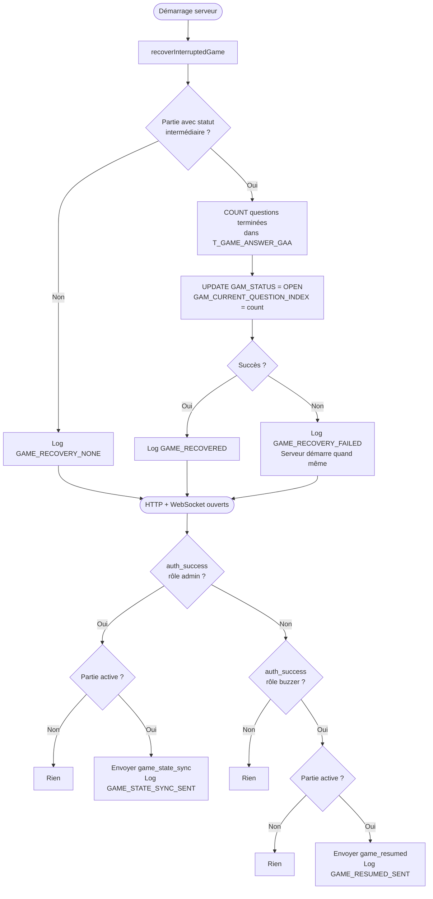
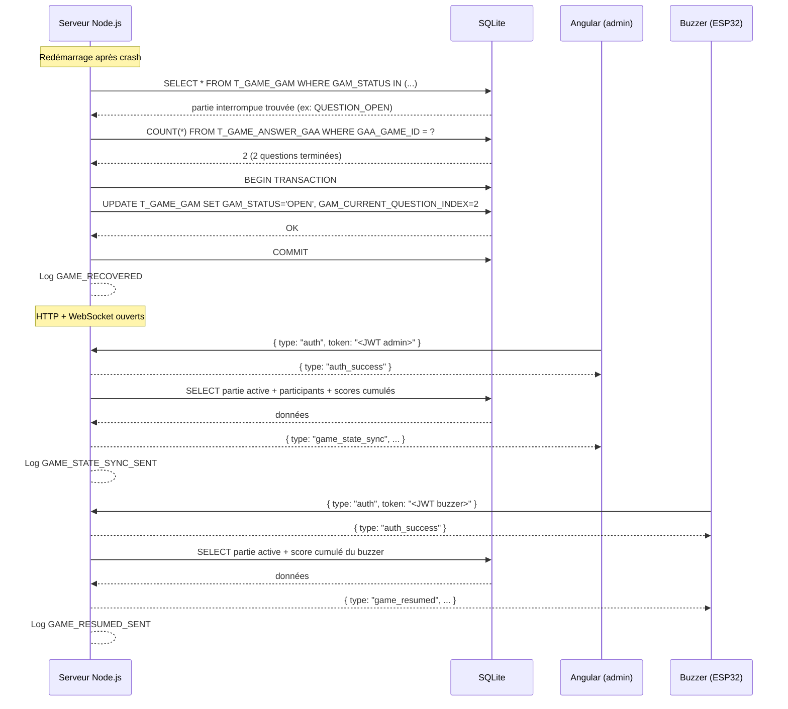

# US-019 — Reprise de partie après crash serveur

## 📋 Contexte projet

Le projet **Quiz Buzzer** se décompose en quatre applications :

| Application | Technologie | Rôle |
|---|---|---|
| **Buzzers** | PlatformIO / ESP32-S3 | Périphériques physiques de jeu |
| **App mobile** | Android / NFC | Configuration WiFi des buzzers |
| **App maître de jeu** | Angular | Interface de gestion des parties |
| **Serveur (hub)** | Node.js / JavaScript | Communication WebSocket entre l'app Angular et les buzzers, gestion du workflow des parties |

---

## 🎯 User Story

> **En tant que** maître du jeu,
> **je veux** que le serveur reprenne automatiquement une partie interrompue au redémarrage, et que les clients reconnectés reçoivent l'état courant de la partie,
> **afin de** poursuivre une partie sans avoir à la recréer manuellement après un crash ou une coupure réseau.

---

## ✅ Critères d'acceptance

> 🧪 **Exigence de couverture** — Chaque critère d'acceptance listé ci-dessous doit être couvert par **au moins un test automatisé** (unitaire et/ou d'intégration). Un CA non couvert par un test est considéré comme **non livré**. La couverture globale du code de l'US doit être **≥ 90%**, mesurée via `jest --coverage`.

### Reprise au démarrage du serveur

| # | Critère | Résultat attendu |
|---|---|---|
| CA-1 | Au démarrage, aucune partie n'est en statut intermédiaire (`QUESTION_TITLE`, `QUESTION_OPEN`, `QUESTION_BUZZED`, `QUESTION_CLOSED`) | Le serveur démarre normalement sans modification en base — log `INFO GAME_RECOVERY_NONE` |
| CA-2 | Au démarrage, une partie est trouvée en statut intermédiaire | Le serveur calcule le nombre de questions complètement terminées (COUNT dans `T_GAME_ANSWER_GAA`), met à jour `GAM_STATUS = 'OPEN'` et `GAM_CURRENT_QUESTION_INDEX` = ce count, puis log `INFO GAME_RECOVERED` |
| CA-3 | La question interrompue (celle dont les scores ne sont pas persistés) est toujours rejouée depuis le début | `GAM_CURRENT_QUESTION_INDEX` pointe sur la question suivant la dernière complètement terminée |
| CA-4 | Aucune question n'a encore été terminée au moment du crash (première question interrompue, `T_GAME_ANSWER_GAA` vide pour cette partie) | `GAM_CURRENT_QUESTION_INDEX = 0`, `GAM_STATUS = 'OPEN'` — la première question sera rejouée |
| CA-5 | Une partie est trouvée en statut `IN_ERROR` au démarrage | Le serveur ne tente aucune restauration — la partie reste en `IN_ERROR`, aucun log de reprise |
| CA-6 | Une partie est trouvée en statut `PENDING` au démarrage | Le serveur ne la modifie pas — elle reste `PENDING`, le maître du jeu reprend normalement |
| CA-7 | Une partie est trouvée en statut `COMPLETED` au démarrage | Le serveur ne la modifie pas |
| CA-8 | La logique de reprise s'exécute **avant** que le serveur HTTP et WebSocket commence à accepter des connexions | Aucun client ne peut se connecter sur un état incohérent |
| CA-9 | La mise à jour en base est effectuée dans une transaction atomique | En cas d'échec SQLite, le serveur log `ERROR GAME_RECOVERY_FAILED` et continue son démarrage sans modifier l'état |

### Synchronisation d'Angular à la reconnexion

| # | Critère | Résultat attendu |
|---|---|---|
| CA-10 | Angular se reconnecte (rôle `admin`) alors qu'aucune partie active n'existe (`OPEN`, `QUESTION_TITLE`, `QUESTION_OPEN`, `QUESTION_BUZZED`, `QUESTION_CLOSED`) | Aucun message de synchronisation envoyé |
| CA-11 | Angular se reconnecte (rôle `admin`) alors qu'une partie est en statut `OPEN` | Le serveur envoie `game_state_sync` à Angular immédiatement après `auth_success` — sans `started_at` ni `time_limit` |
| CA-12 | Angular se reconnecte alors qu'une partie est en statut `QUESTION_TITLE` ou `QUESTION_CLOSED` | Le serveur envoie `game_state_sync` à Angular sans `started_at` ni `time_limit` |
| CA-13 | Angular se reconnecte alors qu'une partie est en statut `QUESTION_OPEN` ou `QUESTION_BUZZED` | Le serveur envoie `game_state_sync` à Angular avec `started_at` et `time_limit` pour permettre le recalcul du temps restant côté Angular |
| CA-14 | Le message `game_state_sync` contient `game_id`, `status`, `question_index`, `quiz_id` et la liste des participants avec leur score cumulé | Données calculées à partir de `T_GAME_GAM`, `T_GAME_PARTICIPANT_GPA` et `T_GAME_ANSWER_GAA` |
| CA-15 | Une partie en statut `IN_ERROR`, `PENDING` ou `COMPLETED` n'entraîne pas l'envoi d'un `game_state_sync` | Angular ne reçoit aucun message de synchronisation pour ces statuts |

### Synchronisation d'un buzzer à la reconnexion

| # | Critère | Résultat attendu |
|---|---|---|
| CA-16 | Un buzzer se reconnecte (rôle `buzzer`) alors qu'aucune partie active n'existe | Aucun message de synchronisation envoyé |
| CA-17 | Un buzzer se reconnecte alors qu'une partie est active (`OPEN`, `QUESTION_TITLE`, `QUESTION_OPEN`, `QUESTION_BUZZED`, `QUESTION_CLOSED`) | Le serveur envoie `game_resumed` au buzzer immédiatement après `auth_success` |
| CA-18 | Le message `game_resumed` contient `question_index`, `cumulative_score` (score cumulé du buzzer concerné calculé depuis `T_GAME_ANSWER_GAA`) et `status` | Chaque buzzer ne reçoit que son propre score cumulé |
| CA-19 | Un buzzer se reconnecte et n'a encore marqué aucun point (`T_GAME_ANSWER_GAA` vide pour ce participant) | `cumulative_score: 0` dans `game_resumed` |
| CA-20 | Une partie en statut `IN_ERROR`, `PENDING` ou `COMPLETED` n'entraîne pas l'envoi d'un `game_resumed` | Le buzzer ne reçoit aucun message de synchronisation pour ces statuts |

### Logging

| # | Critère | Résultat attendu |
|---|---|---|
| CA-21 | Reprise réussie au démarrage | Log `INFO GAME_RECOVERED` avec `game_id`, `old_status`, `new_question_index` |
| CA-22 | Aucune partie à reprendre au démarrage | Log `INFO GAME_RECOVERY_NONE` |
| CA-23 | Échec de la mise à jour en base lors de la reprise | Log `ERROR GAME_RECOVERY_FAILED` avec `game_id` et détail de l'erreur |
| CA-24 | Envoi de `game_state_sync` à Angular | Log `INFO GAME_STATE_SYNC_SENT` avec `game_id` et `status` |
| CA-25 | Envoi de `game_resumed` à un buzzer | Log `INFO GAME_RESUMED_SENT` avec `game_id` et `username` |
| CA-26 | Tests unitaires et d'intégration | Couverture ≥ 90% |

---

## 🔄 Diagramme de flux




---

## 🔀 Diagramme de séquences




---

## 🔧 Spécifications techniques

| Élément | Choix |
|---|---|
| Runtime | Node.js 24 LTS (dernière version stable disponible) |
| Langage | JavaScript (ES Modules) |
| Base de données | SQLite |
| Tests | Jest (dernière version stable disponible) |
| Bibliothèque WebSocket | `ws` (dernière version stable disponible) |
| Principes d'architecture | YAGNI, KISS, DRY, SOLID |

> ⚠️ **Exigence fondamentale** — Toute implémentation de cette US doit scrupuleusement respecter les principes **KISS** (solutions simples), **DRY** (pas de duplication), **YAGNI** (pas de fonctionnalité prématurée) et **SOLID** (architecture modulaire et responsabilités séparées). Ces principes prévalent sur toute optimisation prématurée ou généralisation non justifiée par un besoin immédiat documenté.

### Pas de modification de schéma SQL

Cette US n'introduit aucune table ni colonne. Les tables `T_GAME_GAM` et `T_GAME_ANSWER_GAA` définies dans les US-010 et US-011 sont suffisantes.

### Requête de détection des parties interrompues

```sql
SELECT
  GAM_ID,
  GAM_STATUS,
  GAM_CURRENT_QUESTION_INDEX
FROM T_GAME_GAM
WHERE GAM_STATUS IN (
  'QUESTION_TITLE',
  'QUESTION_OPEN',
  'QUESTION_BUZZED',
  'QUESTION_CLOSED'
)
LIMIT 1;
```

> La contrainte d'unicité de la partie active (US-010) garantit qu'au plus une ligne peut être retournée. Le `LIMIT 1` est une sécurité défensive.

### Requête de calcul du nouvel index

```sql
SELECT COUNT(DISTINCT GAA_QUESTION_ID) AS questions_terminées
FROM T_GAME_ANSWER_GAA
WHERE GAA_GAME_ID = ?;
```

> Une question est considérée complètement terminée si au moins une ligne la référence dans `T_GAME_ANSWER_GAA`. Pour les questions SPEED sans gagnant, aucune ligne n'est insérée (US-012 CA-27) — elles ne sont donc **pas** comptabilisées ici.

> ⚠️ **Point de vigilance** — Pour les questions SPEED sans gagnant (aucune ligne dans `T_GAME_ANSWER_GAA`), cette requête sous-compte le nombre de questions terminées. Voir la section **Points de vigilance** pour la résolution.

### Mise à jour atomique

```sql
BEGIN TRANSACTION;
UPDATE T_GAME_GAM
SET GAM_STATUS = 'OPEN',
    GAM_CURRENT_QUESTION_INDEX = ?
WHERE GAM_ID = ?;
COMMIT;
```

### Requête de synchronisation pour `game_state_sync`

```sql
-- Données de la partie
SELECT
  g.GAM_ID,
  g.GAM_STATUS,
  g.GAM_CURRENT_QUESTION_INDEX,
  g.GAM_QUIZ_ID
FROM T_GAME_GAM g
WHERE g.GAM_STATUS IN (
  'OPEN', 'QUESTION_TITLE', 'QUESTION_OPEN',
  'QUESTION_BUZZED', 'QUESTION_CLOSED'
)
LIMIT 1;

-- Participants avec score cumulé
SELECT
  p.GPA_ORDER      AS participant_order,
  p.GPA_NAME       AS name,
  COALESCE(
    (SELECT MAX(a.GAA_CUMULATIVE_SCORE)
     FROM T_GAME_ANSWER_GAA a
     WHERE a.GAA_GAME_ID = p.GPA_GAME_ID
       AND a.GAA_PARTICIPANT_ORDER = p.GPA_ORDER),
    0
  ) AS cumulative_score
FROM T_GAME_PARTICIPANT_GPA p
WHERE p.GPA_GAME_ID = ?
ORDER BY p.GPA_ORDER;
```

### Structure des fichiers

```
src/
  game/
    gameRecovery.js            ← nouveau — logique de reprise au démarrage (SRP)
    gameSync.js                ← nouveau — envoi game_state_sync / game_resumed post-auth
  game/__tests__/
    gameRecovery.test.js       ← nouveau
    gameSync.test.js           ← nouveau
  server.js                    ← modifié — appel recoverInterruptedGame(db) avant listen()
  websocket/
    authHandler.js             ← modifié — appel gameSync après auth_success
```

---

## 🔌 Architecture — Reprise de partie

### Séquence de démarrage modifiée

```
startServer(db)
  1. Connexion SQLite        (existant — US-001)
  2. Migrations              (existant — US-001)
  3. recoverInterruptedGame(db)   ← nouveau — avant toute connexion cliente
  4. Démarrage HTTP + WebSocket   (existant — US-001)
```

### Hook post-authentification

Le module `gameSync.js` expose une fonction `syncGameStateOnConnect(ws, role, username, db)` appelée depuis `authHandler.js` immédiatement après l'envoi de `auth_success` :

```javascript
// authHandler.js — après envoi auth_success
await syncGameStateOnConnect(ws, role, username, db);
```

`syncGameStateOnConnect` encapsule la logique de décision :
- Rôle `admin` → cherche une partie active → envoie `game_state_sync` si trouvée
- Rôle `buzzer` → cherche une partie active + score cumulé du buzzer → envoie `game_resumed` si trouvée

Cette séparation respecte le **SRP** : `authHandler.js` gère l'authentification, `gameSync.js` gère la synchronisation de l'état de jeu.

### Format des messages WebSocket

**Serveur → Angular (`game_state_sync`)**

Statut `OPEN`, `QUESTION_TITLE` ou `QUESTION_CLOSED` :

```json
{
  "type": "game_state_sync",
  "game_id": "018e4f5d-0000-7000-8000-000000000001",
  "status": "OPEN",
  "question_index": 2,
  "quiz_id": "018e4f5d-0000-7000-8000-000000000002",
  "participants": [
    { "order": 1, "name": "Alice", "cumulative_score": 30 },
    { "order": 2, "name": "Bob",   "cumulative_score": 15 },
    { "order": 3, "name": "Charlie", "cumulative_score": 45 }
  ]
}
```

Statut `QUESTION_OPEN` ou `QUESTION_BUZZED` — avec `started_at` et `time_limit` :

```json
{
  "type": "game_state_sync",
  "game_id": "018e4f5d-0000-7000-8000-000000000001",
  "status": "QUESTION_OPEN",
  "question_index": 2,
  "quiz_id": "018e4f5d-0000-7000-8000-000000000002",
  "participants": [
    { "order": 1, "name": "Alice",   "cumulative_score": 30 },
    { "order": 2, "name": "Bob",     "cumulative_score": 15 },
    { "order": 3, "name": "Charlie", "cumulative_score": 45 }
  ],
  "started_at": "2026-03-27T14:30:00.000Z",
  "time_limit": 30
}
```

**Serveur → Buzzer (`game_resumed`)**

```json
{
  "type": "game_resumed",
  "question_index": 2,
  "cumulative_score": 30,
  "status": "OPEN"
}
```

> `status` vaut toujours `OPEN` après une reprise au redémarrage (CA-2). En cas de reconnexion en cours de partie sans redémarrage, `status` reflète l'état courant réel.

---

## 📝 Logging structuré

**Reprise réussie au démarrage :**

```json
{
  "timestamp": "2026-03-27T14:00:00.000Z",
  "level": "INFO",
  "event": "GAME_RECOVERED",
  "game_id": "018e4f5d-0000-7000-8000-000000000001",
  "old_status": "QUESTION_OPEN",
  "new_question_index": 2
}
```

**Aucune partie à reprendre :**

```json
{
  "timestamp": "2026-03-27T14:00:00.000Z",
  "level": "INFO",
  "event": "GAME_RECOVERY_NONE"
}
```

**Échec de la mise à jour en base :**

```json
{
  "timestamp": "2026-03-27T14:00:00.000Z",
  "level": "ERROR",
  "event": "GAME_RECOVERY_FAILED",
  "game_id": "018e4f5d-0000-7000-8000-000000000001",
  "error": "SQLITE_BUSY"
}
```

**Envoi de `game_state_sync` :**

```json
{
  "timestamp": "2026-03-27T14:00:05.000Z",
  "level": "INFO",
  "event": "GAME_STATE_SYNC_SENT",
  "game_id": "018e4f5d-0000-7000-8000-000000000001",
  "status": "OPEN"
}
```

**Envoi de `game_resumed` :**

```json
{
  "timestamp": "2026-03-27T14:00:06.000Z",
  "level": "INFO",
  "event": "GAME_RESUMED_SENT",
  "game_id": "018e4f5d-0000-7000-8000-000000000001",
  "username": "quiz_buzzer_01"
}
```

---

## 📐 Périmètre

| Inclus | Exclu |
|---|---|
| Détection et restauration d'une partie interrompue au démarrage | Reconnexion automatique des buzzers (firmware ESP32 — hors périmètre serveur) |
| Envoi de `game_state_sync` à Angular après reconnexion | Interface Angular de reprise |
| Envoi de `game_resumed` à chaque buzzer après reconnexion | Reprise du chronomètre côté serveur (le maître du jeu re-déclenche la question depuis `OPEN`) |
| Logging structuré des événements de reprise | Refresh token JWT (US dédiée) |
| Tests unitaires et d'intégration (couverture ≥ 90%) | Déploiement / CI-CD |

---

## 🔍 Points de vigilance

### Questions SPEED sans gagnant et calcul de l'index

Les questions SPEED terminées sans gagnant n'insèrent **aucune ligne** dans `T_GAME_ANSWER_GAA` (US-012, CA-27). Un `COUNT(DISTINCT GAA_QUESTION_ID)` sous-compte donc ces questions.

**Solution** : stocker `GAM_CURRENT_QUESTION_INDEX` en base à chaque transition `QUESTION_CLOSED → OPEN` (déjà fait dans US-011 et US-012, CA-2). La reprise doit utiliser la valeur de `GAM_CURRENT_QUESTION_INDEX` **telle qu'elle est en base** si la partie est en `QUESTION_CLOSED`, et revenir à `GAM_CURRENT_QUESTION_INDEX` (sans incrément) pour tous les autres états intermédiaires — la question en cours est à rejouer.

La logique exacte dans `recoverInterruptedGame` est donc :

```
si GAM_STATUS == 'QUESTION_CLOSED'
  → nouvel index = GAM_CURRENT_QUESTION_INDEX + 1
    (la question affichée était terminée, on passe à la suivante)
sinon (QUESTION_TITLE, QUESTION_OPEN, QUESTION_BUZZED)
  → nouvel index = GAM_CURRENT_QUESTION_INDEX
    (la question était en cours, on la rejoue)
dans tous les cas → GAM_STATUS = 'OPEN'
```

### Reconnexion Angular pendant une question ouverte — chronomètre

Lorsque Angular se reconnecte en état `QUESTION_OPEN` ou `QUESTION_BUZZED`, le chronomètre tourne toujours côté serveur. Le `game_state_sync` inclut `started_at` et `time_limit` — Angular recalcule le temps restant localement via `time_limit - (now - started_at)`. Ce mécanisme est cohérent avec le comportement des buzzers décrit dans US-011 et US-012.

Si le chrono a déjà expiré au moment de la reconnexion (le `timer_end` a été émis mais Angular ne l'a pas reçu), Angular affichera `0` secondes restantes — ce qui est correct. Le maître du jeu peut alors envoyer `trigger_correction` normalement.

### Échec de reprise au démarrage — décision de continuer

En cas d'échec SQLite lors de la mise à jour (CA-9), le serveur **continue son démarrage** plutôt que de s'arrêter. La partie reste dans son état intermédiaire en base. Cette décision est pragmatique : bloquer le démarrage du serveur sur un échec de récupération serait pire que de laisser le maître du jeu gérer manuellement la situation (supprimer la partie corrompue via REST et en créer une nouvelle). Le log `ERROR GAME_RECOVERY_FAILED` alerte l'opérateur.

### Indépendance de `gameRecovery.js` et `gameSync.js`

Ces deux modules ont des responsabilités distinctes et des cycles de vie différents :

- `gameRecovery.js` s'exécute **une seule fois** au démarrage, avant l'ouverture des connexions.
- `gameSync.js` s'exécute **à chaque reconnexion** d'un client authentifié.

Ils ne doivent pas être fusionnés (SRP). `gameSync.js` ne doit pas supposer qu'une reprise vient d'avoir lieu — il interroge toujours l'état courant en base.

### Pas de retransmission des événements manqués

Cette US ne rejoue pas les messages WebSocket manqués pendant la déconnexion (`question_title`, `question_choices`, `timer_tick`, etc.). Angular et les buzzers reçoivent uniquement l'état courant consolidé (`game_state_sync` / `game_resumed`). C'est intentionnel (YAGNI) : le maître du jeu reprend le pilotage depuis l'état `OPEN` après un redémarrage serveur, et depuis l'état courant après une simple reconnexion.

---

## 📅 Historique des révisions

| Version | Date | Description |
|---|---|---|
| 1.0 | 2026-03-27 | Version initiale |
