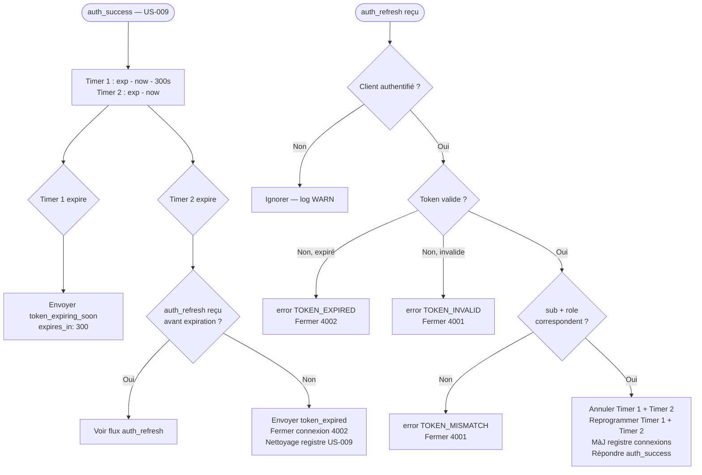
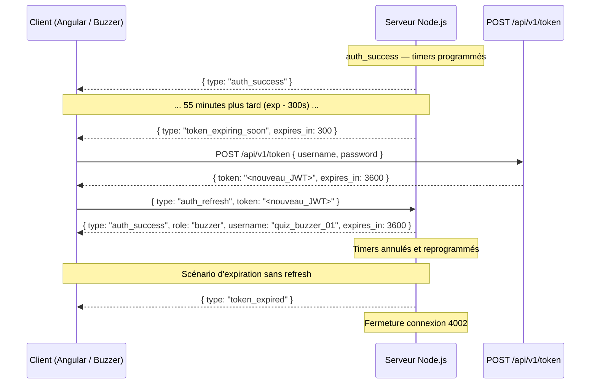

# US-021 — Refresh du token JWT (WebSocket)

## 📋 Contexte projet

Voir [VISION.md](VISION.md) pour la description complète du projet et de ses quatre applications.

---

## 🎯 User Story

> **En tant que** buzzer ou application Angular connecté en WebSocket,
> **je veux** être averti avant l'expiration de mon token et pouvoir le renouveler sans couper la connexion,
> **afin de** maintenir une session WebSocket active pendant toute la durée d'une partie sans interruption.

---

## ✅ Critères d'acceptance

> 🧪 **Exigence de couverture** — Voir [Conventions techniques — Couverture des tests](CONVENTIONS-TECHNIQUES.md#-exigence-de-couverture-des-tests). Chaque CA doit être couvert par au moins un test automatisé. Couverture globale ≥ 90 %.

### Avertissement d'expiration — `token_expiring_soon`

| # | Critère | Résultat attendu |
|---|---|---|
| CA-1 | À l'`auth_success`, le serveur programme un timer à `exp - now - 300s` | Si le délai calculé est ≤ 0 (token déjà proche de l'expiration), le message est envoyé immédiatement |
| CA-2 | À l'échéance du timer, le serveur envoie `token_expiring_soon` au client concerné | Format : `{ "type": "token_expiring_soon", "expires_in": 300 }` |
| CA-3 | Le message `token_expiring_soon` est envoyé uniquement au client dont le token expire — pas de broadcast | Envoi ciblé sur la connexion WebSocket concernée |
| CA-4 | Si le client se déconnecte avant l'échéance du timer `token_expiring_soon`, le timer est annulé | Pas d'envoi sur une connexion fermée |

### Expiration sans refresh — `token_expired`

| # | Critère | Résultat attendu |
|---|---|---|
| CA-5 | À l'`auth_success`, le serveur programme un second timer à `exp - now` | Timer d'expiration absolue, indépendant du timer `token_expiring_soon` |
| CA-6 | À l'échéance du timer d'expiration, le serveur envoie `token_expired` au client | Format : `{ "type": "token_expired" }` |
| CA-7 | Immédiatement après l'envoi de `token_expired`, le serveur ferme la connexion WebSocket | Code de fermeture `4002` avec raison `"Token expired."` |
| CA-8 | La fermeture déclenche le nettoyage du registre des connexions défini en US-009 | Le slot libéré (buzzer ou admin) est immédiatement disponible pour une nouvelle connexion |
| CA-9 | Si le client se déconnecte avant l'échéance du timer d'expiration, le timer est annulé | Pas de tentative d'envoi ou de fermeture sur une connexion déjà fermée |

### Ré-authentification sur connexion existante — `auth_refresh`

| # | Critère | Résultat attendu |
|---|---|---|
| CA-10 | Le client envoie `{ "type": "auth_refresh", "token": "<nouveau_JWT>" }` sur la connexion existante | Le serveur valide le token sans couper la connexion |
| CA-11 | Le token est valide, non expiré, et le `sub` correspond à la session courante | Le serveur annule les deux timers existants, programme deux nouveaux timers basés sur le nouvel `exp`, met à jour le registre des connexions, et répond `auth_success` |
| CA-12 | Le `sub` du nouveau token ne correspond pas au `sub` de la session courante | Le serveur envoie `error` avec code `TOKEN_MISMATCH` et ferme la connexion avec code `4001` |
| CA-13 | Le `role` du nouveau token ne correspond pas au `role` de la session courante | Le serveur envoie `error` avec code `TOKEN_MISMATCH` et ferme la connexion avec code `4001` |
| CA-14 | Le nouveau token est déjà expiré au moment de `auth_refresh` | Le serveur envoie `error` avec code `TOKEN_EXPIRED` et ferme la connexion avec code `4002` |
| CA-15 | Le nouveau token a une signature invalide | Le serveur envoie `error` avec code `TOKEN_INVALID` et ferme la connexion avec code `4001` |
| CA-16 | Le message `auth_refresh` ne contient pas le champ `token` | Le serveur envoie `error` avec code `INVALID_MESSAGE` — la connexion reste ouverte |
| CA-17 | Le message `auth_refresh` contient un `token` qui n'est pas une chaîne JSON valide | Le serveur envoie `error` avec code `INVALID_MESSAGE` — la connexion reste ouverte |
| CA-18 | `auth_refresh` reçu d'un client non authentifié | Ignoré silencieusement, log `WARN` |
| CA-19 | Les timers heartbeat (US-015) ne sont pas réinitialisés lors d'un `auth_refresh` réussi | Les timers heartbeat sont indépendants des timers JWT |

### Sécurité et transversalité

| # | Critère | Résultat attendu |
|---|---|---|
| CA-20 | Tout message WebSocket avec un JSON invalide est ignoré silencieusement | Log `WARN`, connexion maintenue |
| CA-21 | Erreur serveur inattendue lors du traitement de `auth_refresh` | Log `ERROR INTERNAL_ERROR`, connexion fermée avec code `1011` |
| CA-22 | Tests unitaires et d'intégration | Couverture ≥ 90%, timers injectables pour les tests |

---

## 🔄 Diagramme de flux




---

## 🔀 Diagramme de séquences




---

## 🔧 Spécifications techniques

Voir les [Conventions techniques](CONVENTIONS-TECHNIQUES.md) pour la stack complète, les principes d'architecture (KISS, DRY, YAGNI, SOLID) et les conventions de données.

### Pas de modification de schéma SQL

Cette US n'introduit aucune table ni colonne. Les tokens ne sont pas persistés — la validité est vérifiée à la volée via la signature JWT.

### Extension du registre des connexions (US-009)

Le registre `Map<sub, { ws, role, username, connectedAt }>` est étendu avec deux nouveaux champs pour stocker les références des timers :

```javascript
Map<sub, {
  ws,
  role,
  username,
  connectedAt,
  tokenExpiringSoonTimer,  // référence setTimeout — annulable via clearTimeout
  tokenExpiredTimer,       // référence setTimeout — annulable via clearTimeout
}>
```

### Calcul des délais

```javascript
const nowSeconds = Math.floor(Date.now() / 1000);
const expiringSoonDelay = Math.max(0, (payload.exp - nowSeconds - 300) * 1000);
const expiredDelay      = Math.max(0, (payload.exp - nowSeconds) * 1000);
```

> `Math.max(0, ...)` garantit qu'un délai négatif (token déjà proche de l'expiration) déclenche l'envoi immédiatement plutôt que de produire un comportement indéfini.

### Nettoyage des timers à la déconnexion

Le nettoyage des timers doit être intégré dans le handler `close` de l'US-009, après retrait du registre :

```javascript
// Dans le handler close — US-009 étendu
clearTimeout(entry.tokenExpiringSoonTimer);
clearTimeout(entry.tokenExpiredTimer);
```

### Structure des fichiers

```
src/
  websocket/
    authHandler.js                  ← modifié — programmation des timers post-auth_success
    tokenRefreshHandler.js          ← nouveau — traitement du message auth_refresh
  websocket/__tests__/
    tokenRefreshHandler.test.js     ← nouveau
```

---

## 🔌 Architecture WebSocket — Refresh du token

### Format des messages WebSocket

**Serveur → Client (`token_expiring_soon`)**

```json
{
  "type": "token_expiring_soon",
  "expires_in": 300
}
```

**Serveur → Client (`token_expired`)**

```json
{
  "type": "token_expired"
}
```

**Client → Serveur (`auth_refresh`)**

```json
{
  "type": "auth_refresh",
  "token": "<nouveau_JWT>"
}
```

**Serveur → Client (`auth_success` après refresh)**

Format identique à l'`auth_success` de l'US-009 :

```json
{
  "type": "auth_success",
  "role": "buzzer",
  "username": "quiz_buzzer_01",
  "expires_in": 3600
}
```

**Serveur → Client (erreurs)**

```json
{
  "type": "error",
  "code": "TOKEN_MISMATCH",
  "message": "Token identity does not match the current session."
}
```

```json
{
  "type": "error",
  "code": "TOKEN_EXPIRED",
  "message": "The provided token has already expired."
}
```

```json
{
  "type": "error",
  "code": "TOKEN_INVALID",
  "message": "The provided token is invalid."
}
```

### Catalogue des codes d'erreur WebSocket

| Code | Contexte |
|---|---|
| `TOKEN_MISMATCH` | `sub` ou `role` du nouveau token ≠ session courante — fermeture `4001` |
| `TOKEN_EXPIRED` | Nouveau token déjà expiré lors du `auth_refresh` — fermeture `4002` |
| `TOKEN_INVALID` | Signature invalide ou format incorrect lors du `auth_refresh` — fermeture `4001` |
| `INVALID_MESSAGE` | Champ `token` absent ou non-string dans `auth_refresh` — connexion maintenue |

---

## 📝 Logging structuré

**Avertissement d'expiration envoyé :**

```json
{
  "timestamp": "2026-03-27T14:55:00.000Z",
  "level": "INFO",
  "event": "WEBSOCKET_TOKEN_EXPIRING_SOON",
  "username": "quiz_buzzer_01",
  "role": "buzzer",
  "expires_in": 300
}
```

**Expiration sans refresh — connexion fermée :**

```json
{
  "timestamp": "2026-03-27T15:00:00.000Z",
  "level": "WARN",
  "event": "WEBSOCKET_TOKEN_EXPIRED",
  "username": "quiz_buzzer_01",
  "role": "buzzer"
}
```

**Refresh réussi :**

```json
{
  "timestamp": "2026-03-27T14:56:00.000Z",
  "level": "INFO",
  "event": "WEBSOCKET_TOKEN_REFRESHED",
  "username": "quiz_buzzer_01",
  "role": "buzzer"
}
```

**Tentative de refresh avec token invalide :**

```json
{
  "timestamp": "2026-03-27T14:56:00.000Z",
  "level": "WARN",
  "event": "WEBSOCKET_TOKEN_REFRESH_FAILED",
  "username": "quiz_buzzer_01",
  "role": "buzzer",
  "reason": "TOKEN_MISMATCH"
}
```

---

## 📐 Périmètre

| Inclus | Exclu |
|---|---|
| Avertissement `token_expiring_soon` 5 minutes avant expiration | Refresh token REST (YAGNI) |
| Fermeture `4002` à l'expiration sans refresh | Rotation automatique côté client (firmware ESP32 — hors périmètre serveur) |
| Message `auth_refresh` sur connexion existante | Révocation de token (YAGNI) |
| Validation `sub` + `role` lors du refresh | Interface Angular (hors périmètre serveur) |
| Reprogrammation des timers après refresh réussi | Déploiement / CI-CD |
| Nettoyage des timers à la déconnexion (extension US-009) | |
| Tests unitaires et d'intégration (couverture ≥ 90%) | |

---

## 🔍 Points de vigilance

### Timers injectables pour les tests

Les `setTimeout` ne doivent pas être appelés directement dans les handlers. Ils sont injectés comme dépendances (ou remplacés via `jest.useFakeTimers()`) pour permettre des tests rapides sans attendre des délais réels de plusieurs milliers de secondes.

### Cas limite — token expiré dès la connexion

Si un client s'authentifie avec un token dont `exp - now < 300s`, le délai `expiringSoonDelay` vaut `0` — `token_expiring_soon` est envoyé immédiatement après `auth_success`. Ce comportement est correct : le client est averti dès sa connexion qu'il doit rafraîchir son token. L'`auth_success` est toujours envoyé en premier, `token_expiring_soon` suit dans la même itération de la boucle d'événements.

### Race condition entre `token_expired` et `auth_refresh`

Si le timer d'expiration se déclenche exactement au même moment qu'un `auth_refresh` entrant, Node.js traite les événements séquentiellement — pas de vrai parallélisme. Le handler `auth_refresh` doit vérifier si le token de session est encore valide avant d'annuler les timers. Si le timer `tokenExpiredTimer` s'est déjà déclenché et a fermé la connexion, le message `auth_refresh` sera ignoré car la connexion est fermée.

### Indépendance des timers heartbeat (US-015)

Les timers heartbeat (`setInterval` de 30s) et les timers JWT (`setTimeout`) ont des cycles de vie indépendants. Un `auth_refresh` réussi ne réinitialise pas le heartbeat. La déconnexion par heartbeat timeout (US-015) annule les timers JWT via le handler `close` commun.

### `auth_success` identique à la connexion initiale

Le message `auth_success` envoyé après un `auth_refresh` réussi est strictement identique à celui de l'US-009. Pas de nouveau format, pas de champ supplémentaire. Le client peut traiter les deux de la même façon (DRY côté client).

---

## 📅 Historique des révisions

| Version | Date | Description |
|---|---|---|
| 1.0 | 2026-03-27 | Version initiale |
