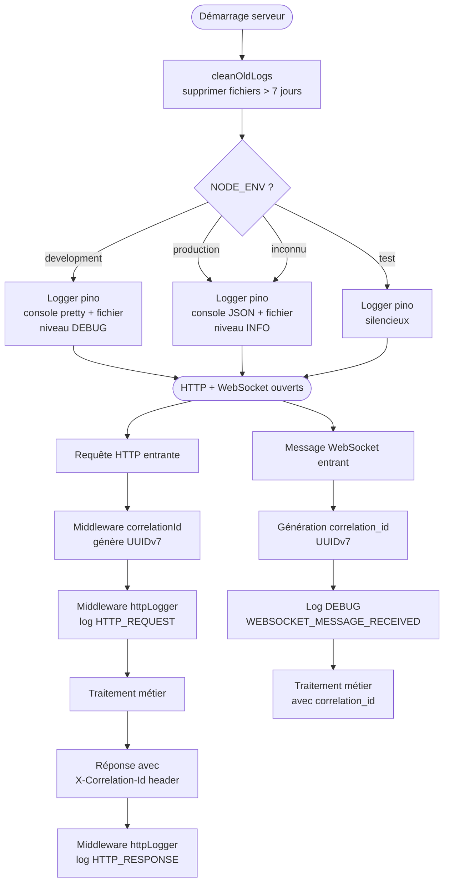
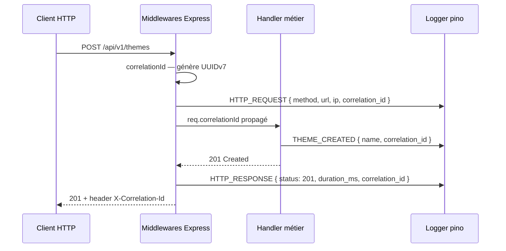

# US-022 — Logging et observabilité

## 📋 Contexte projet

Voir [VISION.md](VISION.md) pour la description complète du projet et de ses quatre applications.

---

## 🎯 User Story

> **En tant qu'** administrateur système,
> **je veux** que tous les événements du serveur soient loggués de façon structurée, corrélés par opération, et archivés dans des fichiers rotatifs,
> **afin de** diagnostiquer rapidement les incidents sans avoir à redémarrer le serveur ou instrumenter le code à la volée.

---

## ✅ Critères d'acceptance

> 🧪 **Exigence de couverture** — Voir [Conventions techniques — Couverture des tests](CONVENTIONS-TECHNIQUES.md#-exigence-de-couverture-des-tests). Chaque CA doit être couvert par au moins un test automatisé. Couverture globale ≥ 90 %.

### Configuration du logger

| # | Critère | Résultat attendu |
|---|---|---|
| CA-1 | En environnement `development` (`NODE_ENV=development`), le logger écrit sur la console (pretty-print) **et** dans les fichiers rotatifs, au niveau `DEBUG` minimum | Les deux destinations sont actives simultanément |
| CA-2 | En environnement `production` (`NODE_ENV=production`), le logger écrit sur la console (JSON brut) **et** dans les fichiers rotatifs, au niveau `INFO` minimum | Les deux destinations sont actives simultanément |
| CA-3 | En environnement `test` (`NODE_ENV=test`), le logger est entièrement silencieux | Aucune sortie console, aucun fichier créé |
| CA-4 | Si `NODE_ENV` est absent ou inconnu, le comportement `production` est appliqué par défaut | Sécurité par défaut |
| CA-5 | L'instance `pino` est un singleton partagé dans toute la codebase | Importée depuis `src/config/logger.js`, jamais réinstanciée |

### Format JSON des entrées de log

| # | Critère | Résultat attendu |
|---|---|---|
| CA-6 | Toute entrée de log contient `timestamp`, `level`, `event` | Champs obligatoires présents dans chaque ligne |
| CA-7 | Le champ `timestamp` est au format ISO 8601 UTC avec millisecondes | `"2026-03-27T14:30:00.000Z"` |
| CA-8 | Le champ `level` est une chaîne lisible (`"DEBUG"`, `"INFO"`, `"WARN"`, `"ERROR"`) | Pas le code numérique pino natif — converti en chaîne |
| CA-9 | Le champ `event` est en `SCREAMING_SNAKE_CASE` | Cohérent avec les conventions définies dans les US précédentes |
| CA-10 | Les entrées de log incluent `correlation_id` lorsqu'elles s'inscrivent dans le contexte d'une requête HTTP ou d'un message WebSocket | Absent des logs hors-contexte (démarrage, nettoyage, heartbeat) |

### Rotation et rétention des fichiers

| # | Critère | Résultat attendu |
|---|---|---|
| CA-11 | Un nouveau fichier de log est créé chaque heure | Nommé `logs/app-2026-03-27T14.log` |
| CA-12 | Les fichiers de log sont écrits dans le répertoire `logs/` à la racine du projet | Créé automatiquement s'il n'existe pas |
| CA-13 | Au démarrage du serveur, les fichiers `logs/app-*.log` plus vieux de 7 jours sont supprimés | Exécuté avant l'ouverture des connexions HTTP et WebSocket |
| CA-14 | Si le répertoire `logs/` n'est pas accessible en écriture, le serveur log un `ERROR` sur la console et continue sans écriture fichier | Le serveur ne plante pas sur une erreur de log |
| CA-15 | En environnement `test`, aucun fichier de log n'est créé et aucun nettoyage n'est exécuté | Le répertoire `logs/` n'est pas touché pendant les tests |

### Corrélation des requêtes HTTP

| # | Critère | Résultat attendu |
|---|---|---|
| CA-16 | Chaque requête HTTP entrante reçoit un `correlation_id` UUIDv7 unique généré par le middleware `correlationId` | Généré avant tout traitement métier |
| CA-17 | Le `correlation_id` est propagé dans l'objet `req` (`req.correlationId`) pour toute la durée du traitement | Accessible dans tous les middlewares et handlers suivants |
| CA-18 | Le `correlation_id` est inclus dans le header de réponse `X-Correlation-Id` pour toute réponse HTTP | Présent sur les réponses `2xx`, `4xx` et `5xx` |
| CA-19 | Le `correlation_id` est inclus dans le body JSON des réponses d'erreur `500` | Format : `{ "status": 500, "error": "INTERNAL_SERVER_ERROR", "message": "...", "correlation_id": "..." }` |
| CA-20 | Le middleware `httpLogger` log chaque requête entrante au niveau `INFO` avec méthode, URL, IP source et `correlation_id` | Événement `HTTP_REQUEST` |
| CA-21 | Le middleware `httpLogger` log chaque réponse sortante au niveau `INFO` avec statut HTTP, durée en ms et `correlation_id` | Événement `HTTP_RESPONSE` |
| CA-22 | En niveau `DEBUG`, le body de la requête entrante est inclus dans le log `HTTP_REQUEST` | Absent en `INFO` et au-dessus |

### Corrélation des messages WebSocket

| # | Critère | Résultat attendu |
|---|---|---|
| CA-23 | Chaque message WebSocket entrant reçoit un `correlation_id` UUIDv7 unique au moment de sa réception | Généré dans le handler de message, avant tout traitement |
| CA-24 | Le `correlation_id` est propagé dans le contexte de traitement du message et inclus dans tous les logs produits par ce traitement | Tous les logs liés à ce message partagent le même `correlation_id` |
| CA-25 | En niveau `DEBUG`, le type et le contenu brut du message WebSocket entrant sont loggués | Événement `WEBSOCKET_MESSAGE_RECEIVED` — absent en `INFO` et au-dessus |
| CA-26 | En niveau `DEBUG`, le type et le contenu brut de chaque message WebSocket sortant sont loggués | Événement `WEBSOCKET_MESSAGE_SENT` — absent en `INFO` et au-dessus |

### Logging SQL (niveau DEBUG)

| # | Critère | Résultat attendu |
|---|---|---|
| CA-27 | En niveau `DEBUG`, chaque requête SQL exécutée est loggée avec la requête, les paramètres et la durée en ms | Événement `SQL_QUERY` — absent en `INFO` et au-dessus |
| CA-28 | Les valeurs de paramètres SQL potentiellement sensibles (mots de passe hachés) ne sont jamais loggées | Le champ `USR_PASSWORD` est masqué (`"[REDACTED]"`) dans les logs SQL |

### Nettoyage au démarrage

| # | Critère | Résultat attendu |
|---|---|---|
| CA-29 | Au démarrage, les fichiers plus vieux de 7 jours sont supprimés avant l'ouverture des connexions | Log `INFO LOGS_CLEANUP_DONE` avec le nombre de fichiers supprimés |
| CA-30 | Si aucun fichier n'est à supprimer, le nettoyage s'exécute sans erreur | Log `INFO LOGS_CLEANUP_DONE` avec `deleted_count: 0` |
| CA-31 | Si la suppression d'un fichier échoue (permissions), l'erreur est loggée en `WARN` et le nettoyage continue | Les autres fichiers sont traités normalement |

### Sécurité et transversalité

| # | Critère | Résultat attendu |
|---|---|---|
| CA-32 | Les mots de passe, tokens JWT et secrets ne sont jamais présents dans les logs | Validation à la revue de code — aucune donnée sensible loggée |
| CA-33 | Tests unitaires et d'intégration | Couverture ≥ 90% |

---

## 🔄 Diagramme de flux




---

## 🔀 Diagramme de séquences




---

## 🔧 Spécifications techniques

Voir les [Conventions techniques](CONVENTIONS-TECHNIQUES.md) pour la stack complète, les principes d'architecture (KISS, DRY, YAGNI, SOLID) et les conventions de données.

### Configuration du logger

```javascript
// src/config/logger.js
import pino from 'pino';
import { join } from 'node:path';

const isTest = process.env.NODE_ENV === 'test';
const isDev  = process.env.NODE_ENV === 'development';

// Niveau minimum selon l'environnement
const level = isDev ? 'debug' : 'info';

// Sérialisation du niveau en chaîne lisible (pas le code numérique pino)
const formatters = {
  level: (label) => ({ level: label.toUpperCase() }),
};

// Horodatage ISO 8601 UTC avec millisecondes
const timestamp = () => `,"timestamp":"${new Date().toISOString()}"`;

const logger = isTest
  ? pino({ enabled: false })
  : pino(
      { level, formatters, timestamp },
      pino.multistream([
        {
          // Console : pretty en dev, JSON brut en prod
          stream: isDev
            ? (await import('pino-pretty')).default({ colorize: true })
            : process.stdout,
        },
        {
          // Fichier rotatif — un fichier par heure
          stream: await import('pino-roll').then(({ roll }) =>
            roll(join('logs', 'app-{YYYY}-{MM}-{DD}T{HH}.log'), {
              frequency: 'hourly',
            })
          ),
        },
      ])
    );

export default logger;
```

### Middleware correlationId

```javascript
// src/middleware/correlationId.js
import { generateUUIDv7 } from '../utils/uuid.js';

export function correlationId(req, res, next) {
  req.correlationId = generateUUIDv7();
  res.setHeader('X-Correlation-Id', req.correlationId);
  next();
}
```

### Middleware httpLogger

```javascript
// src/middleware/httpLogger.js
import logger from '../config/logger.js';

export function httpLogger(req, res, next) {
  const startedAt = Date.now();

  // Log de la requête entrante
  const requestLog = {
    event: 'HTTP_REQUEST',
    method: req.method,
    url: req.originalUrl,
    ip: req.ip,
    correlation_id: req.correlationId,
  };
  // Body uniquement en DEBUG
  if (logger.isLevelEnabled('debug') && req.body) {
    requestLog.body = req.body;
  }
  logger.info(requestLog);

  // Interception de la réponse sortante
  res.on('finish', () => {
    logger.info({
      event: 'HTTP_RESPONSE',
      status: res.statusCode,
      duration_ms: Date.now() - startedAt,
      correlation_id: req.correlationId,
    });
  });

  next();
}
```

### Nettoyeur de logs

```javascript
// src/utils/logCleaner.js
import { readdir, unlink, stat } from 'node:fs/promises';
import { join } from 'node:path';
import logger from '../config/logger.js';

const RETENTION_MS = 7 * 24 * 60 * 60 * 1000; // 7 jours

export async function cleanOldLogs(logsDir = 'logs') {
  let deletedCount = 0;
  try {
    const files = await readdir(logsDir);
    const logFiles = files.filter(f => f.match(/^app-.*\.log$/));
    for (const file of logFiles) {
      const filePath = join(logsDir, file);
      try {
        const { mtimeMs } = await stat(filePath);
        if (Date.now() - mtimeMs > RETENTION_MS) {
          await unlink(filePath);
          deletedCount++;
        }
      } catch (err) {
        logger.warn({ event: 'LOGS_CLEANUP_FILE_ERROR', file, error: err.message });
      }
    }
  } catch {
    // Répertoire logs/ absent ou inaccessible — pas bloquant
  }
  logger.info({ event: 'LOGS_CLEANUP_DONE', deleted_count: deletedCount });
}
```

### Corrélation WebSocket

La génération du `correlation_id` pour les messages WebSocket est ajoutée dans le handler de message principal, avant tout dispatch :

```javascript
// src/websocket/messageHandler.js — extrait
import { generateUUIDv7 } from '../utils/uuid.js';
import logger from '../config/logger.js';

export function handleMessage(ws, raw, context) {
  const correlationId = generateUUIDv7();

  logger.debug({
    event: 'WEBSOCKET_MESSAGE_RECEIVED',
    raw,
    username: context.username,
    correlation_id: correlationId,
  });

  // Propagation du correlationId dans tous les logs du traitement
  const ctx = { ...context, correlationId };
  // ... dispatch vers les handlers métier
}
```

### Format du nom de fichier de log

```
logs/app-2026-03-27T14.log
logs/app-2026-03-27T15.log
logs/app-2026-03-28T00.log
```

### Structure des fichiers

```
src/
  config/
    logger.js                    ← nouveau — instance pino singleton
  middleware/
    correlationId.js             ← nouveau — génération correlation_id HTTP
    httpLogger.js                ← nouveau — logging requêtes/réponses HTTP
  utils/
    logCleaner.js                ← nouveau — nettoyage fichiers > 7 jours
  websocket/
    messageHandler.js            ← modifié — génération correlation_id WS
  server.js                      ← modifié — ajout middlewares + cleanOldLogs()
  config/__tests__/
    logger.test.js               ← nouveau
  middleware/__tests__/
    correlationId.test.js        ← nouveau
    httpLogger.test.js           ← nouveau
  utils/__tests__/
    logCleaner.test.js           ← nouveau
logs/                            ← répertoire créé automatiquement, non versionné
```

> Le répertoire `logs/` doit être ajouté au `.gitignore`.

---

## 📝 Logging structuré

### Requête HTTP entrante

```json
{
  "timestamp": "2026-03-27T14:30:00.000Z",
  "level": "INFO",
  "event": "HTTP_REQUEST",
  "method": "POST",
  "url": "/api/v1/themes",
  "ip": "192.168.1.100",
  "correlation_id": "018e4f5d-0000-7000-8000-000000000001"
}
```

### Réponse HTTP sortante

```json
{
  "timestamp": "2026-03-27T14:30:00.012Z",
  "level": "INFO",
  "event": "HTTP_RESPONSE",
  "status": 201,
  "duration_ms": 12,
  "correlation_id": "018e4f5d-0000-7000-8000-000000000001"
}
```

### Message WebSocket reçu (DEBUG)

```json
{
  "timestamp": "2026-03-27T14:30:05.000Z",
  "level": "DEBUG",
  "event": "WEBSOCKET_MESSAGE_RECEIVED",
  "raw": "{\"type\":\"trigger_title\"}",
  "username": "admin",
  "correlation_id": "018e4f5d-0000-7000-8000-000000000002"
}
```

### Requête SQL (DEBUG)

```json
{
  "timestamp": "2026-03-27T14:30:00.005Z",
  "level": "DEBUG",
  "event": "SQL_QUERY",
  "query": "SELECT * FROM T_THEME_THM WHERE THM_ID = ?",
  "params": ["018e4f5d-0000-7000-8000-000000000003"],
  "duration_ms": 2,
  "correlation_id": "018e4f5d-0000-7000-8000-000000000001"
}
```

### Nettoyage des logs au démarrage

```json
{
  "timestamp": "2026-03-27T14:00:00.000Z",
  "level": "INFO",
  "event": "LOGS_CLEANUP_DONE",
  "deleted_count": 3
}
```

### Erreur 500 avec correlation_id

```json
{
  "status": 500,
  "error": "INTERNAL_SERVER_ERROR",
  "message": "An unexpected error occurred. Please try again later.",
  "correlation_id": "018e4f5d-0000-7000-8000-000000000001"
}
```

---

## 📐 Périmètre

| Inclus | Exclu |
|---|---|
| Instance `pino` singleton partagée | Envoi des logs vers un service externe (YAGNI) |
| Configuration par environnement (`development`, `production`, `test`) | Dashboard de visualisation des logs (YAGNI) |
| Rotation horaire via `pino-roll` | Alerting (YAGNI) |
| Rétention 7 jours — nettoyage au démarrage | Agrégation de logs multi-instances (YAGNI) |
| Middleware `correlationId` HTTP (UUIDv7) | |
| Header `X-Correlation-Id` dans toutes les réponses HTTP | |
| `correlation_id` dans le body des erreurs `500` | |
| Middleware `httpLogger` (requête + réponse + durée) | |
| Body HTTP en `DEBUG` | |
| Corrélation des messages WebSocket | |
| Messages WebSocket bruts en `DEBUG` | |
| Requêtes SQL en `DEBUG` avec masquage des données sensibles | |
| Tests unitaires et d'intégration (couverture ≥ 90%) | Déploiement / CI-CD |

---

## 🔍 Points de vigilance

### Logger silencieux en test — isolation stricte

En environnement `test`, le logger est instancié avec `{ enabled: false }`. Aucun mock n'est nécessaire dans les tests unitaires des autres modules — les appels à `logger.info(...)` s'exécutent sans effet de bord. Ne jamais mocker le logger dans les tests métier : tester que le code appelle `logger.info` est un test de comportement interne fragile, pas un test de valeur.

### Données sensibles — revue systématique

Le logging SQL en `DEBUG` est le seul endroit où des données issues de la base peuvent apparaître dans les logs. Le champ `USR_PASSWORD` (hash bcrypt) doit être masqué via une fonction `redactSensitiveParams(params)` appliquée avant le log. Les tokens JWT ne doivent jamais apparaître dans les logs HTTP (ni dans `req.headers.authorization`).

### Performance — pino multistream

`pino` est conçu pour la haute performance via des streams asynchrones. L'écriture fichier ne bloque jamais la boucle d'événements. En revanche, `pino-pretty` est synchrone et coûteux — il est réservé à l'environnement `development` uniquement. Ne jamais activer `pino-pretty` en `production`.

### Répertoire `logs/` manquant

`pino-roll` crée automatiquement le fichier de log mais pas le répertoire parent. `logCleaner.js` doit s'assurer que `logs/` existe avant que le logger tente d'écrire (`fs.mkdirSync('logs', { recursive: true })`). Cette création doit être effectuée au démarrage, avant l'initialisation du logger fichier.

### `correlation_id` absent des logs hors-contexte

Les logs de démarrage, heartbeat, nettoyage et reprise de partie (US-019) ne s'inscrivent dans aucune requête HTTP ni message WebSocket — ils n'ont pas de `correlation_id`. Ce champ est simplement absent de ces entrées. Ne pas générer un `correlation_id` factice pour les uniformiser.

---

## 📅 Historique des révisions

| Version | Date | Description |
|---|---|---|
| 1.0 | 2026-03-27 | Version initiale |
