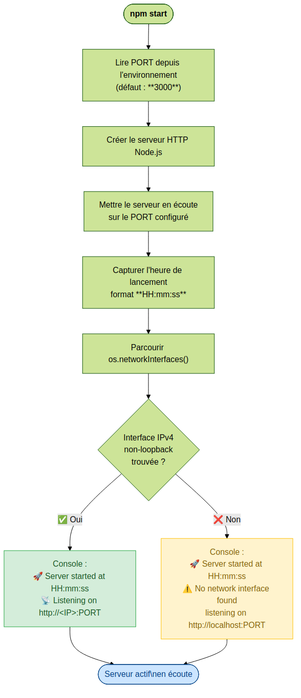
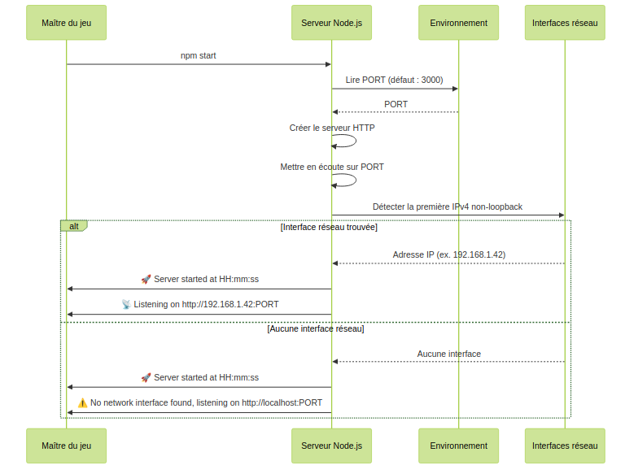

# US-001 — Démarrage du serveur Quiz Buzzer

## 📋 Contexte projet

Voir [VISION.md](../shared/VISION.md) pour la description complète du projet et de ses quatre applications.

---

## 🎯 User Story

> **En tant que** maître du jeu,
> **quand** je lance le serveur `quiz-buzzer-server` via la commande `npm start`,
> **alors** la console m'affiche l'heure de lancement ainsi que l'adresse IP sur laquelle le serveur est joignable.

---

## ✅ Critères d'acceptance

> 🧪 **Exigence de couverture** — Voir [Conventions techniques — Couverture des tests](../shared/CONVENTIONS-TECHNIQUES.md#-exigence-de-couverture-des-tests). Chaque CA doit être couvert par au moins un test automatisé. Couverture globale ≥ 90 %.

| # | Critère | Résultat attendu |
|---|---|---|
| CA-1 | Le serveur démarre sans erreur avec `npm start` | Le serveur démarre et reste en écoute sans erreur |
| CA-2 | La console affiche l'heure de lancement au format `HH:mm:ss` | Ex : `🚀 Server started at 14:32:07` |
| CA-3 | La console affiche la première adresse IPv4 locale non-loopback trouvée et le port d'écoute | Ex : `📡 Listening on http://192.168.1.42:3000` |
| CA-4 | Si aucune interface réseau IPv4 non-loopback n'est trouvée, un message de fallback est affiché | Ex : `⚠️ No network interface found, listening on http://localhost:3000` |
| CA-5 | Le port d'écoute est configurable via la variable d'environnement `PORT` (défaut : `3000`) | `PORT=8080 npm start` → écoute sur le port 8080 |
| CA-6 | Les tests couvrent les cas : démarrage normal, absence d'interface réseau, port personnalisé | Couverture de tests ≥ 90% |

---

## 🔄 Diagramme de flux



---

## 🔀 Diagramme de séquences



---

## 🔧 Spécifications techniques

Voir les [Conventions techniques](../shared/CONVENTIONS-TECHNIQUES.md) pour la stack complète, les principes d'architecture (KISS, DRY, YAGNI, SOLID) et les conventions de données.

### Spécifications propres à cette US

| Élément | Choix |
|---|---|
| Base de données | Non utilisée dans cette US |

### Scripts npm

```json
{
  "scripts": {
    "start": "node src/index.js",
    "dev": "node --watch src/index.js",
    "test": "node --experimental-vm-modules ./node_modules/.bin/jest --coverage"
  }
}
```

---

## 📐 Périmètre

| Inclus | Exclu |
|---|---|
| Démarrage du serveur HTTP | Communication WebSocket (US dédiée) |
| Affichage heure + IP au démarrage | Logique métier de quiz |
| Configuration du port via variable d'environnement | Interface Angular |
| Tests unitaires avec couverture ≥ 90% | Intégration avec les buzzers |
| | Déploiement / CI-CD |

---

## 🔍 Points de vigilance

### Interfaces réseau multiples

Si la machine possède plusieurs interfaces IPv4 non-loopback (ex : Ethernet + WiFi), le serveur affiche la **première trouvée**. Si un besoin de sélection d'interface se présente ultérieurement, une variable d'environnement `HOST` pourra être ajoutée (YAGNI pour l'instant).