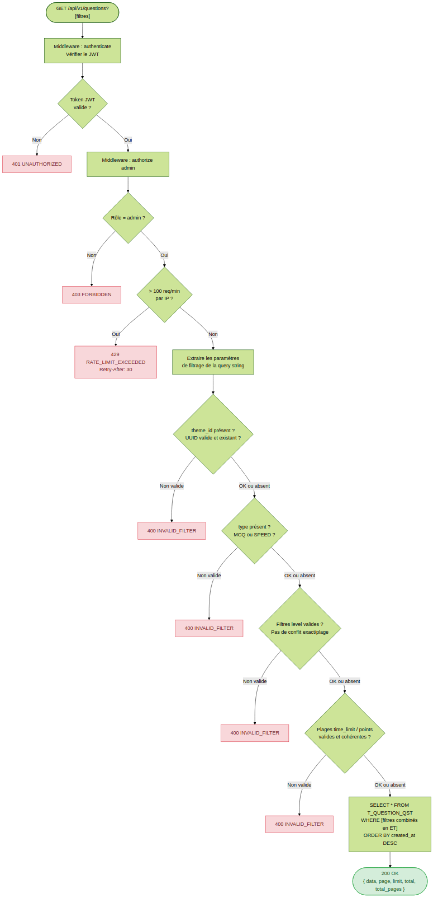
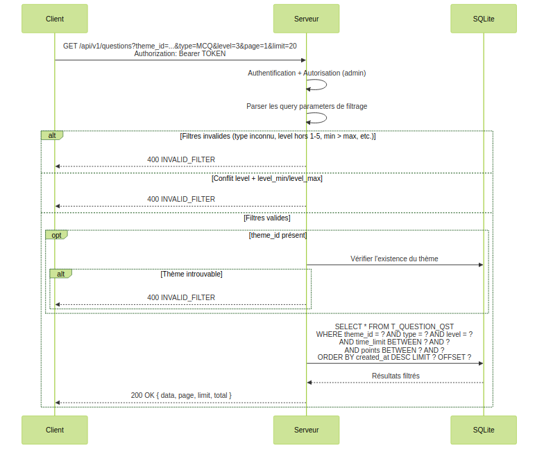

# US-006 — Filtrage avancé de la liste des questions

## 📋 Contexte projet

Voir [VISION.md](../shared/VISION.md) pour la description complète du projet et de ses quatre applications.

---

## 🎯 User Story

> **En tant qu'** administrateur,
> **je veux** filtrer la liste des questions par critères (thème, type, niveau, durée, points),
> **afin de** retrouver rapidement les questions correspondant à mes besoins.

---

## ✅ Critères d'acceptance

> 🧪 **Exigence de couverture** — Voir [Conventions techniques — Couverture des tests](../shared/CONVENTIONS-TECHNIQUES.md#-exigence-de-couverture-des-tests). Chaque CA doit être couvert par au moins un test automatisé. Couverture globale ≥ 90 %.

### Filtrage — `GET /api/v1/questions`

| # | Critère | Résultat attendu |
|---|---|---|
| CA-1 | Filtrage par `theme_id` (UUID valide, thème existant) | Seules les questions du thème sont retournées |
| CA-2 | Filtrage par `type` (`MCQ` ou `SPEED`) | Seules les questions du type sont retournées |
| CA-3 | Filtrage par `level` (valeur exacte : `?level=3`) | Seules les questions du niveau sont retournées |
| CA-4 | Filtrage par `level_min` et/ou `level_max` | Filtre par plage (bornes incluses) |
| CA-5 | Filtrage par `time_limit_min` et/ou `time_limit_max` | Filtre par plage (bornes incluses) |
| CA-6 | Filtrage par `points_min` et/ou `points_max` | Filtre par plage (bornes incluses) |
| CA-7 | Combinaison de plusieurs filtres | Les filtres sont combinés en ET logique |
| CA-8 | `theme_id` inexistant en base | `400 INVALID_FILTER` |
| CA-9 | `type` invalide (ni `MCQ` ni `SPEED`) | `400 INVALID_FILTER` |
| CA-10 | Valeurs numériques invalides pour `level`, `level_min`, `level_max`, `time_limit_min`, `time_limit_max`, `points_min`, `points_max` | `400 INVALID_FILTER` |
| CA-11 | Plage incohérente (`level_min` > `level_max`, etc.) | `400 INVALID_FILTER` |
| CA-12 | `level` et `level_min`/`level_max` présents simultanément | `400 INVALID_FILTER` |

### Sécurité et transversalité

Voir [Annexe — Critères de sécurité transversaux](../shared/SECURITE-TRANSVERSALE.md)

Les critères suivants s'appliquent à toutes les routes de cette US :

| # | Critère | Résultat attendu |
|---|---|---|
| CA-13 | Bearer token (voir annexe CA-Bearer) | Token absent/invalide/expiré → `401 UNAUTHORIZED` |
| CA-14 | Rôle administrateur (voir annexe CA-Forbidden) | Rôle insuffisant → `403 FORBIDDEN` |
| CA-15 | Rate limiting (voir annexe CA-RateLimit) | Dépassement → `429 RATE_LIMIT_EXCEEDED` avec header `Retry-After: 60` |
| CA-16 | Méthode HTTP (voir annexe CA-MethodNotAllowed) | `405 METHOD_NOT_ALLOWED` avec header `Allow` adapté |
| CA-17 | Erreur serveur (voir annexe CA-InternalError) | `500 INTERNAL_SERVER_ERROR` sans détails techniques |
| CA-18 | Tests unitaires et d'intégration | Couverture de tests ≥ 90% |

---

## 🔄 Diagramme de flux



---

## 🔀 Diagramme de séquences



---

## 🧪 Cas de tests — requêtes cURL

> **Variables** à définir avant d'exécuter les commandes :
> ```bash
> BASE_URL=http://localhost:3000
> TOKEN=<votre_token_JWT_admin>           # Obtenu via POST /api/v1/token (US-003)
> TOKEN_BUZZER=<token_JWT_buzzer>         # Token avec rôle buzzer (pour CA-14)
> THEME_ID=018e4f5a-8c3b-7d2e-9f1a-4b5c6d7e8f9a
> ```

### Filtrage — `GET /api/v1/questions`

**CA-1** — Filtrage par `theme_id` → `200 OK` avec les questions du thème uniquement

```bash
curl -s -w "\n→ HTTP %{http_code}\n" -X GET "$BASE_URL/api/v1/questions?theme_id=$THEME_ID" \
  -H "Authorization: Bearer $TOKEN"
```

**CA-2** — Filtrage par `type=MCQ` → `200 OK` avec les questions MCQ uniquement

```bash
curl -s -w "\n→ HTTP %{http_code}\n" -X GET "$BASE_URL/api/v1/questions?type=MCQ" \
  -H "Authorization: Bearer $TOKEN"
```

**CA-3** — Filtrage par `level=3` (valeur exacte) → `200 OK` avec les questions de niveau 3

```bash
curl -s -w "\n→ HTTP %{http_code}\n" -X GET "$BASE_URL/api/v1/questions?level=3" \
  -H "Authorization: Bearer $TOKEN"
```

**CA-4** — Filtrage par plage de niveau → `200 OK` avec les questions de niveau 2 à 4

```bash
curl -s -w "\n→ HTTP %{http_code}\n" -X GET "$BASE_URL/api/v1/questions?level_min=2&level_max=4" \
  -H "Authorization: Bearer $TOKEN"
```

**CA-5** — Filtrage par plage de durée → `200 OK` avec les questions entre 10 et 30 secondes

```bash
curl -s -w "\n→ HTTP %{http_code}\n" -X GET "$BASE_URL/api/v1/questions?time_limit_min=10&time_limit_max=30" \
  -H "Authorization: Bearer $TOKEN"
```

**CA-6** — Filtrage par plage de points → `200 OK` avec les questions entre 100 et 500 points

```bash
curl -s -w "\n→ HTTP %{http_code}\n" -X GET "$BASE_URL/api/v1/questions?points_min=100&points_max=500" \
  -H "Authorization: Bearer $TOKEN"
```

**CA-7** — Combinaison de filtres → `200 OK` avec les questions MCQ de niveau 3, entre 100 et 500 points

```bash
curl -s -w "\n→ HTTP %{http_code}\n" -X GET "$BASE_URL/api/v1/questions?type=MCQ&level=3&points_min=100&points_max=500" \
  -H "Authorization: Bearer $TOKEN"
```

**CA-8** — `theme_id` inexistant en base → `400 INVALID_FILTER`

```bash
curl -s -w "\n→ HTTP %{http_code}\n" -X GET "$BASE_URL/api/v1/questions?theme_id=018e4f5a-0000-0000-0000-000000000000" \
  -H "Authorization: Bearer $TOKEN"
```

**CA-9** — `type` invalide → `400 INVALID_FILTER`

```bash
curl -s -w "\n→ HTTP %{http_code}\n" -X GET "$BASE_URL/api/v1/questions?type=INVALID" \
  -H "Authorization: Bearer $TOKEN"
```

**CA-10** — Valeur numérique invalide pour `level` → `400 INVALID_FILTER`

```bash
curl -s -w "\n→ HTTP %{http_code}\n" -X GET "$BASE_URL/api/v1/questions?level=abc" \
  -H "Authorization: Bearer $TOKEN"
```

**CA-11** — Plage incohérente (`level_min` > `level_max`) → `400 INVALID_FILTER`

```bash
curl -s -w "\n→ HTTP %{http_code}\n" -X GET "$BASE_URL/api/v1/questions?level_min=5&level_max=1" \
  -H "Authorization: Bearer $TOKEN"
```

**CA-12** — `level` et `level_min` présents simultanément → `400 INVALID_FILTER`

```bash
curl -s -w "\n→ HTTP %{http_code}\n" -X GET "$BASE_URL/api/v1/questions?level=3&level_min=2" \
  -H "Authorization: Bearer $TOKEN"
```

### Sécurité et transversalité

Voir [Annexe — Critères de sécurité transversaux](../shared/SECURITE-TRANSVERSALE.md) pour tous les cas de test de sécurité.

**Exemples rapides contextualisés à cette US** :

```bash
# CA-13 — Token absent
curl -s -w "\n→ HTTP %{http_code}\n" -X GET "$BASE_URL/api/v1/questions"
# Attendu : 401 UNAUTHORIZED

# CA-14 — Rôle insuffisant
curl -s -w "\n→ HTTP %{http_code}\n" -X GET "$BASE_URL/api/v1/questions" \
  -H "Authorization: Bearer $TOKEN_BUZZER"
# Attendu : 403 FORBIDDEN
```

Consulter l'annexe pour les autres cas (rate limiting, méthode non supportée, erreur serveur).

---

## 🔧 Spécifications techniques

Voir les [Conventions techniques](../shared/CONVENTIONS-TECHNIQUES.md) pour la stack complète, les principes d'architecture (KISS, DRY, YAGNI, SOLID) et les conventions de données.

### Paramètres de filtrage

| Paramètre | Type | Description |
|---|---|---|
| `theme_id` | `string` (UUID) | Filtrer par thème (doit exister en base) |
| `type` | `string` | Filtrer par type (`MCQ` ou `SPEED`) |
| `level` | `integer` | Filtrer par niveau exact (1–5) |
| `level_min` | `integer` | Niveau minimum (borne incluse) |
| `level_max` | `integer` | Niveau maximum (borne incluse) |
| `time_limit_min` | `integer` | Durée minimum en secondes (borne incluse) |
| `time_limit_max` | `integer` | Durée maximum en secondes (borne incluse) |
| `points_min` | `integer` | Points minimum (borne incluse) |
| `points_max` | `integer` | Points maximum (borne incluse) |

### Règles de validation des filtres

```
Paramètres entrants (query string)
  → 1. theme_id présent ? → UUID valide ? → thème existant en base ?
  → 2. type présent ? → valeur MCQ ou SPEED ?
  → 3. level présent ? → entier valide ? → level_min/level_max absents ?
  → 4. level_min/level_max présents ? → entiers valides ? → level_min ≤ level_max ?
  → 5. time_limit_min/time_limit_max présents ? → entiers valides ? → cohérents ?
  → 6. points_min/points_max présents ? → entiers valides ? → cohérents ?
  → 7. Construction du WHERE SQL (filtres combinés en ET logique)
```

### Versioning API

Voir [Conventions techniques — Versioning API](../shared/CONVENTIONS-TECHNIQUES.md#-versioning-api).

### Structure des fichiers

```
src/
  routes/
    questionRoute.js      ← endpoint GET /api/v1/questions (complété par l'US-006)
  routes/__tests__/
    questionRoute.test.js ← tests d'intégration CA-1 à CA-18
  utils/
    filterQuestions.js    ← logique de validation et construction des filtres SQL
  utils/__tests__/
    filterQuestions.test.js ← tests unitaires
```

---

## 📡 Endpoints

| Méthode | URL | Description | Auth | Code succès |
|---|---|---|---|---|
| `GET` | `/api/v1/questions` | Lister les questions avec filtres | Bearer (admin) | `200 OK` |

### Headers `Allow` par ressource

| URL | Méthodes autorisées |
|---|---|
| `/api/v1/questions` | `GET, POST` |
| `/api/v1/questions/:id` | `GET, PUT, PATCH, DELETE` |

---

## 🔐 Authentification et autorisation

Voir l'[Annexe — Authentification et autorisation](../shared/AUTHENTIFICATION.md) pour le mécanisme JWT, la structure du payload et l'architecture middleware.

Les middlewares `authenticate` et `authorize('admin')` définis en [US-003](US-003-authentication-token.md) sont réutilisés sur toutes les routes de cette US.

---

## 🚨 Catalogue des erreurs

### Codes standards
Voir le [Catalogue centralisé des codes d'erreur](error-codes.md#1️⃣-codes-derreur-standards-transversaux)

### Codes spécifiques à cette US

| Code erreur | Code HTTP | Message | Contexte |
|---|---|---|---|
| `INVALID_FILTER` | `400` | `"Invalid filter parameters."` | Filtres invalides (type inconnu, UUID mal formé, thème inexistant, plage incohérente, conflit exact/plage) |

---

**Format standard des réponses d'erreur** — Voir [Format standard des réponses d'erreur](error-codes.md#-format-standard-des-réponses-derreur)

---

## 📐 Périmètre

| Inclus | Exclu |
|---|---|
| Filtrage de la liste des questions par 7 critères combinables | Pagination (gérée par US-005) |
| Validation stricte des paramètres de filtrage | Tri (géré par US-005) |
| ET logique entre les filtres | Recherche full-text |
| Bornes incluses pour les plages numériques | Interface Angular |
| Réutilisation des middlewares `authenticate` et `authorize` | CRUD des questions (US-005) |
| Rate limiting (100 req/min) | Déploiement / CI-CD |
| Tests unitaires et d'intégration (couverture ≥ 90%) | |

---

## 🔍 Points de vigilance

### Validation stricte avant la requête SQL

Tous les paramètres de filtrage doivent être validés **avant** la construction de la requête SQL. Une valeur invalide déclenche immédiatement un `400 INVALID_FILTER` sans interroger la base de données.

### Paramètres inconnus ignorés silencieusement

Les paramètres de query string non reconnus (ex. : `?foo=bar`) sont ignorés silencieusement. Seuls les paramètres documentés (`theme_id`, `type`, `level`, `level_min`, `level_max`, `time_limit_min`, `time_limit_max`, `points_min`, `points_max`) sont traités.

### Vérification d'existence du `theme_id`

Le paramètre `theme_id` doit être un UUID valide **et** référencer un thème existant en base. Une vérification applicative est effectuée avant la requête principale pour fournir un message d'erreur explicite (`400 INVALID_FILTER`) plutôt qu'une réponse vide silencieuse.

### Exclusivité filtre exact / filtre par plage

Les paramètres `level` (valeur exacte) et `level_min`/`level_max` (plage) sont mutuellement exclusifs. Leur présence simultanée déclenche un `400 INVALID_FILTER`. Cette contrainte ne s'applique pas aux autres champs (`time_limit`, `points`) qui n'ont pas de filtre exact.

### Bornes incluses pour les plages

Toutes les plages (`level_min`/`level_max`, `time_limit_min`/`time_limit_max`, `points_min`/`points_max`) utilisent des bornes **incluses** (opérateur `>=` et `<=` en SQL).

### Dépendance avec US-005

Cette US complète l'endpoint `GET /api/v1/questions` défini dans l'US-005. Elle s'appuie sur la même table `T_QUESTION_QST` et les mêmes middlewares. La logique de filtrage doit être isolée dans un utilitaire dédié (`filterQuestions.js`) pour respecter le **principe de responsabilité unique (SRP — SOLID)**.

---
