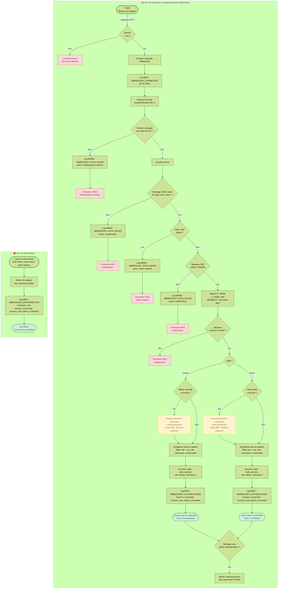
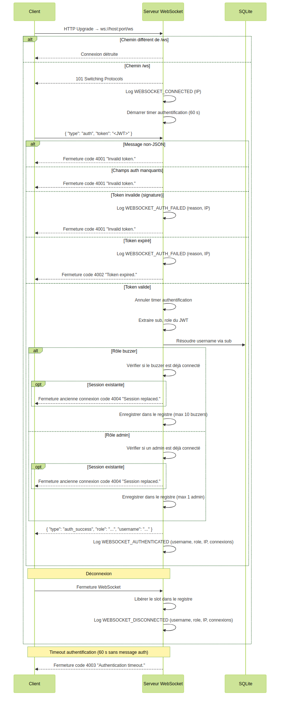

# US-009 — Connexion WebSocket des buzzers et de l'application Angular

## 📋 Contexte projet

Voir [VISION.md](../shared/VISION.md) pour la description complète du projet et de ses quatre applications.

---

## 🎯 User Story

> **En tant que** maître du jeu,
> **je veux** voir sur la console du hub Node.js les connexions et les déconnexions des quiz buzzers et de l'application Angular,
> **afin de** savoir en temps réel quels périphériques sont connectés au serveur.

---

## ✅ Critères d'acceptance

> 🧪 **Exigence de couverture** — Voir [Conventions techniques — Couverture des tests](../shared/CONVENTIONS-TECHNIQUES.md#-exigence-de-couverture-des-tests). Chaque CA doit être couvert par au moins un test automatisé. Couverture globale ≥ 90 %.

### Initialisation du serveur WebSocket

| # | Critère | Résultat attendu |
|---|---|---|
| CA-1 | Le serveur WebSocket est attaché au serveur HTTP existant (même port) | L'upgrade WebSocket se fait sur le même serveur que l'API REST |
| CA-2 | Le endpoint WebSocket est accessible sur `/ws` | `ws://<ip>:<port>/ws` |
| CA-3 | Une requête d'upgrade sur un chemin différent de `/ws` est refusée | La connexion WebSocket est détruite (pas d'upgrade) |

### Authentification post-connexion

| # | Critère | Résultat attendu |
|---|---|---|
| CA-4 | Après l'ouverture de la connexion WebSocket, le client doit envoyer un message d'authentification contenant son token JWT | Format : `{ "type": "auth", "token": "<JWT>" }` |
| CA-5 | Le token JWT est vérifié (signature HS256, expiration, claims `sub` et `role`) | Réutilisation du secret `JWT_SECRET` existant (US-003) |
| CA-6 | Si le token est valide, le serveur envoie un message de confirmation | `{ "type": "auth_success", "role": "buzzer", "username": "quiz_buzzer_01", "expires_in": 3600 }` |
| CA-7 | Si le token est invalide (signature, malformé), le serveur ferme la connexion | Code de fermeture `4001` avec raison "Invalid token." |
| CA-8 | Si le token est expiré, le serveur ferme la connexion | Code de fermeture `4002` avec raison "Token expired." |
| CA-9 | Si le client n'envoie pas de message d'authentification dans les 60 secondes, le serveur ferme la connexion | Code de fermeture `4003` avec raison "Authentication timeout." |
| CA-10 | Si le premier message n'est pas du JSON valide, le serveur ferme la connexion | Code de fermeture `4001` avec raison "Invalid token." |
| CA-11 | Si le premier message ne contient pas les champs `type: "auth"` et `token`, le serveur ferme la connexion | Code de fermeture `4001` avec raison "Invalid token." |

### Gestion des connexions — Buzzers (rôle `buzzer`)

| # | Critère | Résultat attendu |
|---|---|---|
| CA-12 | Un buzzer authentifié est enregistré dans le registre des connexions en mémoire | Maximum 10 buzzers simultanés |
| CA-13 | Si un buzzer déjà connecté se reconnecte (même `sub`), l'ancienne connexion est fermée silencieusement | Code de fermeture `4004` avec raison "Session replaced." — La nouvelle connexion prend sa place |
| CA-14 | Un buzzer déconnecté libère son slot | Le buzzer peut se reconnecter librement |

### Gestion des connexions — Application Angular (rôle `admin`)

| # | Critère | Résultat attendu |
|---|---|---|
| CA-15 | L'application Angular (rôle `admin`) s'authentifie avec le même format de message que les buzzers | `{ "type": "auth", "token": "<JWT admin>" }` |
| CA-16 | Maximum 1 connexion admin simultanée | Le slot admin est unique |
| CA-17 | Si une deuxième connexion admin arrive, l'ancienne est fermée silencieusement | Code de fermeture `4004` avec raison "Session replaced." — La nouvelle connexion prend sa place |

### Logging structuré

| # | Critère | Résultat attendu |
|---|---|---|
| CA-18 | Une connexion WebSocket établie (avant authentification) est loggée | `WEBSOCKET_CONNECTED` — niveau `INFO` |
| CA-19 | Une authentification WebSocket réussie est loggée avec le récapitulatif des clients connectés | `WEBSOCKET_AUTHENTICATED` — niveau `INFO` — inclut `buzzers_connected`, `buzzers_max`, `admin_connected` |
| CA-20 | Une authentification WebSocket échouée est loggée | `WEBSOCKET_AUTH_FAILED` — niveau `WARN` |
| CA-21 | Une déconnexion WebSocket est loggée avec le récapitulatif des clients connectés | `WEBSOCKET_DISCONNECTED` — niveau `INFO` — inclut `buzzers_connected`, `buzzers_max`, `admin_connected` |

### Notifications de connexion/déconnexion de buzzers

| # | Critère | Résultat attendu |
|---|---|---|
| CA-27 | Quand un buzzer s'authentifie avec succès, le serveur envoie un message `buzzer_connected` à l'admin | `{ "type": "buzzer_connected", "username": "quiz_buzzer_01" }` |
| CA-28 | Quand un buzzer se déconnecte, le serveur envoie un message `buzzer_disconnected` à l'admin | `{ "type": "buzzer_disconnected", "username": "quiz_buzzer_01" }` |
| CA-29 | L'admin peut envoyer `request_game_state` pour recevoir un `game_state_sync` à la demande (inclut `connected_buzzers`) | Permet le polling de l'état des buzzers connectés |

### Messages post-authentification

| # | Critère | Résultat attendu |
|---|---|---|
| CA-22 | Tout message reçu d'un client non authentifié (après le timeout ou hors séquence) est ignoré | Aucune réponse, la connexion est fermée si le timeout expire |
| CA-23 | Tout message reçu d'un client authentifié autre que l'authentification initiale est ignoré silencieusement (hors périmètre de cette US) | Aucune erreur, aucune réponse |

### Rate limiting

| # | Critère | Résultat attendu |
|---|---|---|
| CA-26 | Si une adresse IP dépasse 15 tentatives de connexion WebSocket par minute, la connexion est détruite | La connexion est fermée immédiatement sans upgrade WebSocket, l'événement `WEBSOCKET_RATE_LIMITED` est loggé au niveau `WARN` |

### Sécurité et transversalité

| # | Critère | Résultat attendu |
|---|---|---|
| CA-24 | Erreur serveur inattendue lors du traitement WebSocket | Log `INTERNAL_ERROR` niveau `ERROR`, connexion fermée avec code `1011` (Internal Error) |
| CA-25 | Tests unitaires et d'intégration | Couverture de tests ≥ 90% |

---

## 🔄 Diagramme de flux



---

## 🔀 Diagramme de séquences



---

## 🔧 Spécifications techniques

Voir les [Conventions techniques](../shared/CONVENTIONS-TECHNIQUES.md) pour la stack complète, les principes d'architecture (KISS, DRY, YAGNI, SOLID) et les conventions de données.

### Endpoint WebSocket

| URL | Protocole | Description | Auth |
|---|---|---|---|
| `/ws` | `ws://` | Connexion WebSocket (buzzers + admin) | Token JWT post-connexion (premier message) |

### Format des messages — Client → Serveur

**Authentification (premier message obligatoire) :**

```json
{
  "type": "auth",
  "token": "eyJhbGciOiJIUzI1NiIsInR5cCI6IkpXVCJ9..."
}
```

### Format des messages — Serveur → Client

**Authentification réussie :**

```json
{
  "type": "auth_success",
  "role": "buzzer",
  "username": "quiz_buzzer_01",
  "expires_in": 2847
}
```

```json
{
  "type": "auth_success",
  "role": "admin",
  "username": "admin",
  "expires_in": 2847
}
```

**Notes:**
- `expires_in` : Nombre de secondes **avant l'expiration actuelle** du token JWT (US-003), **calculé dynamiquement** à l'instant de l'envoi du message `auth_success` comme `Math.floor(token.exp - Date.now() / 1000)`. Cette valeur décroît avec le temps : si un client se reconnecte 50 minutes après l'émission du token, `expires_in` reflétera le temps réel restant, pas l'expiration initiale du token.

**Notification de connexion d'un buzzer (Serveur → Admin) :**

```json
{
  "type": "buzzer_connected",
  "username": "quiz_buzzer_01"
}
```

**Notification de déconnexion d'un buzzer (Serveur → Admin) :**

```json
{
  "type": "buzzer_disconnected",
  "username": "quiz_buzzer_01"
}
```

**Demande de synchronisation (Admin → Serveur) :**

```json
{
  "type": "request_game_state"
}
```

### Codes de fermeture WebSocket

| Code | Constante | Raison | Contexte |
|---|---|---|---|
| `4001` | `WS_CLOSE_INVALID_TOKEN` | "Invalid token." | Token malformé, signature invalide, JSON invalide, champs manquants |
| `4002` | `WS_CLOSE_TOKEN_EXPIRED` | "Token expired." | Token JWT expiré |
| `4003` | `WS_CLOSE_AUTH_TIMEOUT` | "Authentication timeout." | Pas de message d'authentification dans les 60 secondes |
| `4004` | `WS_CLOSE_SESSION_REPLACED` | "Session replaced." | Même utilisateur connecté depuis un autre client |
| `1011` | — | "Internal server error." | Erreur serveur inattendue |

---

## 🔌 Architecture WebSocket

### Flux de connexion

```
Client (buzzer ou Angular) → Upgrade HTTP → ws://<ip>:<port>/ws
  → 1. Le serveur accepte l'upgrade sur /ws uniquement
  → 2. Log WEBSOCKET_CONNECTED (IP du client)
  → 3. Démarrage du timer d'authentification (60 secondes)
  → 4. Attente du premier message
  → 5. Réception du message { "type": "auth", "token": "<JWT>" }
  → 6. Vérification du token JWT (signature, expiration, claims)
    → Si invalide → log WEBSOCKET_AUTH_FAILED, fermeture (4001 ou 4002)
    → Si timeout → log WEBSOCKET_AUTH_FAILED, fermeture (4003)
  → 7. Résolution du username depuis le claim `sub` (lookup en base)
  → 8. Vérification de connexion existante pour ce `sub`
    → Si existante → fermeture silencieuse de l'ancienne (4004)
  → 9. Enregistrement dans le registre des connexions
  → 10. Si rôle buzzer → envoi de { "type": "buzzer_connected", "username": "..." } à l'admin
  → 11. Envoi de { "type": "auth_success", ... }
  → 12. Log WEBSOCKET_AUTHENTICATED avec récapitulatif
```

### Flux de déconnexion

```
Client se déconnecte (fermeture TCP, close frame, ou perte réseau)
  → 1. Si rôle buzzer → envoi de { "type": "buzzer_disconnected", "username": "..." } à l'admin
  → 2. Suppression du registre des connexions
  → 3. Log WEBSOCKET_DISCONNECTED avec récapitulatif
```

### Registre des connexions (en mémoire)

```javascript
// Structure conceptuelle
Map<sub (UUIDv7), { ws, role, username, connectedAt }>
```

| Propriété | Type | Description |
|---|---|---|
| `sub` (clé) | `string` | UUIDv7 de l'utilisateur (claim JWT) |
| `ws` | `WebSocket` | Instance WebSocket active |
| `role` | `string` | "buzzer" ou "admin" |
| `username` | `string` | Nom d'utilisateur |
| `connectedAt` | `string` | Horodatage ISO 8601 UTC de la connexion |

### Compteurs

| Compteur | Dérivé de | Max |
|---|---|---|
| `buzzers_connected` | Nombre d'entrées avec `role === "buzzer"` | 10 |
| `admin_connected` | Nombre d'entrées avec `role === "admin"` | 1 |

---

## 📝 Logging structuré

### Format JSON

**Connexion WebSocket établie :**

```json
{
  "timestamp": "2026-03-09T14:30:00.000Z",
  "level": "INFO",
  "event": "WEBSOCKET_CONNECTED",
  "ip": "192.168.1.50"
}
```

**Authentification réussie (buzzer) :**

```json
{
  "timestamp": "2026-03-09T14:30:01.000Z",
  "level": "INFO",
  "event": "WEBSOCKET_AUTHENTICATED",
  "username": "quiz_buzzer_01",
  "role": "buzzer",
  "ip": "192.168.1.50",
  "buzzers_connected": 3,
  "buzzers_max": 10,
  "admin_connected": 1
}
```

**Authentification réussie (admin) :**

```json
{
  "timestamp": "2026-03-09T14:30:02.000Z",
  "level": "INFO",
  "event": "WEBSOCKET_AUTHENTICATED",
  "username": "admin",
  "role": "admin",
  "ip": "192.168.1.100",
  "buzzers_connected": 5,
  "buzzers_max": 10,
  "admin_connected": 1
}
```

**Authentification échouée :**

```json
{
  "timestamp": "2026-03-09T14:30:05.000Z",
  "level": "WARN",
  "event": "WEBSOCKET_AUTH_FAILED",
  "reason": "Invalid token.",
  "ip": "192.168.1.200"
}
```

**Déconnexion :**

```json
{
  "timestamp": "2026-03-09T14:35:00.000Z",
  "level": "INFO",
  "event": "WEBSOCKET_DISCONNECTED",
  "username": "quiz_buzzer_01",
  "role": "buzzer",
  "ip": "192.168.1.50",
  "buzzers_connected": 2,
  "buzzers_max": 10,
  "admin_connected": 1
}
```

**Rate limiting :**

```json
{
  "timestamp": "2026-03-09T14:30:10.000Z",
  "level": "WARN",
  "event": "WEBSOCKET_RATE_LIMITED",
  "ip": "192.168.1.200"
}
```

---

## 📐 Périmètre

| Inclus | Exclu |
|---|---|
| Serveur WebSocket attaché au serveur HTTP existant | Messages métier (buzz, réponses, scores) — US dédiées |
| Endpoint unique `/ws` pour buzzers et admin | Notification du maître de jeu lors des connexions/déconnexions — US dédiée |
| Authentification post-connexion par token JWT | Heartbeat / ping-pong — US dédiée |
| Remplacement silencieux des connexions existantes | Interface Angular WebSocket |
| Registre des connexions en mémoire (`Map`) | Persistance des sessions en base |
| Timeout d'authentification (60 secondes) | Reconnexion automatique côté client |
| Logging structuré JSON (4 événements) | Déploiement / CI-CD |
| Codes de fermeture WebSocket personnalisés (4001–4004) | |
| Rate limiting des connexions (15 par minute par IP) | Rate limiting au niveau du reverse proxy |
| Tests unitaires et d'intégration (couverture ≥ 90%) | |

---

## 🔍 Points de vigilance

### Bibliothèque `ws`

La bibliothèque `ws` est choisie pour sa légèreté, sa conformité au standard WebSocket (RFC 6455) et sa compatibilité native avec le module `node:http`. Contrairement à Socket.IO, elle n'ajoute pas de couche de protocole propriétaire, ce qui est important pour les clients ESP32-S3 qui utilisent une implémentation WebSocket bas niveau.

### Upgrade HTTP uniquement sur `/ws`

Le serveur doit intercepter l'événement `upgrade` du serveur HTTP et ne traiter que les requêtes ciblant le chemin `/ws`. Toute autre requête d'upgrade doit être détruite (`socket.destroy()`) pour éviter des connexions WebSocket non autorisées sur d'autres chemins.

### Timeout d'authentification

Le timer de 60 secondes est démarré dès l'acceptation de la connexion WebSocket. Si le client n'envoie pas de message `{ "type": "auth", "token": "..." }` dans ce délai, la connexion est fermée avec le code `4003`. Le timer doit être annulé (`clearTimeout`) dès qu'un message d'authentification est reçu (qu'il soit valide ou non).

### Remplacement silencieux de connexion

Lorsqu'un utilisateur déjà connecté se reconnecte, l'ancienne connexion est fermée avec le code `4004` **sans message d'avertissement préalable**. Ce comportement est choisi pour simplifier la gestion côté client (l'ESP32-S3 ne gère pas de messages d'erreur complexes). Le client déconnecté peut interpréter le code `4004` pour décider de ne pas tenter de reconnexion automatique.

### Résolution du username

Après vérification du token JWT, le serveur doit résoudre le `sub` (UUIDv7) en username via un lookup en base de données. Cela garantit que le token fait référence à un utilisateur toujours existant. Si l'utilisateur n'est plus trouvé en base (cas théorique : suppression entre l'émission du token et la connexion WebSocket), la connexion est fermée avec le code `4001`.

### Nettoyage des événements

Lors de la fermeture d'une connexion (qu'elle soit initiée par le client, le serveur ou une erreur réseau), le serveur doit :
1. Annuler le timer d'authentification s'il est encore actif.
2. Retirer l'entrée du registre des connexions.
3. Logger l'événement `WEBSOCKET_DISCONNECTED` (uniquement si le client était authentifié).

### Intégration avec `src/server.js`

Le serveur WebSocket (`ws.WebSocketServer`) doit être créé avec l'option `{ noServer: true }` et l'upgrade doit être géré manuellement via l'événement `upgrade` du serveur HTTP retourné par `startServer()`. Cela permet de partager le même port et de filtrer le chemin de l'upgrade.

### Rate limiting des connexions WebSocket

**Limitation appliquée:** 15 connexions par minute par adresse IP.

Pour prévenir les attaques par déni de service (DoS) où un client malveillant ouvrirait/fermerait des connexions WebSocket en boucle, un rate limiter en mémoire est appliqué au niveau du `upgrade` HTTP. Chaque adresse IP est limitée à **15 tentatives de connexion par minute (60 secondes)**.

**Comportement:**
- Si une adresse IP dépasse la limite, la connexion est détruite immédiatement (`socket.destroy()`) sans upgrade vers WebSocket.
- L'événement `WEBSOCKET_RATE_LIMITED` est loggé au niveau `WARN`.
- La fenêtre de temps est glissante (timestamps en mémoire).
- Après 60 secondes, les tentatives expirées sont supprimées de la limite, autorisant de nouvelles connexions.

**Limitation de périmètre:**
- Cette protection s'applique au **niveau réseau local uniquement** (réseau WiFi privé).
- Pas de persistance en base de données.
- Le rate limiter est réinitialisé à chaque redémarrage du serveur.
- En production avec un reverse proxy (Nginx, HAProxy), il est recommandé d'appliquer également un rate limiting au niveau du proxy.