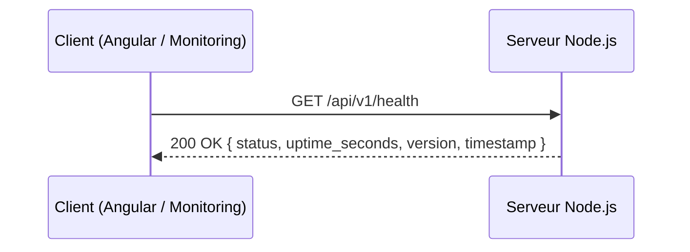

# US-020 — Health check

## 📋 Contexte projet

Voir [VISION.md](../shared/VISION.md) pour la description complète du projet et de ses quatre applications.

---

## 🎯 User Story

> **En tant qu'** administrateur ou système de monitoring,
> **je veux** interroger un endpoint public pour vérifier que le serveur est en vie,
> **afin de** détecter rapidement une indisponibilité sans avoir besoin d'un token d'authentification.

---

## ✅ Critères d'acceptance

> 🧪 **Exigence de couverture** — Voir [Conventions techniques — Couverture des tests](../shared/CONVENTIONS-TECHNIQUES.md#-exigence-de-couverture-des-tests). Chaque CA doit être couvert par au moins un test automatisé. Couverture globale ≥ 90 %.

### Health check — `GET /api/v1/health`

| # | Critère | Résultat attendu |
|---|---|---|
| CA-1 | Appel `GET /api/v1/health` sans token | `200 OK` avec le corps JSON décrit ci-dessous |
| CA-2 | La réponse contient `status: "ok"` | Valeur fixe |
| CA-3 | La réponse contient `uptime_seconds` | Valeur numérique issue de `process.uptime()`, arrondie à l'entier le plus proche |
| CA-4 | La réponse contient `version` | Chaîne lue depuis le champ `version` de `package.json` au démarrage du serveur |
| CA-5 | La réponse contient `timestamp` | Horodatage ISO 8601 UTC de la réponse, avec millisecondes |
| CA-6 | Un body éventuel dans la requête est ignoré silencieusement | Aucune erreur |
| CA-7 | Le `Content-Type` de la requête est ignoré | Aucune validation, quelle que soit sa valeur |
| CA-8 | Méthode HTTP autre que `GET` sur `/api/v1/health` | `405 METHOD_NOT_ALLOWED` avec header `Allow: GET` |
| CA-9 | Tests unitaires et d'intégration | Couverture ≥ 90% |

---

## 🔄 Diagramme de flux


```mermaid
flowchart TD
    A([GET /api/v1/health]) --> B{Méthode = GET ?}
    B -- Non --> C[405 METHOD_NOT_ALLOWED\nAllow: GET]
    B -- Oui --> D[Lire process.uptime\nLire version package.json\nGénérer timestamp]
    D --> E[200 OK\n{ status, uptime_seconds, version, timestamp }]
```

---

## 🔀 Diagramme de séquences




---

## 🧪 Cas de tests — requêtes cURL

```bash
BASE_URL="http://192.168.1.10:3000"

# CA-1 à CA-5 — Appel nominal sans token
curl -s -w "\n→ HTTP %{http_code}\n" "$BASE_URL/api/v1/health"
# Attendu : 200 OK
# {
#   "status": "ok",
#   "uptime_seconds": 42,
#   "version": "1.0.0",
#   "timestamp": "2026-03-27T14:00:00.000Z"
# }

# CA-8 — Méthode non autorisée
curl -s -w "\n→ HTTP %{http_code}\n" -X POST "$BASE_URL/api/v1/health"
# Attendu : 405 METHOD_NOT_ALLOWED — header Allow: GET

# CA-6 — Body ignoré
curl -s -w "\n→ HTTP %{http_code}\n" "$BASE_URL/api/v1/health" \
  -H "Content-Type: application/json" \
  -d '{"foo": "bar"}'
# Attendu : 200 OK (body ignoré silencieusement)
```

---

## 🔧 Spécifications techniques

Voir les [Conventions techniques](../shared/CONVENTIONS-TECHNIQUES.md) pour la stack complète, les principes d'architecture (KISS, DRY, YAGNI, SOLID) et les conventions de données.

### Lecture de la version au démarrage

La version est lue depuis `package.json` **une seule fois au démarrage du serveur** et mise en cache en mémoire. Elle n'est pas relue à chaque requête (performance + KISS).

```javascript
// src/config.js — chargé au démarrage
import { readFileSync } from 'node:fs';
const { version } = JSON.parse(readFileSync('./package.json', 'utf8'));
export { version };
```

### Format de la réponse

```json
{
  "status": "ok",
  "uptime_seconds": 42,
  "version": "1.0.0",
  "timestamp": "2026-03-27T14:00:00.000Z"
}
```

### Versioning API

Voir [Conventions techniques — Versioning API](../shared/CONVENTIONS-TECHNIQUES.md#-versioning-api).

### Structure des fichiers

```
src/
  routes/
    health.js              ← nouveau — handler GET /api/v1/health
  routes/__tests__/
    health.test.js         ← nouveau
```

---

## 📡 Endpoint

| Méthode | URL | Description | Auth | Code succès |
|---|---|---|---|---|
| `GET` | `/api/v1/health` | Vérifier la disponibilité du serveur | Aucune | `200 OK` |

### Header `Allow`

| URL | Méthodes autorisées |
|---|---|
| `/api/v1/health` | `GET` |

---

## 🚨 Catalogue des erreurs

### Codes standards

| Code erreur | Code HTTP | Message | Contexte |
|---|---|---|---|
| `METHOD_NOT_ALLOWED` | `405` | `"Method Not Allowed."` | Méthode HTTP autre que `GET` |
| `INTERNAL_SERVER_ERROR` | `500` | `"An unexpected error occurred. Please try again later."` | Erreur serveur inattendue |

---

## 📐 Périmètre

| Inclus | Exclu |
|---|---|
| Endpoint public `GET /api/v1/health` | Vérification de la connexion SQLite (YAGNI) |
| Réponse `status`, `uptime_seconds`, `version`, `timestamp` | Vérification de l'espace disque (YAGNI) |
| Aucune authentification requise | Métriques détaillées (YAGNI) |
| Tests unitaires et d'intégration (couverture ≥ 90%) | Déploiement / CI-CD |

---

## 🔍 Points de vigilance

### Absence de vérification des dépendances (shallow check)

Ce health check est délibérément **superficiel** : il confirme uniquement que le processus Node.js répond. Il ne vérifie pas que SQLite est accessible ni que le système de fichiers est opérationnel. Un `200 OK` signifie que le serveur est en vie, pas qu'il est entièrement fonctionnel. Ce choix est intentionnel (KISS / YAGNI) — un deep check ferait dépendre la disponibilité du health check de celle de ses dépendances, ce qui peut créer de faux négatifs.

### Version lue depuis `package.json`

La version est lue au démarrage et mise en cache. Si `package.json` est absent ou malformé au démarrage, le serveur doit logger un `WARN` et utiliser `"unknown"` comme valeur de repli — il ne doit pas planter.

### Sécurité des erreurs 500

En cas d'erreur inattendue dans ce handler (improbable mais défensif), la réponse ne doit exposer aucun détail technique. Le format standard `{ "status": 500, "error": "INTERNAL_SERVER_ERROR", "message": "..." }` s'applique.

---

## 📅 Historique des révisions

| Version | Date | Description |
|---|---|---|
| 1.0 | 2026-03-27 | Version initiale |
